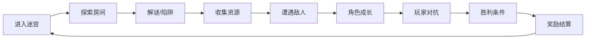
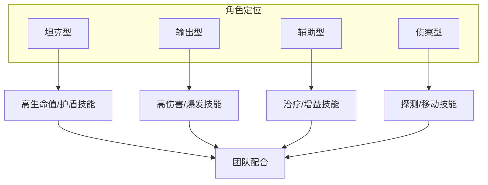
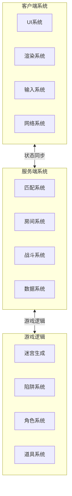
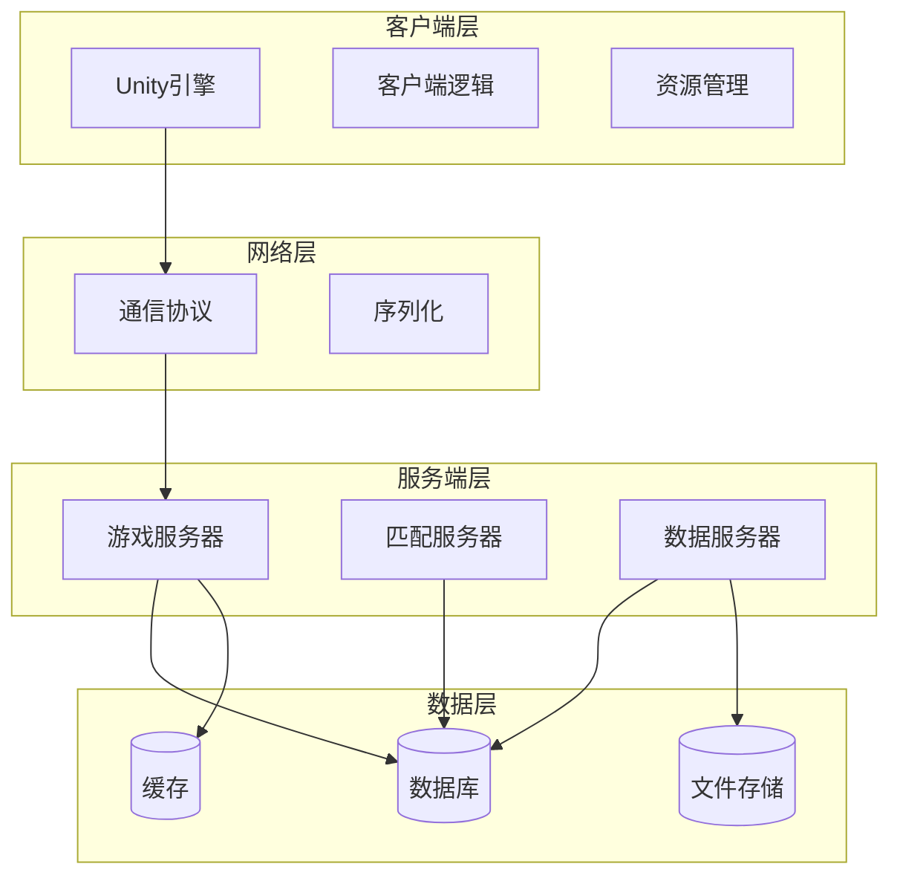
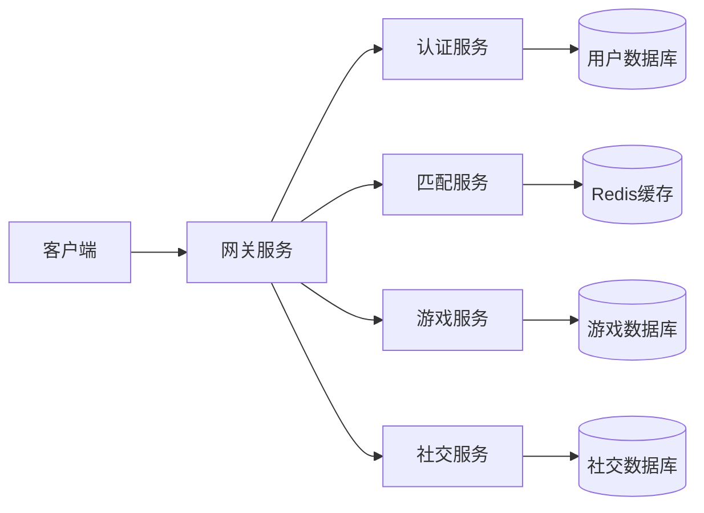
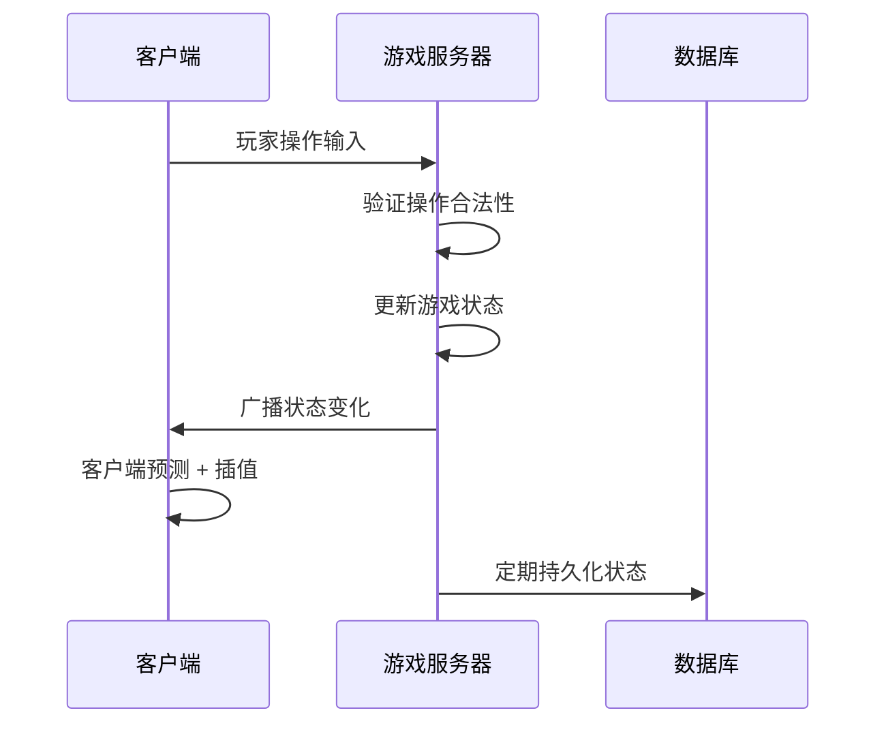
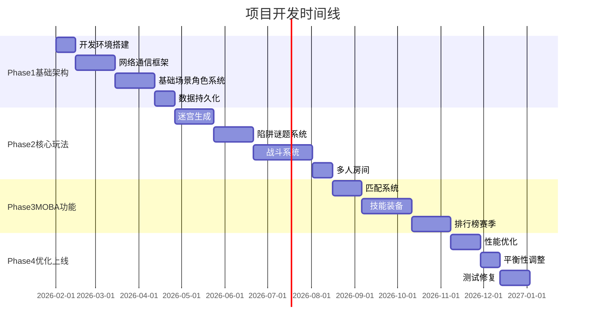
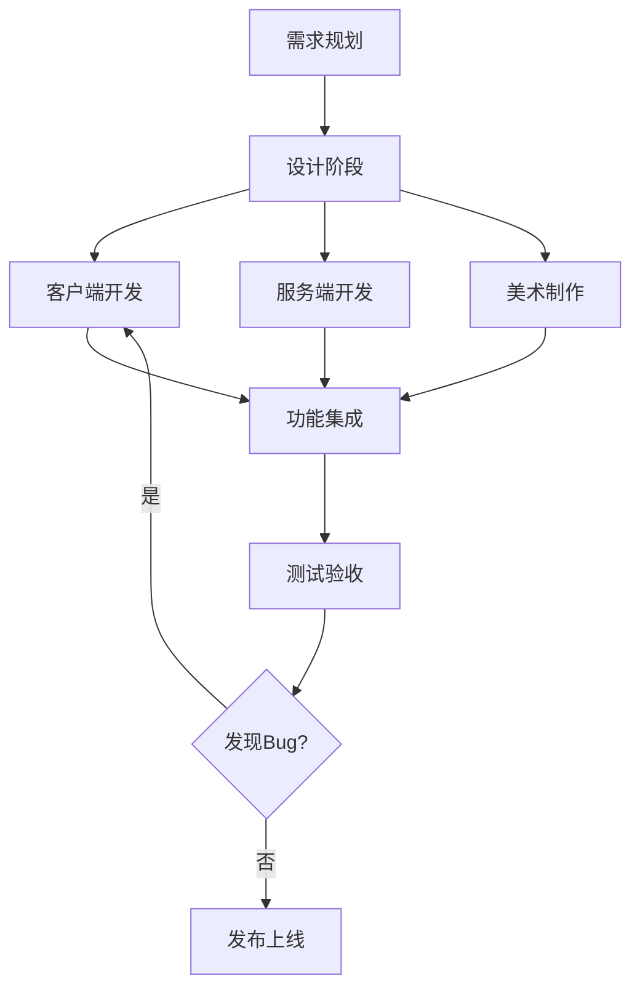
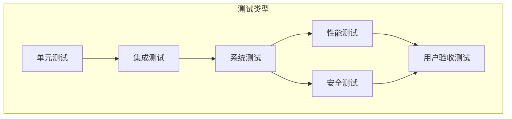

# Cube - 异次元杀阵 项目启动计划

## 文档版本信息
- **版本**：1.0
- **创建日期**：2026-01-22
- **最后更新**：2026-01-22
- **状态**：草案

---

## 1. 项目总览

### 1.1 项目愿景
打造一款融合《Cube》电影世界观的创新型迷宫竞技游戏，将生存恐怖与 MOBA 竞技完美结合，为玩家提供紧张刺激且策略性强的多人在线游戏体验。

### 1.2 核心价值主张
- **独特世界观**：基于经典科幻恐怖电影《Cube》，营造神秘压迫的游戏氛围
- **创新玩法**：将迷宫探索、解谜、生存与 MOBA 竞技元素深度融合
- **策略深度**：房间陷阱、资源争夺、角色配合，多维度策略决策
- **社交互动**：团队协作与竞技对抗并存，强化玩家互动体验

### 1.3 目标用户群体
- 核心玩家：喜欢 MOBA、竞技类游戏的硬核玩家
- 次要玩家：喜欢解谜、探索类游戏的策略玩家
- 潜在玩家：《Cube》系列电影粉丝

### 1.4 成功标准定义

| 维度 | 短期目标（6个月） | 中期目标（12个月） | 长期目标（24个月） |
|------|------------------|-------------------|-------------------|
| 技术指标 | 完成核心功能开发 | 实现稳定运营 | 支持大规模并发 |
| 用户规模 | Alpha测试 100+ 用户 | 日活用户 5,000+ | 日活用户 50,000+ |
| 游戏性能 | 客户端 60fps | 服务器延迟 <50ms | 全球服务器部署 |
| 内容丰富度 | 3种角色，10个房间 | 10种角色，50个房间 | 20+角色，100+房间 |

---

## 2. 游戏设计核心

### 2.1 核心游戏循环



### 2.2 立方体迷宫机制

#### 2.2.1 房间系统
- **房间类型**：
  - 安全房间：无陷阱，可休整
  - 陷阱房间：物理陷阱（激光、尖刺、酸液等）
  - 谜题房间：需要解谜才能通过
  - 资源房间：包含装备、道具
  - Boss房间：精英怪物或特殊挑战
  - 传送房间：快速移动到其他区域

- **动态生成**：
  - 采用程序化生成算法（Procedural Generation）
  - 保证每局游戏迷宫布局不同
  - 基于规则的生成系统，确保可通过性

#### 2.2.2 陷阱系统
- **陷阱等级**：1-5级，难度递增
- **陷阱类型**：
  - 激光网格：需要计算移动路径
  - 酸液池：造成持续伤害
  - 机械陷阱：运动部件，时机控制
  - 数字密码：数学谜题
  - 重力陷阱：改变移动方式

- **破解机制**：
  - 观察模式识别
  - 团队协作触发机关
  - 使用特定道具破解

#### 2.2.3 谜题设计
- **数学谜题**：质数识别、数列计算（呼应电影）
- **逻辑谜题**：推理、排列组合
- **协作谜题**：需要多名玩家同时操作
- **时间限制**：增加紧张感

### 2.3 MOBA元素融合

#### 2.3.1 角色系统



#### 2.3.2 技能体系
- **主动技能**：每个角色 3-4 个主动技能
- **被动技能**：角色特性被动
- **终极技能**：强力技能，需要充能
- **技能升级**：游戏内通过经验升级

#### 2.3.3 竞技玩法
- **游戏模式**：
  - 生存模式：最后存活的队伍获胜
  - 逃脱模式：最先逃出迷宫的队伍获胜
  - 资源争夺：收集最多资源的队伍获胜
  - 对抗模式：击杀敌方队伍获胜

- **匹配机制**：
  - 单排/组排
  - ELO 评分系统
  - 赛季排行榜

### 2.4 游戏系统架构



---

## 3. 技术架构方案

### 3.1 整体架构设计



### 3.2 客户端架构（Unity）

#### 3.2.1 技术选型
- **Unity 版本**：Unity 2022 LTS 或更高
- **渲染管线**：URP（Universal Render Pipeline）
- **脚本后端**：IL2CPP（发布版本）
- **目标平台**：PC（Windows/Mac）优先，后续扩展移动端

#### 3.2.2 核心模块

**场景管理系统**
- 场景异步加载
- 场景对象池
- LOD 管理
- 遮挡剔除优化

**网络同步方案**
- 推荐方案：
  1. **自研框架**：完全可控，适合大型项目

- 状态同步策略：
  - 权威服务器模式
  - 客户端预测 + 服务器校验
  - 差值补偿，减少网络抖动

**UI框架选择**
- 推荐：UIToolkit（适合复杂UI）
- 功能需求：
  - MVC/MVP 架构
  - UI事件系统
  - 动画管理
  - 多语言支持

**资源管理策略**
- YooAsset

**音频模块**
- Wwise

#### 3.2.3 客户端目录结构
```
client/Matrix/Assets/
├── Scripts/
│   ├── Framework/        # 框架层
│   ├── Game/            # 游戏逻辑
│   │   ├── Character/   # 角色系统
│   │   ├── Maze/        # 迷宫系统
│   │   ├── Combat/      # 战斗系统
│   │   └── UI/          # UI逻辑
│   ├── Network/         # 网络模块
│   └── Utility/         # 工具类
├── Art/
│   ├── Models/          # 3D模型
│   ├── Textures/        # 贴图
│   ├── Materials/       # 材质
│   └── Animations/      # 动画
├── Audio/               # 音频资源
├── Prefabs/             # 预制体
└── Scenes/              # 场景文件
```

### 3.3 服务端架构（.NET）

#### 3.3.1 技术选型
- **.NET 版本**：.NET 8（LTS）推荐
- **服务器框架**：
  - **ASP.NET Core**：适合 Web API 和 WebSocket
  - **自定义 TCP 服务器**：适合游戏逻辑服务器，性能更优
  - 混合方案：ASP.NET Core（Web服务）+ 自定义游戏服务器

#### 3.3.2 服务器架构

**微服务设计**


**核心服务模块**

1. **网关服务（Gateway）**
   - 请求路由
   - 负载均衡
   - 服务发现
   - API聚合

2. **认证服务（Auth Service）**
   - 用户注册/登录
   - Token 验证（JWT）
   - 权限管理
   - 防刷机制

3. **匹配服务（Match Service）**
   - ELO 评分系统
   - 匹配队列管理
   - 房间创建和分配
   - 队伍平衡算法

4. **游戏服务（Game Service）**
   - 房间管理
   - 游戏逻辑处理
   - 状态同步
   - 帧同步/状态同步

5. **数据服务（Data Service）**
   - 玩家数据持久化
   - 游戏记录存储
   - 排行榜统计
   - 数据分析

#### 3.3.3 数据库设计

**数据库选型**

| 数据库类型 | 推荐方案 | 用途 | 优势 |
|-----------|---------|------|------|
| 关系型数据库 | PostgreSQL | 用户数据、游戏配置 | 事务支持、数据一致性 |
| 文档数据库 | MongoDB | 游戏记录、日志 | 灵活 schema、水平扩展 |
| 缓存数据库 | Redis | 会话、匹配队列 | 高性能、实时数据 |
| 时序数据库 | InfluxDB | 性能监控、数据分析 | 时间序列优化 |

**核心数据表设计**

```
用户表 (users)
- user_id (PK)
- username
- email
- password_hash
- created_at
- last_login

角色表 (characters)
- character_id (PK)
- user_id (FK)
- character_type
- level
- experience
- stats (JSON)

游戏记录表 (game_records)
- record_id (PK)
- room_id
- player_ids (Array)
- game_mode
- result
- duration
- created_at
```

#### 3.3.4 网络协议设计

**协议选择**
- **WebSocket**：适合 Web 端和移动端，易于部署
- **TCP + Protobuf**：性能最优，适合 PC 端
- **KCP**：可靠 UDP，适合弱网环境

**消息格式**
```csharp
// 消息基类
public class Message
{
    public int MessageType { get; set; }
    public long Timestamp { get; set; }
    public byte[] Payload { get; set; }
}

// 消息类型枚举
public enum MessageType
{
    // 连接相关
    Connect = 1000,
    Disconnect = 1001,
    Heartbeat = 1002,
    
    // 匹配相关
    MatchRequest = 2000,
    MatchSuccess = 2001,
    MatchCancel = 2002,
    
    // 游戏相关
    GameStart = 3000,
    PlayerMove = 3001,
    PlayerAction = 3002,
    GameState = 3003,
    GameEnd = 3004
}
```

#### 3.3.5 服务端目录结构
```
server/
├── src/
│   ├── Gateway/          # 网关服务
│   ├── Services/
│   │   ├── AuthService/  # 认证服务
│   │   ├── MatchService/ # 匹配服务
│   │   ├── GameService/  # 游戏服务
│   │   └── DataService/  # 数据服务
│   ├── Shared/
│   │   ├── Models/       # 数据模型
│   │   ├── Protocols/    # 协议定义
│   │   └── Utils/        # 工具类
│   └── Database/
│       ├── Migrations/   # 数据库迁移
│       └── Seeds/        # 初始数据
├── tests/                # 测试代码
└── docs/                 # API文档
```

### 3.4 状态同步机制



**同步策略**
- **关键状态**：服务器权威，客户端预测
- **非关键状态**：客户端自主处理
- **同步频率**：20-30 次/秒
- **优化措施**：
  - 状态压缩
  - 增量更新
  - 插值和外推
  - 延迟补偿

---

## 4. 开发路线图

### 4.1 Phase 1: 基础架构搭建（2-3个月）

#### 里程碑 1.1：开发环境搭建（Week 1-2）
- [ ] 代码仓库初始化（Git）
- [ ] CI/CD 流水线配置
- [ ] 开发规范文档
- [ ] Unity 项目初始化
- [ ] .NET 解决方案初始化

#### 里程碑 1.2：网络通信框架（Week 3-6）
- [ ] 选定网络框架并集成
- [ ] 基础消息协议定义
- [ ] 客户端-服务器连接建立
- [ ] 心跳和重连机制
- [ ] 简单的 Echo 测试

**验收标准**：
- 客户端能稳定连接服务器
- 支持100+并发连接
- 消息往返延迟 < 50ms

#### 里程碑 1.3：基础场景和角色系统（Week 7-10）
- [ ] 基础立方体房间场景
- [ ] 第三人称相机控制
- [ ] 角色移动控制
- [ ] 基础角色模型和动画
- [ ] UI 基础框架

**验收标准**：
- 玩家可以控制角色在场景中移动
- 相机跟随流畅
- 60fps @ 1080p

#### 里程碑 1.4：数据持久化（Week 11-12）
- [ ] 数据库设计和初始化
- [ ] 用户注册/登录系统
- [ ] 基础数据 CRUD 操作
- [ ] 数据库备份策略

**验收标准**：
- 用户数据可靠存储
- 登录响应时间 < 500ms

### 4.2 Phase 2: 核心玩法开发（3-4个月）

#### 里程碑 2.1：立方体迷宫生成（Week 1-4）
- [ ] 程序化迷宫生成算法
- [ ] 房间类型系统
- [ ] 房间连接逻辑
- [ ] 迷宫可视化和调试
- [ ] 迷宫序列化和加载

**验收标准**：
- 生成的迷宫保证可通过性
- 支持不同难度配置
- 生成时间 < 1秒

#### 里程碑 2.2：陷阱和谜题系统（Week 5-8）
- [ ] 陷阱基类框架
- [ ] 实现5种基础陷阱
- [ ] 谜题系统框架
- [ ] 实现3种基础谜题
- [ ] 陷阱/谜题配置编辑器

**验收标准**：
- 陷阱触发逻辑准确
- 谜题有合理难度梯度
- 支持动态配置

#### 里程碑 2.3：角色战斗系统（Week 9-14）
- [ ] 伤害计算系统
- [ ] 技能系统框架
- [ ] 实现3个角色，每个3个技能
- [ ] 战斗特效和反馈
- [ ] 战斗状态同步

**验收标准**：
- 战斗手感流畅
- 技能释放无延迟
- 多人战斗状态一致

#### 里程碑 2.4：多人房间系统（Week 15-16）
- [ ] 房间创建和加入
- [ ] 玩家状态同步
- [ ] 房间内聊天
- [ ] 准备和开始机制

**验收标准**：
- 支持4v4房间
- 状态同步稳定

### 4.3 Phase 3: MOBA 功能完善（2-3个月）

#### 里程碑 3.1：匹配系统（Week 1-3）
- [ ] 匹配队列管理
- [ ] ELO 评分系统
- [ ] 匹配算法实现
- [ ] 匹配 UI 界面

**验收标准**：
- 匹配时间 < 2分钟
- 队伍评分差异 < 200

#### 里程碑 3.2：技能和装备系统（Week 4-8）
- [ ] 装备数据配置
- [ ] 装备拾取和装备
- [ ] 装备属性加成
- [ ] 技能升级系统
- [ ] 装备UI界面

**验收标准**：
- 支持10种装备
- 装备效果正确生效

#### 里程碑 3.3：排行榜和赛季系统（Week 9-12）
- [ ] 排行榜数据统计
- [ ] 排行榜 UI
- [ ] 赛季奖励系统
- [ ] 赛季结算逻辑

**验收标准**：
- 排行榜实时更新
- 赛季奖励正确发放

### 4.4 Phase 4: 优化和上线准备（1-2个月）

#### 里程碑 4.1：性能优化（Week 1-3）
- [ ] 客户端性能分析
- [ ] 内存优化
- [ ] 网络流量优化
- [ ] 服务器性能调优
- [ ] 数据库查询优化

**验收标准**：
- 客户端稳定60fps
- 内存占用 < 2GB
- 服务器CPU < 70%

#### 里程碑 4.2：平衡性调整（Week 4-5）
- [ ] 角色数值平衡
- [ ] 陷阱难度调整
- [ ] 装备属性平衡
- [ ] 游戏节奏优化

#### 里程碑 4.3：测试和修复（Week 6-8）
- [ ] 完整功能测试
- [ ] 压力测试
- [ ] 安全测试
- [ ] Bug 修复
- [ ] Alpha/Beta 测试

**验收标准**：
- P0/P1 级别 Bug 清零
- 支持500并发用户

### 4.5 开发时间线总览



---

## 5. 团队配置建议

### 5.1 小团队配置（2-5人）

#### 配置方案 A：2-3人团队（最小可行团队）
- **全栈游戏程序员 x 1-2**
  - Unity 客户端开发
  - .NET 服务器开发
  - 系统架构设计
  
- **游戏策划/美术 x 1**
  - 游戏设计
  - UI/UX 设计
  - 简单美术资源制作

**适用场景**：原型验证、MVP 开发

#### 配置方案 B：4-5人团队
- **客户端程序员 x 2**
  - Unity 游戏逻辑开发
  - UI 开发
  
- **服务端程序员 x 1**
  - .NET 服务器开发
  - 数据库设计
  
- **游戏策划 x 1**
  - 游戏设计
  - 数值平衡
  
- **美术 x 1**
  - 3D 模型
  - UI 美术

**适用场景**：完整游戏开发

### 5.2 中等团队配置（6-15人）

#### 标准配置：10人团队
- **技术总监 x 1**
  - 技术架构
  - 技术决策
  - 团队管理

- **客户端团队 x 4**
  - 主程 x 1（架构、核心系统）
  - 游戏逻辑程序员 x 2
  - UI 程序员 x 1

- **服务端团队 x 2**
  - 服务器架构师 x 1
  - 服务器开发 x 1

- **策划团队 x 2**
  - 主策划 x 1（游戏设计、系统设计）
  - 数值策划 x 1

- **美术团队 x 2**
  - 3D 美术 x 1
  - UI 美术 x 1

- **测试 x 1**
  - 功能测试
  - 性能测试

**适用场景**：商业化项目

### 5.3 角色职责定义

#### 技术总监
- 技术选型和架构设计
- 代码审查和质量把控
- 技术难题攻坚
- 团队技术培训

#### 客户端主程序
- 客户端架构设计
- 核心系统开发
- 性能优化
- 技术文档编写

#### 游戏逻辑程序员
- 游戏玩法实现
- 战斗系统开发
- 技能系统开发
- Bug 修复

#### UI 程序员
- UI 框架搭建
- UI 功能实现
- UI 性能优化
- UI 动画效果

#### 服务器架构师
- 服务器架构设计
- 数据库设计
- 网络协议设计
- 性能优化方案

#### 服务器开发
- 服务器功能开发
- API 接口开发
- 数据库操作
- 服务器部署

#### 主策划
- 游戏核心玩法设计
- 系统功能设计
- 游戏流程设计
- 功能需求文档

#### 数值策划
- 角色数值设计
- 装备属性设计
- 经济系统设计
- 数值平衡调优

#### 3D 美术
- 角色模型制作
- 场景建模
- 动画制作
- 特效制作

#### UI 美术
- UI 设计
- 图标设计
- 界面交互设计
- UI 资源输出

### 5.4 协作流程



---

## 6. 技术风险评估

### 6.1 风险矩阵

| 风险项 | 可能性 | 影响程度 | 风险等级 | 优先级 |
|-------|-------|---------|---------|--------|
| 网络同步复杂度 | 高 | 高 | 🔴 严重 | P0 |
| Unity 性能优化 | 中 | 高 | 🟠 较高 | P1 |
| 服务器并发处理 | 中 | 高 | 🟠 较高 | P1 |
| 反外挂和安全 | 高 | 中 | 🟠 较高 | P1 |
| 迷宫生成算法 | 中 | 中 | 🟡 中等 | P2 |
| 游戏平衡性 | 高 | 中 | 🟡 中等 | P2 |
| 团队经验不足 | 中 | 中 | 🟡 中等 | P2 |
| 资源制作效率 | 中 | 低 | 🟢 较低 | P3 |

### 6.2 风险详细分析及应对策略

#### 风险 1：网络同步复杂度 🔴
**描述**：多人实时游戏的状态同步是技术难点，涉及延迟补偿、预测回滚等复杂机制。

**影响**：
- 游戏体验差（卡顿、不同步）
- 开发周期延长
- 可能需要重构

**应对策略**：
1. **技术选型**：
   - 优先使用成熟网络框架（Mirror、Netcode）
   - 早期进行技术验证和压力测试
   
2. **架构设计**：
   - 采用权威服务器模式
   - 客户端预测 + 服务器校验
   - 关键操作服务器验证，非关键操作客户端处理
   
3. **分阶段实施**：
   - Phase 1：基础连接和简单同步
   - Phase 2：完整状态同步
   - Phase 3：优化和补偿机制
   
4. **降级方案**：
   - 如果实时同步困难，考虑回合制或准实时
   - 减少需要同步的状态数量

#### 风险 2：Unity 性能优化 🟠
**描述**：3D 游戏的性能优化需要多方面考虑，特别是动态迷宫和多角色场景。

**影响**：
- 帧率不稳定
- 发热和耗电问题（移动端）
- 部分设备无法运行

**应对策略**：
1. **性能预算**：
   - 设定明确的性能目标（60fps @ 1080p）
   - 每个模块有性能预算
   
2. **优化技术**：
   - 使用对象池减少 GC
   - LOD 和遮挡剔除
   - 合批和图集
   - 异步加载
   
3. **性能监控**：
   - 集成 Unity Profiler
   - 持续性能测试
   - 建立性能基线
   
4. **备选方案**：
   - 降低画面质量档位
   - 减少同屏角色数量
   - 简化特效

#### 风险 3：服务器并发处理 🟠
**描述**：大量玩家同时在线时，服务器压力增大，可能出现性能瓶颈。

**影响**：
- 响应延迟增加
- 服务器崩溃
- 用户流失

**应对策略**：
1. **架构设计**：
   - 微服务架构，横向扩展
   - 服务器分区（多游戏服）
   - 负载均衡
   
2. **性能优化**：
   - 异步 I/O
   - 数据库查询优化
   - 缓存策略（Redis）
   - 连接池管理
   
3. **压力测试**：
   - 模拟大量并发连接
   - 找到性能瓶颈
   - 制定扩容方案
   
4. **监控告警**：
   - 服务器监控（CPU、内存、网络）
   - 自动扩容
   - 故障转移

#### 风险 4：反外挂和安全性 🟠
**描述**：在线竞技游戏容易受到外挂和作弊的影响。

**影响**：
- 游戏公平性破坏
- 正常玩家流失
- 游戏口碑下降

**应对策略**：
1. **架构层面**：
   - 服务器权威验证
   - 关键逻辑在服务器执行
   - 客户端不信任原则
   
2. **代码保护**：
   - IL2CPP 编译
   - 代码混淆
   - 反调试机制
   
3. **行为检测**：
   - 异常行为监控
   - 统计学分析
   - 举报系统
   
4. **定期更新**：
   - 客户端强制更新
   - 协议加密
   - 动态校验

#### 风险 5：迷宫生成算法 🟡
**描述**：程序化生成的迷宫需要保证可玩性和趣味性。

**影响**：
- 生成的迷宫不合理
- 游戏体验差
- 开发时间延长

**应对策略**：
1. **算法研究**：
   - 研究现有算法（Prim、Kruskal、DFS）
   - 原型验证
   
2. **规则系统**：
   - 基于规则的生成
   - 保证可通过性
   - 难度梯度控制
   
3. **人工调优**：
   - 关键区域手动设计
   - 模板混合生成
   
4. **测试验证**：
   - 大量生成测试
   - 玩家测试反馈
   - 迭代优化

#### 风险 6：游戏平衡性 🟡
**描述**：角色、技能、装备的平衡需要大量测试和调整。

**影响**：
- 游戏策略单一
- 某些角色过强/过弱
- 玩家体验差

**应对策略**：
1. **数据驱动**：
   - 配置表管理数值
   - 支持热更新
   
2. **数据收集**：
   - 埋点统计
   - 胜率分析
   - 使用率统计
   
3. **持续迭代**：
   - 定期平衡性更新
   - Beta 测试
   - 玩家反馈收集
   
4. **预留调整空间**：
   - 数值系统灵活
   - 支持快速调整

---

## 7. 关键技术决策

### 7.1 Unity 版本选择

| 版本 | 优势 | 劣势 | 推荐度 |
|------|------|------|--------|
| Unity 2022 LTS | 长期支持、稳定、新特性 | - | ⭐⭐⭐⭐⭐ |
| Unity 2021 LTS | 稳定、文档丰富 | 部分新特性缺失 | ⭐⭐⭐⭐ |
| Unity 6 (最新) | 最新特性、性能提升 | 稳定性待验证 | ⭐⭐⭐ |

**推荐**：Unity 2022 LTS

**理由**：
- 长期支持（2年以上）
- 稳定性好
- URP 性能优秀
- 社区资源丰富

### 7.2 .NET 版本选择

| 版本 | 优势 | 劣势 | 推荐度 |
|------|------|------|--------|
| .NET 8 | LTS、性能最佳、最新特性 | - | ⭐⭐⭐⭐⭐ |
| .NET 6 | LTS、稳定 | 性能略低于 .NET 8 | ⭐⭐⭐⭐ |
| .NET Framework | Windows 兼容性好 | 不跨平台、过时 | ⭐⭐ |

**推荐**：.NET 8

**理由**：
- LTS 支持到 2026+
- 性能提升显著
- 跨平台支持
- 现代化开发体验

### 7.3 数据库选型

#### 主数据库

| 数据库 | 适用场景 | 优势 | 劣势 | 推荐度 |
|--------|---------|------|------|--------|
| PostgreSQL | 用户数据、配置数据 | 功能强大、开源、JSON支持 | - | ⭐⭐⭐⭐⭐ |
| MySQL | 用户数据 | 流行、文档多 | 功能较少 | ⭐⭐⭐⭐ |
| SQL Server | Windows环境 | 集成好、工具多 | 授权费用 | ⭐⭐⭐ |

**推荐**：PostgreSQL

#### 缓存数据库

| 数据库 | 适用场景 | 推荐度 |
|--------|---------|--------|
| Redis | 会话、排行榜、匹配队列 | ⭐⭐⭐⭐⭐ |
| Memcached | 简单缓存 | ⭐⭐⭐ |

**推荐**：Redis（必选）

#### 文档数据库（可选）

| 数据库 | 适用场景 | 推荐度 |
|--------|---------|--------|
| MongoDB | 游戏记录、日志 | ⭐⭐⭐⭐ |
| Elasticsearch | 日志搜索、分析 | ⭐⭐⭐⭐ |

### 7.4 网络方案选择

#### Unity 网络框架

| 方案 | 学习曲线 | 性能 | 灵活性 | 成本 | 推荐度 |
|------|---------|------|--------|------|--------|
| Mirror | 低 | 高 | 高 | 免费 | ⭐⭐⭐⭐⭐ |
| Unity Netcode | 中 | 高 | 中 | 免费 | ⭐⭐⭐⭐ |
| Photon PUN | 低 | 中 | 低 | 付费 | ⭐⭐⭐ |
| 自研框架 | 高 | 最高 | 最高 | 时间成本 | ⭐⭐⭐ |

**推荐**：
- **小团队/快速开发**：Mirror（开源、成熟、社区好）
- **官方支持**：Unity Netcode（官方维护）
- **大型项目**：自研框架（完全可控）

#### 通信协议

| 协议 | 适用场景 | 优势 | 劣势 |
|------|---------|------|------|
| WebSocket | Web/移动端 | 易用、防火墙友好 | 性能略低 |
| TCP + Protobuf | PC 端 | 性能高、可靠 | 实现复杂 |
| KCP over UDP | 弱网环境 | 低延迟、可靠 | 需要优化 |

**推荐**：
- **MVP 阶段**：WebSocket
- **正式版本**：TCP + Protobuf

### 7.5 CI/CD 工具链

#### 代码托管
- **推荐**：GitHub / GitLab / Gitee
- **分支策略**：Git Flow

#### CI/CD 平台

| 平台 | 适用场景 | 推荐度 |
|------|---------|--------|
| GitHub Actions | GitHub 项目 | ⭐⭐⭐⭐⭐ |
| GitLab CI | GitLab 项目 | ⭐⭐⭐⭐⭐ |
| Jenkins | 私有部署 | ⭐⭐⭐⭐ |
| Unity Cloud Build | Unity 专用 | ⭐⭐⭐ |

**推荐**：GitHub Actions（免费、易用）

#### 自动化内容
- 代码编译
- 单元测试
- 代码质量检查
- 自动打包
- 自动部署

### 7.6 项目管理工具

| 工具 | 用途 | 推荐度 |
|------|------|--------|
| Jira | 任务管理、Bug 追踪 | ⭐⭐⭐⭐⭐ |
| Trello | 轻量任务管理 | ⭐⭐⭐⭐ |
| Notion | 文档和知识库 | ⭐⭐⭐⭐⭐ |
| Confluence | 文档管理 | ⭐⭐⭐⭐ |

### 7.7 监控和分析

| 工具 | 用途 | 推荐度 |
|------|------|--------|
| Prometheus + Grafana | 服务器监控 | ⭐⭐⭐⭐⭐ |
| Unity Analytics | 游戏数据分析 | ⭐⭐⭐⭐ |
| Sentry | 错误追踪 | ⭐⭐⭐⭐ |
| ELK Stack | 日志分析 | ⭐⭐⭐⭐ |

---

## 8. 资源和预算估算

### 8.1 开发工具和软件许可

| 项目 | 说明 | 单价 | 数量 | 年费用 | 备注 |
|------|------|------|------|--------|------|
| Unity Pro | 专业版许可 | $2,040/年 | 2 | $4,080 | 可选，Plus版 $399 |
| Visual Studio | 专业版 | $499/年 | 3 | $1,497 | 社区版免费 |
| JetBrains Rider | IDE | $149/年 | 2 | $298 | 可选 |
| Adobe CC | 美术工具 | $600/年 | 1 | $600 | Photoshop+Illustrator |
| Blender | 3D 建模 | 免费 | - | $0 | 开源 |
| Git 托管 | GitHub Pro | $4/月 | 5 | $240 | 私有仓库 |

**开发工具小计**：$6,715/年（最大配置）
**经济方案**：$840/年（使用免费工具）

### 8.2 服务器和云服务

#### 开发/测试环境

| 项目 | 配置 | 月费用 | 年费用 | 备注 |
|------|------|--------|--------|------|
| 游戏服务器 | 4核8G | $40 | $480 | AWS/阿里云 |
| 数据库服务器 | 2核4G | $25 | $300 | RDS |
| Redis 缓存 | 1G | $15 | $180 | 托管服务 |
| 对象存储 | 100GB | $5 | $60 | 静态资源 |
| CDN | 100GB流量 | $10 | $120 | 资源分发 |

**开发环境小计**：$1,140/年

#### 生产环境（预估初期）

| 项目 | 配置 | 数量 | 月费用 | 年费用 |
|------|------|------|--------|--------|
| 游戏服务器 | 8核16G | 3 | $360 | $4,320 |
| 数据库 | 4核8G | 2 | $200 | $2,400 |
| Redis | 4G | 2 | $100 | $1,200 |
| 负载均衡 | - | 1 | $20 | $240 |
| 对象存储 | 1TB | 1 | $25 | $300 |
| CDN | 500GB流量 | 1 | $50 | $600 |
| 监控服务 | - | 1 | $30 | $360 |

**生产环境小计**：$9,420/年（支持 500-1000 在线）

**总服务器成本**：$10,560/年

### 8.3 第三方服务

| 服务 | 用途 | 年费用 | 备注 |
|------|------|--------|------|
| 域名 | 官网域名 | $15 | .com 域名 |
| SSL 证书 | HTTPS | $0 | Let's Encrypt 免费 |
| 邮件服务 | 通知邮件 | $120 | SendGrid |
| 推送服务 | 消息推送 | $0-300 | 按量计费 |
| 语音服务 | 语音聊天 | $0-500 | Agora/声网 |
| 支付网关 | 支付处理 | 3% 交易费 | 按交易计费 |

**第三方服务小计**：$135 + 按量费用

### 8.4 第三方资源采购

| 项目 | 说明 | 费用 | 备注 |
|------|------|------|------|
| 音效素材 | 背景音乐、音效 | $200-500 | Asset Store |
| 3D 模型 | 角色、场景模型 | $300-1000 | 可自制节省 |
| UI 素材 | UI 图标、界面 | $100-300 | 可自制节省 |
| 字体授权 | 商用字体 | $100-500 | 可选 |
| 插件工具 | Unity 插件 | $200-500 | DOTween、Odin 等 |

**资源采购预算**：$900-2,800（一次性）

### 8.5 测试设备

| 设备 | 用途 | 费用 | 备注 |
|------|------|------|------|
| 高配 PC | 开发测试 | $1,500 | 每台 |
| 中配 PC | 性能测试 | $800 | 每台 |
| 低配 PC | 兼容性测试 | $400 | 每台 |

**测试设备预算**：$2,700（一次性）

### 8.6 人力成本

#### 小团队（3人，中国一线城市）

| 角色 | 月薪 | 人数 | 年成本 |
|------|------|------|--------|
| 高级程序员 | ¥25,000 | 2 | ¥600,000 |
| 游戏策划/美术 | ¥18,000 | 1 | ¥216,000 |

**人力成本小计**：¥816,000/年（约 $120,000）

#### 中型团队（10人）

| 角色 | 月薪 | 人数 | 年成本 |
|------|------|------|--------|
| 技术总监 | ¥40,000 | 1 | ¥480,000 |
| 高级程序员 | ¥25,000 | 4 | ¥1,200,000 |
| 中级程序员 | ¥18,000 | 2 | ¥432,000 |
| 策划 | ¥20,000 | 2 | ¥480,000 |
| 美术 | ¥18,000 | 2 | ¥432,000 |
| 测试 | ¥12,000 | 1 | ¥144,000 |

**人力成本小计**：¥3,168,000/年（约 $465,000）

### 8.7 总预算估算

#### 小团队配置（最低预算）

| 项目 | 第一年 |
|------|--------|
| 人力成本 | $120,000 |
| 开发工具 | $840 |
| 服务器（开发） | $1,140 |
| 第三方服务 | $135 |
| 资源采购 | $900 |
| 测试设备 | $1,200 |
| **总计** | **$124,215** |

#### 中型团队配置（标准预算）

| 项目 | 第一年 |
|------|--------|
| 人力成本 | $465,000 |
| 开发工具 | $6,715 |
| 服务器（全） | $10,560 |
| 第三方服务 | $635 |
| 资源采购 | $2,800 |
| 测试设备 | $2,700 |
| 运营推广 | $20,000 |
| 预留储备 | $10,000 |
| **总计** | **$518,410** |

---

## 9. 质量保证和测试策略

### 9.1 测试策略



### 9.2 测试覆盖率目标

| 模块 | 单元测试 | 集成测试 | 备注 |
|------|---------|---------|------|
| 网络模块 | 80%+ | 90%+ | 关键模块 |
| 战斗系统 | 70%+ | 80%+ | 复杂逻辑 |
| 数据库层 | 60%+ | 90%+ | 数据一致性 |
| UI 层 | 30%+ | 50%+ | 手动为主 |

### 9.3 测试环境

- **开发环境**：开发人员本地
- **测试环境**：独立测试服务器
- **预发布环境**：生产环境镜像
- **生产环境**：正式服务器

---

## 10. 上线和运营计划

### 10.1 发布阶段

#### Alpha 测试（内部）
- **时间**：Phase 3 完成后
- **参与者**：开发团队 + 少量核心玩家（10-20人）
- **目标**：验证核心玩法，发现重大 Bug
- **周期**：2-4 周

#### Beta 测试（封闭）
- **时间**：Phase 4 开始
- **参与者**：100-500 玩家
- **目标**：压力测试、平衡性调整、收集反馈
- **周期**：4-6 周

#### 公开测试
- **时间**：Beta 测试通过后
- **参与者**：开放注册
- **目标**：扩大用户基数、口碑传播
- **周期**：持续

### 10.2 运营指标

| 指标 | 定义 | 目标 |
|------|------|------|
| DAU | 日活跃用户 | 5,000+ |
| MAU | 月活跃用户 | 30,000+ |
| 留存率（次日） | 次日回流比例 | 40%+ |
| 留存率（7日） | 7日回流比例 | 20%+ |
| ARPU | 用户平均收入 | $5+ |
| 平均游戏时长 | 单次游戏时长 | 20-30 分钟 |

### 10.3 更新计划

- **热修复**：即时修复严重 Bug
- **小版本更新**：每 2 周，内容更新、平衡性调整
- **大版本更新**：每 2-3 个月，新角色、新模式
- **赛季更新**：每 3 个月，重置排行榜、赛季奖励

---

## 11. 成功案例参考

### 11.1 类似游戏分析

| 游戏 | 类型 | 可借鉴点 |
|------|------|---------|
| Dead by Daylight | 非对称竞技 | 紧张氛围、多人协作 |
| Escape Room VR | VR 解谜 | 谜题设计、团队协作 |
| The Maze Runner | 迷宫探索 | 迷宫机制 |
| League of Legends | MOBA | 匹配系统、技能设计 |

### 11.2 技术参考

- **Unity 官方案例**：Boss Room（多人游戏示例）
- **开源项目**：Mirror 示例项目
- **.NET 游戏服务器**：Orleans、Akka.NET

---

## 12. 附录

### 12.1 关键决策记录

| 决策 | 日期 | 决策内容 | 负责人 |
|------|------|---------|--------|
| #001 | 2026-01-22 | 采用 Unity 2022 LTS | TBD |
| #002 | 2026-01-22 | 采用 .NET 8 框架 | TBD |
| #003 | 2026-01-22 | 选择 PostgreSQL 作为主数据库 | TBD |

### 12.2 参考文档

- Unity 官方文档：https://docs.unity3d.com/
- .NET 官方文档：https://docs.microsoft.com/dotnet/
- Mirror 文档：https://mirror-networking.gitbook.io/
- PostgreSQL 文档：https://www.postgresql.org/docs/

### 12.3 联系方式

- **项目负责人**：TBD
- **技术负责人**：TBD
- **项目邮箱**：TBD

---

## 文档变更历史

| 版本 | 日期 | 修改内容 | 修改人 |
|------|------|---------|--------|
| 1.0 | 2026-01-22 | 初始版本 | System |

---

**文档结束**

本文档将随项目进展持续更新，请定期查阅最新版本。
