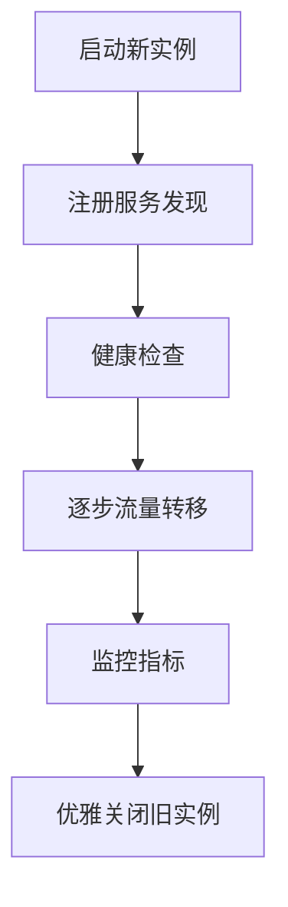

# 服务端热更新机制

## 1. 概述

本文档详细描述了Cube游戏平台的服务端热更新机制，采用实例级别的蓝绿部署策略，实现真正意义上的零停机更新。

## 2. 设计理念

### 2.1 核心思想
- **HTTP Server**: 无状态服务，通过负载均衡实现无缝切换
- **Game Server**: 有状态服务，通过客户端重连实现平滑迁移
- **渐进式部署**: 逐步转移流量，降低风险
- **快速回滚**: 出现问题时能够快速恢复到稳定版本

### 2.2 架构原则
- 高可用性：任何时刻都有可用的服务实例
- 数据一致性：确保状态迁移过程中的数据完整性
- 客户端透明：对终端用户尽可能透明的更新体验

## 3. HTTP Server 热更新

### 3.1 更新流程



### 3.2 核心组件

#### 3.2.1 HttpServerManager
```csharp
public class HttpServerManager
{
    private readonly LoadBalancer _loadBalancer;
    private readonly ServiceDiscovery _serviceDiscovery;
    private readonly HealthChecker _healthChecker;

    public async Task DeployNewHttpServer(HttpServerConfig config)
    {
        // 1. 启动新的HTTP服务器实例
        var newServer = await StartNewHttpServerInstance(config);
        
        // 2. 注册到服务发现
        await _serviceDiscovery.RegisterService(newServer);
        
        // 3. 等待健康检查通过
        await WaitForHealthy(newServer);
        
        // 4. 逐步转移流量
        await GradualTrafficShift(newServer);
        
        // 5. 优雅关闭旧实例
        await GracefulShutdownOldInstances();
    }
}
```

#### 3.2.2 负载均衡策略
```csharp
public class SmartLoadBalancer
{
    public ServerInstance SelectServer(RequestContext context)
    {
        // 基于权重的随机选择算法
        var availableServers = GetHealthyServers();
        var totalWeight = availableServers.Sum(s => s.Weight);
        var randomValue = _random.Next(totalWeight);
        
        // 权重分配逻辑
        return SelectByWeight(availableServers, randomValue);
    }
}
```

### 3.3 流量转移机制

**渐进式流量转移**：
- 0-30秒：新实例10%权重，旧实例90%权重
- 30-60秒：新实例20%权重，旧实例80%权重
- ...逐步递增...
- 270-300秒：新实例100%权重，旧实例0%权重

## 4. Game Server 热更新

### 4.1 房间级更新策略

### 4.1.1 新房间分配
```csharp
public class GameManager
{
    public async Task<GameServerAssignment> AssignGameServerForNewRoom(
        RoomCreationRequest request)
    {
        // 查找最适合的服务器
        var suitableServer = await FindSuitableServer(request);
        
        if (suitableServer == null)
        {
            // 启动新的游戏服务器实例
            suitableServer = await LaunchNewGameServer(request);
        }

        // 分配房间到服务器
        var roomId = await _roomManager.CreateRoom(request);
        await AssignRoomToServer(roomId, suitableServer);
        
        return new GameServerAssignment
        {
            ServerAddress = suitableServer.Address,
            ServerPort = suitableServer.Port,
            RoomId = roomId
        };
    }
}
```

### 4.1.2 现有房间迁移
```csharp
public async Task<GameServerAssignment> MigrateRoomToNewServer(string roomId)
{
    // 1. 启动目标服务器
    var newServer = await LaunchNewGameServer(roomRequest);
    
    // 2. 通知客户端准备重连
    await NotifyClientsRoomMigration(roomId, newServer);
    
    // 3. 等待客户端重连
    await WaitForClientMigration(roomId, newServer);
    
    // 4. 迁移游戏状态
    await MigrateGameState(roomId, currentServer, newServer);
    
    // 5. 更新分配关系
    await AssignRoomToServer(roomId, newServer);
    
    return new Assignment { /* 新服务器信息 */ };
}
```

### 4.2 客户端重连机制

#### 4.2.1 迁移通知协议
```json
{
  "type": "SERVER_MIGRATION",
  "data": {
    "reason": "SERVER_UPGRADE",
    "new_server": {
      "address": "192.168.1.100",
      "port": 8888,
      "instance_id": "gameserver-v2-abc123"
    },
    "migration_deadline": "2026-02-06T10:30:00Z",
    "game_state_snapshot": "{...}"
  }
}
```

#### 4.2.2 重连处理流程
```csharp
public class ClientReconnectionHandler
{
    public async Task HandleMigrationReconnection(
        ClientConnection client, 
        MigrationInfo migrationInfo)
    {
        // 1. 发送迁移通知
        await SendMigrationNotification(client, migrationInfo);
        
        // 2. 等待客户端断开旧连接
        await WaitForClientDisconnect(client);
        
        // 3. 等待新连接建立
        var newConnection = await WaitForNewConnection(
            migrationInfo.NewServerAddress,
            migrationInfo.NewServerPort,
            client.UserId);
            
        // 4. 恢复游戏状态
        await RestoreClientGameState(newConnection, migrationInfo.RoomState);
        
        return newConnection;
    }
}
```

## 5. 服务发现与健康检查

### 5.1 Consul集成
```csharp
public class ServiceDiscovery
{
    public async Task RegisterService(ServerInstance instance)
    {
        var registration = new AgentServiceRegistration
        {
            ID = instance.InstanceId,
            Name = instance.ServiceName,
            Address = instance.Host,
            Port = instance.Port,
            Tags = new[] { 
                $"version={instance.Version}", 
                $"env={instance.Environment}" 
            },
            Check = new AgentServiceCheck
            {
                HTTP = $"http://{instance.Host}:{instance.Port}/health",
                Interval = TimeSpan.FromSeconds(10),
                Timeout = TimeSpan.FromSeconds(5)
            }
        };

        await _consul.Agent.ServiceRegister(registration);
    }
}
```

### 5.2 主动健康检查
```csharp
public class HealthChecker
{
    public async Task<bool> CheckServerHealth(ServerInstance server)
    {
        try
        {
            using var client = new HttpClient();
            var response = await client.GetAsync(
                $"http://{server.Host}:{server.Port}/health");
            
            return response.IsSuccessStatusCode;
        }
        catch
        {
            return false;
        }
    }
}
```

## 6. 部署自动化

### 6.1 Linux平台部署架构

采用外部网关负载均衡 + Linux原生部署的方式：

```
外部请求 → Nginx负载均衡器 → [旧HTTP Server | 新HTTP Server]
                              ↘
                               ↘ 客户端 ←→ [旧Game Server | 新Game Server]
```

### 6.2 HTTP Server部署策略

**Nginx权重配置更新**：
```nginx
# /etc/nginx/conf.d/httpserver.conf
upstream http_backend {
    server old-httpserver:8080 weight=0;  # 旧服务权重
    server new-httpserver:8080 weight=100; # 新服务权重
}

server {
    listen 80;
    location / {
        proxy_pass http://http_backend;
        proxy_set_header Host $host;
        proxy_set_header X-Real-IP $remote_addr;
    }
}
```

**权重调整脚本**：
```bash
#!/bin/bash
# update_http_weights.sh

NEW_WEIGHT=$1
OLD_WEIGHT=$((100 - NEW_WEIGHT))

# 更新Nginx配置
cat > /etc/nginx/conf.d/httpserver.conf << EOF
upstream http_backend {
    server old-httpserver:8080 weight=${OLD_WEIGHT};
    server new-httpserver:8080 weight=${NEW_WEIGHT};
}
EOF

# 重新加载Nginx配置
nginx -s reload

echo "HTTP Server权重已更新: 新服务${NEW_WEIGHT}%, 旧服务${OLD_WEIGHT}%"
```

### 6.3 Game Server部署策略

**服务实例管理模式**：
```csharp
public class GameServerDeploymentManager
{
    private readonly Dictionary<string, GameServerInstance> _servers = new();
    
    public async Task DeployNewGameServer(GameServerConfig config)
    {
        // 1. 启动新的游戏服务器实例
        var newInstance = await LaunchLinuxGameServer(config);
        
        // 2. 注册到服务发现
        await RegisterGameServer(newInstance);
        
        // 3. 等待健康检查通过
        await WaitForGameServerHealth(newInstance);
        
        // 4. 更新服务状态为可用
        await MarkServerAsReady(newInstance.InstanceId);
    }
    
    public async Task<GameServerAssignment> GetOptimalServer(ClientContext context)
    {
        // 优先返回新服务器，除非玩家在关键玩法中
        var newServers = GetReadyNewServers();
        var oldServers = GetActiveOldServersWithPlayers();
        
        // 检查玩家是否在关键玩法中
        if (await IsPlayerInCriticalGameplay(context.PlayerId))
        {
            // 保持在当前服务器
            return await GetCurrentPlayerServer(context.PlayerId);
        }
        
        // 分配到新服务器
        return await AssignToNewServer(context, newServers);
    }
}
```

### 6.4 客户端连接策略

**渐进式服务器切换**：
```csharp
public class ClientConnectionStrategy
{
    public async Task HandleServerTransition(ClientSession session)
    {
        // 1. 检查是否有新的可用服务器
        var newServerAvailable = await CheckNewServerAvailability();
        if (!newServerAvailable) return;
        
        // 2. 检查玩家当前状态
        var playerState = await GetPlayerGameState(session.PlayerId);
        
        // 3. 关键玩法保护
        if (playerState.IsInCriticalGameplay)
        {
            // 延迟切换直到关键玩法结束
            await SchedulePostGameplayTransition(session);
            return;
        }
        
        // 4. 触发服务器切换
        await InitiateServerTransition(session);
    }
    
    private async Task<bool> IsPlayerInCriticalGameplay(long playerId)
    {
        // 检查玩家是否在以下状态：
        // - 正在进行战斗
        // - 正在解谜
        // - 正在参与BOSS战
        // - 正在进行关键剧情
        
        var gameState = await _gameStateManager.GetPlayerGameState(playerId);
        return gameState.CurrentPhase switch
        {
            GamePhase.Combat => true,
            GamePhase.PuzzleSolving => true,
            GamePhase.BossFight => true,
            GamePhase.CriticalStory => true,
            _ => false
        };
    }
}
```

### 6.5 部署流程脚本

**完整部署脚本**：
```bash
#!/bin/bash
# deploy_services.sh

DEPLOY_TYPE=$1  # httpserver 或 gameserver
NEW_VERSION=$2

# 基础部署函数
deploy_service() {
    local service_name=$1
    local version=$2
    local port=$3
    
    echo "部署 ${service_name} 版本 ${version}"
    
    # 1. 构建并部署服务
    dotnet publish -c Release -o /opt/${service_name}/${version}
    
    # 2. 启动新实例
    systemctl start ${service_name}@${version}
    
    # 3. 等待服务就绪
    until curl -f http://localhost:${port}/health; do
        sleep 5
    done
    
    echo "${service_name} ${version} 部署完成"
}

# HTTP Server部署
if [ "$DEPLOY_TYPE" = "httpserver" ]; then
    deploy_service "httpserver" "$NEW_VERSION" "8080"
    
    # 逐步调整Nginx权重
    for weight in 10 30 50 70 90 100; do
        ./update_http_weights.sh $weight
        sleep 60  # 每分钟调整一次
    done
    
    # 关闭旧服务
    systemctl stop httpserver@old-version
fi

# Game Server部署
if [ "$DEPLOY_TYPE" = "gameserver" ]; then
    deploy_service "gameserver" "$NEW_VERSION" "8888"
    
    # 新服务器开始接收新房间
    echo "新Game Server已上线，将接收新的房间请求"
fi

echo "部署流程完成"
```

## 7. 监控与告警

### 7.1 关键监控指标
```csharp
public class DeploymentMetrics
{
    public double ErrorRate { get; set; }        // 错误率
    public double ResponseTime { get; set; }     // 平均响应时间
    public int HealthyInstances { get; set; }    // 健康实例数
    public int TotalInstances { get; set; }      // 总实例数
    public double CPUUsage { get; set; }         // CPU使用率
    public double MemoryUsage { get; set; }      // 内存使用率
}
```

### 7.2 自动回滚条件
当满足以下任一条件时触发自动回滚：
- 错误率 > 5%
- 响应时间 > 1000ms
- 健康实例比例 < 80%
- CPU使用率 > 90%

### 7.3 告警机制
```csharp
public class AlertManager
{
    public async Task SendAlert(string alertType, object metrics)
    {
        var alert = new AlertMessage
        {
            Type = alertType,
            Severity = DetermineSeverity(metrics),
            Timestamp = DateTime.UtcNow,
            Metrics = metrics,
            Recipients = new[] { "ops-team@company.com", "dev-team@company.com" }
        };

        // 发送邮件、短信、Slack通知
        await SendEmailAlert(alert);
        await SendSMSAlert(alert);
        await SendSlackAlert(alert);
    }
}
```

## 8. 回滚机制

### 8.1 快速回滚流程
```csharp
public class RollbackManager
{
    public async Task<bool> RollbackToPreviousVersion(string service, string currentVersion)
    {
        try
        {
            // 1. 获取上一个稳定版本
            var previousVersion = await GetStableVersion(service, currentVersion);
            
            // 2. 启动回滚部署
            await DeployVersion(service, previousVersion);
            
            // 3. 快速转移全部流量
            await ShiftAllTrafficToVersion(service, previousVersion);
            
            // 4. 关闭问题版本
            await ShutdownVersion(service, currentVersion);
            
            return true;
        }
        catch (Exception ex)
        {
            LogUtils.Error("回滚失败", ex);
            return false;
        }
    }
}
```

### 8.2 数据状态恢复
```csharp
public class StateRecovery
{
    public async Task RecoverGameState(string roomId, GameStateSnapshot snapshot)
    {
        // 恢复房间状态
        await _roomManager.RestoreRoomState(roomId, snapshot.RoomData);
        
        // 恢复玩家状态
        foreach (var playerState in snapshot.PlayerStates)
        {
            await _playerManager.RestorePlayerState(playerState);
        }
        
        // 恢复游戏进度
        await _gameLogic.RestoreGameProgress(snapshot.GameProgress);
    }
}
```

## 9. 最佳实践

### 9.1 部署前检查清单
- [ ] 代码通过所有自动化测试
- [ ] 性能基准测试完成
- [ ] 数据库迁移脚本准备就绪
- [ ] 配置文件版本兼容性验证
- [ ] 回滚方案测试通过
- [ ] Nginx配置模板验证
- [ ] Linux systemd服务文件准备
- [ ] 关键玩法状态检测逻辑验证

### 9.2 部署时机建议
- **HTTP Server**: 可在业务低峰期随时部署
- **Game Server**: 建议在凌晨2-6点部署，避免影响玩家体验
- 预留充足的部署时间窗口（至少2小时）
- 确保运维团队在线支持

### 9.3 风险控制措施
- **HTTP Server**: 采用Nginx权重渐进式切换（10%→30%→50%→70%→90%→100%）
- **Game Server**: 新旧服务器并行运行，关键玩法期间禁止强制切换
- 设置自动回滚阈值（错误率>5%或响应时间>1000ms）
- 准备应急预案和手动回滚脚本
- 保持开发和运维团队沟通渠道畅通

### 9.4 关键玩法保护策略
```csharp
public enum CriticalGameplayPhase
{
    None = 0,
    Combat = 1,           // 战斗阶段
    PuzzleSolving = 2,    // 解谜阶段
    BossFight = 3,        // BOSS战
    CriticalStory = 4,    // 关键剧情
    TeamCoordination = 5  // 团队协作
}

public class GameplayProtectionManager
{
    public async Task<bool> ShouldDelayServerTransition(long playerId)
    {
        var gameState = await _gameStateManager.GetPlayerGameState(playerId);
        
        // 在以下情况下延迟服务器切换
        return gameState.CurrentPhase switch
        {
            GamePhase.Combat => true,
            GamePhase.PuzzleSolving when gameState.TimeRemaining < 300 => true,
            GamePhase.BossFight => true,
            GamePhase.CriticalStory => true,
            GamePhase.TeamCoordination when IsTeamInProgress(gameState) => true,
            _ => false
        };
    }
}
```

## 10. 故障排除

### 10.1 常见问题及解决方案

**问题1：Nginx权重配置更新失败**
```
解决方案：
1. 检查Nginx配置文件语法：nginx -t
2. 验证systemctl nginx reload权限
3. 确认脚本执行权限：chmod +x update_http_weights.sh
4. 查看Nginx错误日志：/var/log/nginx/error.log
```

**问题2：Linux服务启动失败**
```
解决方案：
1. 检查systemd服务文件配置
2. 验证dotnet运行时环境
3. 查看服务日志：journalctl -u httpserver@version
4. 确认端口占用情况：netstat -tlnp
```

**问题3：Game Server新旧实例切换异常**
```
解决方案：
1. 检查关键玩法状态检测逻辑
2. 验证玩家会话状态同步
3. 确认房间分配策略配置
4. 查看游戏状态管理日志
```

**问题4：客户端延迟切换策略失效**
```
解决方案：
1. 验证CriticalGameplayPhase枚举配置
2. 检查游戏状态检测接口响应
3. 确认客户端重连超时设置
4. 查看玩家状态缓存一致性
```

**问题5：健康检查持续失败**
```
解决方案：
1. 确认服务监听端口正确
2. 检查防火墙规则
3. 验证健康检查接口实现
4. 确认Linux防火墙配置：ufw status
```

### 10.2 应急处理流程
1. **立即停止流量转移**
2. **启动备用实例**
3. **执行快速回滚**
4. **通知相关人员**
5. **记录事故报告**

## 11. 附录

### 11.1 相关配置文件模板

**appsettings.Production.json**
```json
{
  "Deployment": {
    "HealthCheckInterval": "10s",
    "TrafficShiftInterval": "30s",
    "MaxErrorRate": 0.05,
    "MaxResponseTimeMs": 1000
  },
  "LoadBalancer": {
    "Algorithm": "weighted-round-robin",
    "HealthThreshold": 0.8
  }
}
```

### 11.2 API接口文档

**部署状态查询**
```
GET /api/deployment/status/{service}
Response: { "version": "v1.2.1", "status": "deploying", "progress": 45 }
```

**手动触发回滚**
```
POST /api/deployment/rollback/{service}
Body: { "targetVersion": "v1.2.0" }
```

---
**文档版本**: v1.0  
**最后更新**: 2026-02-06  
**作者**: 系统架构团队