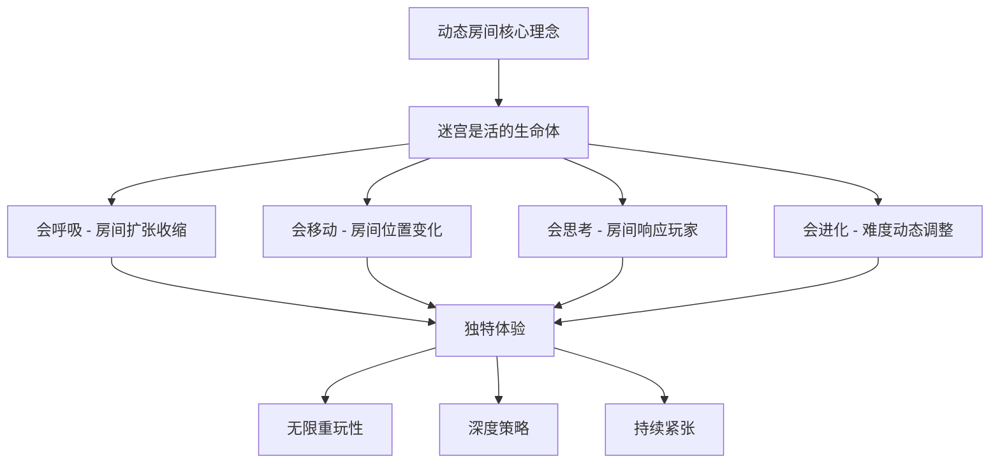
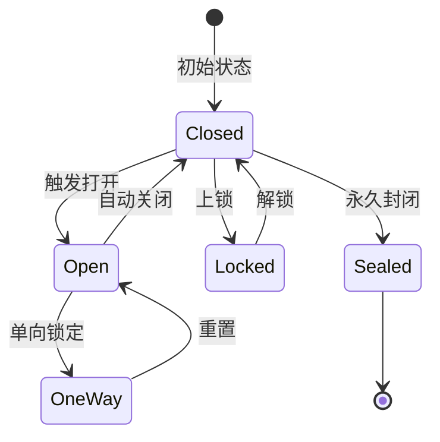
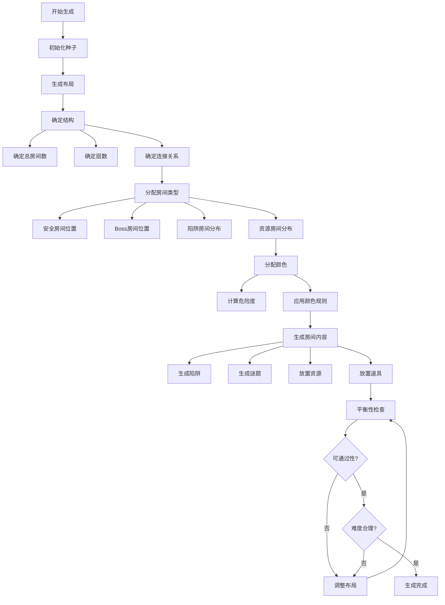
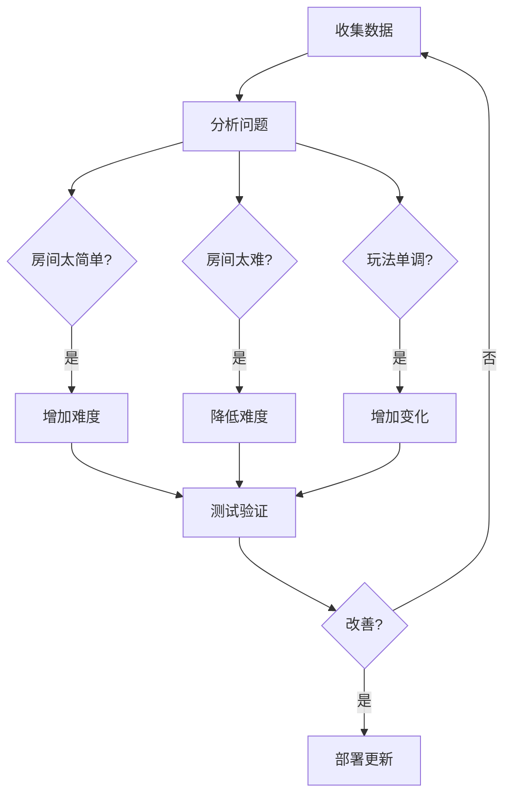

# Cube - 动态房间系统设计

## 文档信息
- **文档类型**：游戏设计文档
- **版本**：1.0
- **创建日期**：2026-01-22
- **最后更新**：2026-01-22
- **状态**：定稿
- **负责人**：关卡设计团队
- **所属模块**：核心玩法系统

---

## 目录

1. [核心概念](#1-核心概念)
2. [房间基础设计](#2-房间基础设计)
3. [动态变化机制](#3-动态变化机制)
4. [房间类型详解](#4-房间类型详解)
5. [玩法创新设计](#5-玩法创新设计)
6. [房间生成算法](#6-房间生成算法)
7. [平衡性设计](#7-平衡性设计)
8. [技术实现](#8-技术实现)

---

## 1. 核心概念

### 1.1 什么是动态房间？

**定义**：动态房间是指在游戏过程中，房间的状态、功能、甚至结构会发生变化的游戏空间单元。

**与传统关卡的区别**：

| 特性 | 传统关卡 | 动态房间系统 |
|------|---------|-------------|
| 地形 | 固定不变 | 可能移动、旋转、重组 |
| 陷阱 | 静态触发 | 动态激活、移动、变化 |
| 连接 | 固定通道 | 通道可能打开/关闭/重新连接 |
| 功能 | 单一用途 | 功能可能随时间或条件改变 |
| 可预测性 | 完全可记忆 | 需要实时判断 |
| 策略性 | 固定路线 | 需要动态调整策略 |

### 1.2 设计目标

**核心目标**：
1. 🎯 **提供无限重玩性**：每局游戏都是独特体验
2. 🧠 **增强策略深度**：玩家需要实时判断和调整
3. 😱 **营造紧张氛围**：不可预测的环境威胁
4. 🤝 **促进团队协作**：共同应对动态变化
5. 🎬 **忠于原作精神**：呼应《Cube》电影的核心设定

**体验目标**：
- 玩家永远不知道下一个房间是什么
- 环境本身成为"敌人"
- 适应能力比记忆力更重要
- 团队需要实时沟通和协作

### 1.3 设计哲学

**"迷宫是活的"**



**三大支柱**：

1. **程序化生成** - 每局不同
2. **实时变化** - 持续威胁
3. **智能响应** - 动态平衡

---

## 2. 房间基础设计

### 2.1 房间物理结构

#### 标准立方体房间

**基础尺寸**：
```
长度：10 米
宽度：10 米
高度：10 米
总体积：1000 立方米
```

**六个面定义**：
```
上面（Top）    - 可能有通道连接上层
下面（Bottom） - 可能有通道连接下层
前面（Front）  - X轴正方向
后面（Back）   - X轴负方向
左面（Left）   - Z轴负方向
右面（Right）  - Z轴正方向
```

**门的位置**：
- 每个面的中心（5m, 5m）
- 标准门尺寸：2m × 2m
- 门可以是：开启、关闭、锁定、单向、需要钥匙

#### 特殊房间尺寸

| 房间类型 | 尺寸 | 用途 |
|---------|------|------|
| 标准房间 | 10×10×10m | 大多数房间 |
| 大型房间 | 20×20×10m | Boss战、特殊事件 |
| 走廊房间 | 20×5×10m | 连接通道 |
| 垂直房间 | 10×10×20m | 垂直移动 |
| 微型房间 | 5×5×5m | 单人挑战 |

### 2.2 房间颜色编码系统

**呼应电影设定**，使用颜色暗示房间危险程度：

#### 主色调系统

```
🔵 蓝色房间（Blue）
├─ 含义：相对安全
├─ 陷阱概率：0-10%
├─ 功能：安全区、休息点、资源补给
└─ 玩家反馈："可以稍微放松"

🟢 绿色房间（Green）
├─ 含义：轻度危险
├─ 陷阱概率：10-30%
├─ 功能：标准房间、轻度谜题
└─ 玩家反馈："保持警惕"

🟡 黄色房间（Yellow）
├─ 含义：中度危险
├─ 陷阱概率：30-50%
├─ 功能：中等陷阱、战斗区域
└─ 玩家反馈："小心前进"

🟠 橙色房间（Orange）
├─ 含义：高度危险
├─ 陷阱概率：50-75%
├─ 功能：复杂陷阱、困难谜题
└─ 玩家反馈："极度危险"

🔴 红色房间（Red）
├─ 含义：致命威胁
├─ 陷阱概率：75-100%
├─ 功能：死亡陷阱、极限挑战
└─ 玩家反馈："可能立即死亡"

⚪ 白色房间（White）
├─ 含义：未知/随机
├─ 陷阱概率：？？？
├─ 功能：完全随机
└─ 玩家反馈："无法预测"

⚫ 黑色房间（Black）
├─ 含义：特殊事件
├─ 陷阱概率：特殊
├─ 功能：Boss房、剧情房、隐藏房
└─ 玩家反馈："独特体验"
```

#### 颜色组合规则

**单色房间**：
- 墙壁、天花板、地板同一色系
- 清晰的危险提示

**双色房间**（更复杂）：
- 墙壁和地板不同颜色
- 表示混合特性
- 例如：绿色墙壁 + 红色地板 = 地面有致命陷阱

**彩虹房间**（稀有）：
- 六个面不同颜色
- 极其罕见
- 包含所有类型的挑战
- 高奖励

### 2.3 房间坐标系统

**呼应电影中的数学元素**

#### 三维坐标

每个房间有唯一坐标：`(X, Y, Z)`

```
例如：
(0, 0, 0)   - 起始房间
(1, 0, 0)   - 向X正方向的第一个房间
(0, 1, 0)   - 向Y正方向的第一个房间（上一层）
(5, 3, -2)  - 复杂位置
```

#### 坐标意义（电影呼应）

**质数坐标规则**：
```python
# 伪代码
def is_prime_coordinate(x, y, z):
    return is_prime(x) or is_prime(y) or is_prime(z)

# 质数坐标的房间更危险
if is_prime_coordinate(room.x, room.y, room.z):
    room.danger_level += 2
    room.trap_probability *= 1.5
```

**特殊坐标组合**：
- `(0, 0, 0)` - 起始点，总是安全
- `(X, Y, Z)` 三个坐标都是质数 - 极度危险
- `(X, Y, Z)` 坐标和是完全平方数 - 隐藏奖励
- `(X, Y, Z)` 坐标积是立方数 - 特殊房间

**玩家可见信息**：
- 进入房间时显示坐标
- 可以通过装备/技能查看周围房间坐标
- 数学好的玩家可以预判危险

---

## 3. 动态变化机制

### 3.1 房间移动系统

**核心创新**：房间本身会移动和旋转

#### 移动类型

**1. 平移移动**
```
房间整体在迷宫中移动位置

触发条件：
- 定时触发（每5分钟）
- 玩家离开房间后
- 特定事件触发

视觉效果：
- 房间震动
- 墙壁移动声效
- 灯光闪烁

玩家影响：
- 原本规划的路线失效
- 需要重新导航
- 可能突然连接新区域
```

**2. 旋转变化**
```
房间绕轴旋转90°/180°/270°

旋转轴：
- X轴旋转 - 前后翻转
- Y轴旋转 - 左右旋转
- Z轴旋转 - 上下翻转

效果：
- 重力方向可能改变
- 门的连接关系改变
- 陷阱位置改变
```

**3. 交换位置**
```
两个房间互换位置

触发：
- 特殊机关激活
- 随机事件
- Boss技能

战术价值：
- 可以把队友传送过来
- 可以把敌人传送走
- 改变战场地形
```

### 3.2 门的动态系统

**门不是静态的**

#### 门的状态



#### 门的动态变化

**1. 定时门**
```
特性：
- 每30秒打开/关闭一次
- 有倒计时显示
- 关闭时无法通过

战术运用：
- 需要计算通过时机
- 可以困住敌人
- 团队需要同步行动
```

**2. 感应门**
```
特性：
- 检测玩家数量
- 可能需要特定角色
- 可能需要特定物品

变化规则：
- 单人无法通过，需要团队
- 检测敌对玩家则关闭
- 特定条件下改变连接
```

**3. 陷阱门**
```
特性：
- 外观正常
- 通过时触发陷阱
- 可能是单向陷阱

危险等级：
- 轻度：减速、扣血
- 中度：传送到危险区
- 重度：直接大量伤害
```

**4. 传送门**
```
特性：
- 不连接相邻房间
- 传送到随机/指定位置
- 可能是单向

战术价值：
- 快速移动
- 逃生通道
- 突袭敌人
```

### 3.3 陷阱的动态变化

#### 激活模式

**1. 延迟激活**
```
进入房间时陷阱未激活
10-30秒后突然激活

目的：
- 打破安全感
- 制造突然威胁
- 阻止逃跑路线
```

**2. 连锁激活**
```
触发一个陷阱导致其他陷阱激活

模式：
- 多米诺效应
- 扩散型激活
- 房间级别连锁

应对：
- 需要预判连锁
- 快速逃离
- 利用连锁攻击敌人
```

**3. 循环模式**
```
陷阱按照固定/随机模式循环

类型：
- 激光网格循环扫描
- 地刺循环弹出
- 毒气循环喷射

策略：
- 观察周期
- 计算时机
- 寻找安全点
```

**4. 自适应陷阱**
```
陷阱会根据玩家行为调整

机制：
- 玩家停留时间越长越危险
- 检测到多个玩家加强威力
- 玩家受伤后降低难度（可选）

目的：
- 防止消极游戏
- 鼓励快速决策
- 动态难度平衡
```

### 3.4 环境动态变化

#### 物理环境变化

**1. 重力变化**
```
房间重力方向突然改变

变化类型：
- 反重力（天花板变地板）
- 侧向重力（墙壁变地板）
- 零重力（漂浮状态）
- 高重力（移动困难）

战术影响：
- 完全改变战斗方式
- 需要重新定位
- 某些技能失效/增强
```

**2. 空间扭曲**
```
房间空间被扭曲变形

效果：
- 彭罗斯阶梯效应
- 视觉欺骗
- 无限走廊错觉
- 空间折叠

解法：
- 数学计算真实路径
- 特殊道具显示真相
- 侦察技能破除幻象
```

**3. 温度变化**
```
房间温度剧烈变化

变化类型：
- 极寒（-50°C）：移动减速，持续掉血
- 极热（+150°C）：视野模糊，持续掉血
- 急速变化：热胀冷缩破坏装备

应对：
- 特定装备抵抗
- 技能短暂免疫
- 快速通过
```

**4. 氧气变化**
```
房间氧气含量变化

模式：
- 逐渐耗尽
- 突然抽空
- 有毒气体替代

影响：
- 视野逐渐缩小
- 移动速度降低
- 生命值下降
- 技能冷却延长

策略：
- 携带氧气装备
- 快速行动
- 寻找氧气补给点
```

---

## 4. 房间类型详解

### 4.1 基础功能房间

#### 安全房间（Safe Room）

**特征**：
- 🔵 蓝色标识
- 无陷阱威胁
- 敌人无法进入（保护机制）
- 资源补给点

**功能**：
```
休息恢复：
- 生命值缓慢回复
- 技能冷却加速
- 状态异常清除

战术准备：
- 团队集合点
- 策略讨论
- 装备整理

时间限制：
- 最多停留3分钟
- 超时会被强制驱逐
- 安全门关闭
```

**动态要素**：
- 位置每局随机生成
- 数量有限（地图总房间的5-10%）
- 后期可能变少（增加压力）

---

#### 资源房间（Resource Room）

**特征**：
- 🟢 绿色标识
- 包含装备、道具、货币
- 可能有轻度陷阱保护
- 竞争热点

**资源类型**：

**1. 装备房间**
```
包含内容：
- 武器升级材料
- 防具
- 特殊道具

分布规则：
- 品质随机（白<绿<蓝<紫<橙）
- 越危险区域品质越高
- 首次发现额外奖励
```

**2. 补给房间**
```
包含内容：
- 生命药水
- 能量药水
- 临时增益
- 弹药补给

刷新机制：
- 拾取后不再生成
- 或定时刷新（5分钟）
- 多队伍竞争
```

**3. 钥匙房间**
```
包含内容：
- 特殊房间钥匙
- 传送门激活钥匙
- Boss房钥匙

特殊性：
- 全局唯一
- 拾取后全服广播
- 成为被追杀目标
```

**动态陷阱**：
- 假宝箱（触发陷阱）
- 拾取后房间锁定
- 引来怪物守卫
- 触发其他房间变化

---

#### 谜题房间（Puzzle Room）

**特征**：
- 🟡 黄色标识
- 必须解谜才能通过
- 失败可能触发惩罚
- 成功获得奖励

**谜题类型**：

**1. 数学谜题（呼应电影）**
```
质数识别谜题：
- 房间显示一组数字
- 玩家必须找出所有质数
- 按顺序激活对应按钮
- 时间限制：60秒

难度分级：
- 简单：10以内质数
- 中等：100以内质数
- 困难：需要计算大数
```

**2. 空间谜题**
```
立方体旋转：
- 房间内有虚拟立方体
- 需要旋转到特定形态
- 6个面上有图案
- 完成后门打开

协作版本：
- 4个玩家控制不同轴
- 必须同步操作
- 考验团队沟通
```

**3. 逻辑谜题**
```
符号推理：
- 墙上显示符号序列
- 找出规律预测下一个
- 在多个选项中选择

记忆谜题：
- 短暂显示图案
- 图案消失后复现
- 错误触发陷阱
```

**4. 反应谜题**
```
西蒙游戏：
- 按钮按特定顺序闪烁
- 玩家需要复现
- 难度递增

音乐节奏：
- 跟随节奏按按钮
- 完美通过额外奖励
```

**动态变化**：
- 解谜期间房间可能变化
- 倒计时增加压力
- 失败次数过多提示答案
- 队友可以提供帮助

---

### 4.2 陷阱房间

#### 激光房间（Laser Room）

**电影经典场景再现**

**基础设计**：
```
激光类型：
1. 网格激光
   - 横纵交叉的激光网
   - 需要计算通过路径
   - 触碰即死

2. 扫描激光
   - 激光束缓慢扫过房间
   - 需要躲避或跳跃
   - 速度逐渐加快

3. 随机激光
   - 激光随机出现
   - 无规律可循
   - 考验反应速度

4. 追踪激光
   - 锁定玩家位置
   - 自动追踪
   - 需要快速移动
```

**动态变化**：
```
激活模式：
- 进入时关闭，5秒后激活
- 间歇性开启/关闭
- 触发其他机关后激活

变化模式：
- 激光图案动态变化
- 速度逐渐加快
- 激光密度增加
- 颜色变化表示威力
```

**破解方法**：
1. **计算路径**：观察激光规律，寻找安全通道
2. **技能通过**：使用闪现、无敌等技能
3. **道具辅助**：反射镜、护盾等
4. **团队协作**：一人关闭机关，其他人通过

---

#### 机械陷阱房间（Mechanical Trap Room）

**旋转刀片、压缩墙壁等物理陷阱**

**陷阱类型**：

**1. 旋转刀片**
```
配置：
- 天花板/地面的旋转刀片
- 可见或隐藏
- 固定速度或变速

模式：
- 单向旋转
- 往复旋转
- 多个刀片同步/异步

通过方法：
- 计算时机穿过缝隙
- 贴墙边小心移动
- 破坏控制装置
```

**2. 压缩墙壁**
```
设定：
- 墙壁逐渐合拢
- 从10m压缩到1m
- 时间：30-60秒

变化：
- 速度不均匀
- 突然加速
- 假装停止后继续

逃生：
- 快速通过门
- 寻找安全凹槽
- 炸开墙壁（消耗道具）
```

**3. 地刺陷阱**
```
特点：
- 地面弹出尖刺
- 随机或规律出现
- 造成大量伤害

模式：
- 全覆盖：所有地板危险
- 网格：特定位置安全
- 扩散：从中心向外扩散
- 追踪：跟随玩家位置

应对：
- 跳跃躲避
- 预判安全点
- 飞行能力
```

**4. 下落地板**
```
机制：
- 踩上去的地板会下落
- 掉入下层（危险区）
- 或掉入虚空（死亡）

变化：
- 延迟下落（1-3秒）
- 连锁下落
- 可恢复/不可恢复

策略：
- 快速移动
- 远程探测
- 飞行角色优势
```

---

#### 环境杀伤房间

**1. 酸液房间**
```
环境：
- 房间部分/全部充满酸液
- 绿色发光液体
- 持续腐蚀伤害

变化：
- 酸液水位上升/下降
- 酸液从墙壁喷射
- 地面突然涌出酸液

安全措施：
- 高台/平台
- 防护装备
- 特殊路径
```

**2. 火焰房间**
```
环境：
- 火焰喷射器
- 熔岩流动
- 高温环境

模式：
- 定时喷射
- 火墙移动
- 地面燃烧

防护：
- 隔热装备
- 冰系技能
- 快速通过
```

**3. 电击房间**
```
环境：
- 通电地板/墙壁
- 电弧在空间中跳跃
- 电磁脉冲干扰

效果：
- 麻痹效果
- 技能冷却延长
- 电子设备失效

应对：
- 绝缘装备
- 短路机关
- 特定路径
```

---

### 4.3 特殊功能房间

#### Boss房间（Boss Room）

**特征**：
- ⚫ 黑色标识
- 巨大空间（20×20×10m）
- 需要特殊钥匙或条件进入
- 高难度，高奖励

**Boss类型**：

**1. 环境Boss**
```
概念：房间本身就是Boss

特性：
- 房间会攻击玩家
- 墙壁会移动追击
- 陷阱全部激活
- 需要破坏控制核心

阶段：
- 阶段1：缓慢移动
- 阶段2：加速，增加陷阱
- 阶段3：狂暴，快速变化
```

**2. 守卫Boss**
```
概念：巨型机械守卫

特性：
- 强大的攻击力
- 特殊技能
- 会利用房间陷阱
- 击败获得大量奖励

战斗：
- 需要团队配合
- 利用环境反击
- 多阶段战斗
```

**3. 逃脱Boss**
```
概念：无法战胜，只能逃脱

特性：
- 不可击败的威胁
- 持续追击玩家
- 需要在限时内逃出
- 增加紧张感

机制：
- 打开逃生通道
- 解谜同时躲避
- 团队掩护
```

---

#### 传送房间（Portal Room）

**特征**：
- ⚪ 白色标识
- 包含传送门
- 快速移动的方式
- 可能是陷阱

**传送类型**：

**1. 固定传送**
```
- 连接两个特定房间
- 双向或单向
- 坐标已知
- 战术价值高
```

**2. 随机传送**
```
- 传送到随机位置
- 风险与机遇并存
- 可能到安全区
- 也可能到危险区
```

**3. 集体传送**
```
- 整个队伍一起传送
- 保持队形
- 战术撤退用
```

**4. 陷阱传送**
```
- 外观正常
- 实则传送到陷阱
- 分散队伍
- 隔离单个玩家
```

---

#### 观察房间（Observatory Room）

**创新功能**：信息就是力量

**特征**：
- 包含监视设备
- 可以查看其他房间
- 获取战术信息
- 高战略价值

**功能**：

**1. 地图室**
```
功能：
- 显示部分迷宫地图
- 标记重要房间
- 显示其他队伍位置
- 标记危险区域

限制：
- 信息延迟（30秒前的数据）
- 只显示部分区域
- 使用一次后失效
```

**2. 监控室**
```
功能：
- 实时监控特定房间
- 观察敌人动向
- 窃听语音（如果有）
- 了解陷阱状态

使用：
- 需要在房间内操作
- 占用一名队员
- 可以语音指挥队友
```

**3. 预言室**
```
功能：
- 预测未来房间变化
- 提示即将激活的陷阱
- 警告危险区域
- 显示最佳路线

代价：
- 消耗稀有道具
- 一次性使用
- 信息可能不准确（80%准确率）
```

---

#### 商店房间（Shop Room）

**特征**：
- 安全区域
- 可以购买/交易
- NPC商人存在
- 中立区域（PvP禁止）

**功能**：

**1. 道具商店**
```
出售：
- 生命药水
- 能量药水
- 简单装备
- 钥匙（昂贵）

货币：
- 击杀获得
- 完成目标获得
- 拾取散落货币
```

**2. 升级站**
```
服务：
- 升级装备
- 学习新技能
- 移除负面状态
- 修理损坏装备

费用：
- 根据等级递增
- 稀有材料
```

**3. 情报商人**
```
出售：
- 地图信息
- 敌人位置
- 陷阱提示
- 隐藏房间位置

价格：
- 信息越重要越贵
- 动态定价
```

---

### 4.4 隐藏房间

#### 秘密房间（Secret Room）

**特征**：
- 不显示在正常地图
- 需要特殊方法发现
- 超值奖励
- 成就挑战

**发现方法**：

**1. 破墙发现**
```
- 某些墙壁可以破坏
- 隐藏门的痕迹
- 声音不同
- 特殊工具检测
```

**2. 谜题解锁**
```
- 解开特定谜题组合
- 触发隐藏机关
- 特定顺序操作
```

**3. 坐标计算**
```
- 通过房间坐标推算
- 特殊数学关系
- 呼应电影元素
```

**奖励**：
- 传说级装备
- 大量资源
- 特殊能力
- 独特皮肤

---

## 5. 玩法创新设计

### 5.1 房间记忆系统

**创新点**：房间会"记住"玩家的行为

#### 记忆机制

**个人记忆**：
```
房间记录：
- 你是否触发过陷阱
- 你的移动路径
- 你的停留时间
- 你的失败次数

影响：
- 再次进入时难度调整
- 陷阱可能移位
- 新的挑战出现
- 或者变得更容易（学习辅助）
```

**团队记忆**：
```
房间记录：
- 队伍配合情况
- 失败原因
- 战术使用
- 通过时间

影响：
- 针对性调整难度
- 奖励优秀配合
- 惩罚消极游戏
```

**全局记忆**：
```
跨局记忆：
- 你在这类房间的表现
- 历史通过率
- 最快记录
- 死亡次数

影响：
- 个性化难度
- 排行榜系统
- 成就追踪
- 技能推荐
```

### 5.2 房间链接系统

**创新点**：房间之间的连接关系是动态的

#### 链接类型

**1. 因果链接**
```
机制：
- 在A房间的行为影响B房间

例子：
- A房间激活机关 → B房间门打开
- A房间拿走钥匙 → B房间陷阱激活
- A房间击败Boss → B、C、D房间奖励出现

战术价值：
- 需要规划路线
- 团队分工
- 时机把握
```

**2. 镜像链接**
```
机制：
- 两个房间互为镜像
- 一个房间的变化反映到另一个

特点：
- 对称设计
- 同步变化
- 解谜价值
- 团队分离战术
```

**3. 寄生链接**
```
机制：
- 一个房间的状态依赖另一个

例子：
- 母房间被摧毁 → 子房间陷阱失效
- 核心房间控制多个房间
- 破坏核心影响整个区域
```

### 5.3 玩家塑造房间

**创新点**：玩家可以改变房间状态

#### 改造方式

**1. 物理改造**
```
玩家可以：
- 破坏墙壁创造新通道
- 建造临时障碍物
- 放置陷阱标记
- 改变地形高度

限制：
- 消耗资源
- 时间限制
- 下局重置
```

**2. 机关操控**
```
玩家可以：
- 关闭陷阱
- 激活休眠机关
- 反转门的状态
- 改变房间功能

代价：
- 影响其他房间
- 可能带来新威胁
- 限时操作
```

**3. 留言系统**
```
玩家可以：
- 在房间留下标记
- 警告后来者
- 假情报误导敌人
- 团队通信

机制：
- 符号标记
- 文字留言
- 语音留言
- 全局可见或队伍专属
```

### 5.4 房间共鸣系统

**创新点**：特定房间组合产生特殊效果

#### 共鸣类型

**1. 颜色共鸣**
```
连续通过3个同色房间：
- 蓝蓝蓝 → 全队生命恢复
- 红红红 → 获得狂暴buff
- 绿绿绿 → 获得防护罩
- 黄黄黄 → 获得提示信息
```

**2. 类型共鸣**
```
连续通过特定类型房间：
- 3个谜题房 → 解谜能力提升
- 3个战斗房 → 攻击力提升
- 3个陷阱房 → 闪避能力提升
```

**3. 坐标共鸣**
```
访问特定坐标组合：
- 斐波那契数列坐标
- 完全平方数坐标
- 对称坐标
- 质数坐标

奖励：
- 隐藏房间开启
- 特殊事件触发
- 传说装备
```

---

## 6. 房间生成算法

### 6.1 程序化生成原理

#### 生成流程



### 6.2 关键参数

```javascript
// 房间生成配置
const RoomGenerationConfig = {
    // 基础参数
    totalRooms: 100,              // 总房间数
    layers: 5,                    // 垂直层数
    branchingFactor: 2.5,         // 分支系数
    
    // 房间类型分布（百分比）
    roomTypeDistribution: {
        safe: 0.10,               // 10% 安全房间
        resource: 0.20,           // 20% 资源房间
        puzzle: 0.15,             // 15% 谜题房间
        trap: 0.35,               // 35% 陷阱房间
        boss: 0.05,               // 5% Boss房间
        special: 0.10,            // 10% 特殊房间
        hidden: 0.05              // 5% 隐藏房间
    },
    
    // 颜色分布
    colorDistribution: {
        blue: 0.15,               // 15% 蓝色
        green: 0.30,              // 30% 绿色
        yellow: 0.25,             // 25% 黄色
        orange: 0.15,             // 15% 橙色
        red: 0.10,                // 10% 红色
        white: 0.03,              // 3% 白色
        black: 0.02               // 2% 黑色
    },
    
    // 难度曲线
    difficultyCurve: {
        start: 1.0,               // 起始难度系数
        middle: 1.5,              // 中期难度系数
        end: 2.5,                 // 后期难度系数
        bossMultiplier: 3.0       // Boss难度系数
    },
    
    // 动态变化频率
    dynamicEvents: {
        roomMoveProbability: 0.2,      // 20%概率房间移动
        doorChangeProbability: 0.3,    // 30%概率门状态改变
        trapActivateDelay: 15,         // 15秒后激活陷阱
        environmentChangeInterval: 300  // 5分钟环境变化
    }
};
```

### 6.3 平衡性保证

#### 规则约束

**1. 可达性规则**
```
保证：
- 从起点可以到达至少一个终点
- 至少存在一条完整路径
- 关键房间不能被完全封锁
- Boss房间需要可选钥匙路线

验证：
- 深度优先搜索
- 检查所有必经房间
- 确保有备用路线
```

**2. 难度梯度**
```
保证：
- 难度逐渐递增
- 不出现难度断崖
- 安全房间合理分布
- 新手区域保护

计算：
difficultyScore = baseScore × (1 + distance × 0.1)
```

**3. 资源平衡**
```
保证：
- 资源总量合理
- 分布不过于集中
- 关键物品必定生成
- 稀有度符合预期

监控：
- 每种资源的数量
- 每个区域的资源密度
- 玩家获取的难易程度
```

---

## 7. 平衡性设计

### 7.1 房间难度评估

#### 难度计算公式

```javascript
function calculateRoomDifficulty(room) {
    let difficulty = 0;
    
    // 基础难度：颜色
    difficulty += colorDifficulty[room.color];
    
    // 陷阱难度
    difficulty += room.traps.reduce((sum, trap) => {
        return sum + trap.damageLevel * trap.frequency;
    }, 0);
    
    // 谜题难度
    difficulty += room.puzzles.reduce((sum, puzzle) => {
        return sum + puzzle.complexity * puzzle.timeLimit;
    }, 0);
    
    // 动态变化难度
    difficulty += room.dynamicEvents.length * 0.5;
    
    // 位置修正（距离起点越远越难）
    difficulty *= (1 + room.distanceFromStart * 0.1);
    
    // 质数坐标加成
    if (isPrimeCoordinate(room.x, room.y, room.z)) {
        difficulty *= 1.5;
    }
    
    return difficulty;
}
```

### 7.2 风险回报平衡

#### 设计原则

**高风险 = 高回报**

| 风险等级 | 死亡概率 | 资源品质 | 经验倍率 | 特殊奖励概率 |
|---------|---------|---------|---------|------------|
| 很低（蓝） | 0-5% | 普通 | 1.0x | 5% |
| 低（绿） | 5-15% | 普通-优秀 | 1.2x | 10% |
| 中（黄） | 15-30% | 优秀 | 1.5x | 20% |
| 高（橙） | 30-50% | 优秀-稀有 | 2.0x | 35% |
| 很高（红） | 50-75% | 稀有-史诗 | 3.0x | 50% |
| 极限（黑） | 75-95% | 传说 | 5.0x | 80% |

#### 玩家选择

**稳健路线**：
- 选择蓝/绿色房间
- 避开质数坐标
- 绕远路但安全
- 慢速但稳定发育

**激进路线**：
- 直冲红/黑色房间
- 主动挑战Boss
- 快速获取优势
- 高风险高回报

**混合路线**：
- 根据局势调整
- 评估队伍状态
- 动态选择策略

### 7.3 时间压力机制

#### 缩圈系统（可选）

```
设计目的：
- 防止消极游戏
- 加快游戏节奏
- 制造最终决战

机制：
- 15分钟后开始缩圈
- 安全区逐渐缩小
- 圈外房间变为红色
- 圈外持续掉血

收缩速度：
- 第1圈：5分钟（缩小50%）
- 第2圈：3分钟（缩小25%）
- 第3圈：2分钟（缩小15%）
- 最终圈：5-10个房间
```

#### 事件驱动压力

```
随机事件：
- 全局警报：某个强力Boss被释放
- 环境恶化：氧气逐渐耗尽
- 房间崩塌：部分区域不可进入
- 怪物入侵：AI敌人出现

目的：
- 打破僵局
- 制造变数
- 增加刺激感
```

---

## 8. 技术实现

### 8.1 房间数据结构

```csharp
// 房间类定义
public class CubeRoom
{
    // 基础属性
    public Vector3Int Coordinates { get; set; }  // 坐标(x,y,z)
    public string RoomId { get; set; }           // 唯一ID
    public RoomType Type { get; set; }           // 房间类型
    public RoomColor Color { get; set; }         // 房间颜色
    public float DifficultyScore { get; set; }   // 难度分数
    
    // 物理属性
    public Vector3 Size { get; set; }            // 尺寸
    public Quaternion Rotation { get; set; }     // 旋转角度
    public bool IsMovable { get; set; }          // 是否可移动
    
    // 连接关系
    public Dictionary<Direction, Door> Doors { get; set; }  // 6个门
    public List<CubeRoom> ConnectedRooms { get; set; }     // 连接的房间
    
    // 内容
    public List<Trap> Traps { get; set; }        // 陷阱列表
    public List<Puzzle> Puzzles { get; set; }    // 谜题列表
    public List<Item> Items { get; set; }        // 物品列表
    public List<Enemy> Enemies { get; set; }     // 敌人列表
    
    // 动态状态
    public bool IsActive { get; set; }           // 是否激活
    public bool IsExplored { get; set; }         // 是否已探索
    public float TimeInRoom { get; set; }        // 玩家停留时间
    public List<Player> PlayersInRoom { get; set; }  // 房间内玩家
    
    // 动态事件
    public List<DynamicEvent> ScheduledEvents { get; set; }
    public Dictionary<string, object> Memory { get; set; }  // 房间记忆
    
    // 方法
    public void Activate() { }                   // 激活房间
    public void OnPlayerEnter(Player player) { } // 玩家进入
    public void OnPlayerExit(Player player) { }  // 玩家离开
    public void Update(float deltaTime) { }      // 每帧更新
    public void TriggerEvent(string eventId) { } // 触发事件
}
```

### 8.2 房间生成器

```csharp
public class CubeRoomGenerator
{
    private int seed;
    private Random random;
    
    public CubeMaze GenerateMaze(MazeConfig config)
    {
        seed = GenerateSeed();
        random = new Random(seed);
        
        var maze = new CubeMaze();
        
        // 1. 生成房间网格
        GenerateRoomGrid(maze, config);
        
        // 2. 连接房间
        ConnectRooms(maze, config);
        
        // 3. 分配房间类型
        AssignRoomTypes(maze, config);
        
        // 4. 生成房间内容
        GenerateRoomContent(maze, config);
        
        // 5. 平衡性检查
        if (!BalanceCheck(maze))
        {
            return GenerateMaze(config); // 重新生成
        }
        
        // 6. 添加动态事件
        AddDynamicEvents(maze, config);
        
        return maze;
    }
    
    private void GenerateRoomGrid(CubeMaze maze, MazeConfig config)
    {
        // 使用改进的Prim算法生成连通的房间网格
        // ...
    }
    
    private void AssignRoomTypes(CubeMaze maze, MazeConfig config)
    {
        // 根据配置和位置分配房间类型
        foreach (var room in maze.Rooms)
        {
            float distanceFromStart = CalculateDistance(room, maze.StartRoom);
            room.Type = DetermineRoomType(distanceFromStart, config);
            room.Color = DetermineRoomColor(room.Type, distanceFromStart);
            room.DifficultyScore = CalculateDifficulty(room);
        }
    }
}
```

### 8.3 房间更新系统

```csharp
public class RoomUpdateManager : MonoBehaviour
{
    private List<CubeRoom> activeRooms;
    
    void Update()
    {
        float deltaTime = Time.deltaTime;
        
        foreach (var room in activeRooms)
        {
            // 更新动态陷阱
            UpdateTraps(room, deltaTime);
            
            // 检查定时事件
            CheckScheduledEvents(room, deltaTime);
            
            // 更新房间状态
            UpdateRoomState(room, deltaTime);
            
            // 检查玩家停留时间
            CheckPlayerTimeout(room, deltaTime);
        }
        
        // 全局动态事件
        CheckGlobalEvents(deltaTime);
    }
    
    private void UpdateTraps(CubeRoom room, float deltaTime)
    {
        foreach (var trap in room.Traps)
        {
            trap.Update(deltaTime);
            
            // 检测玩家碰撞
            foreach (var player in room.PlayersInRoom)
            {
                if (trap.IsActive && trap.CheckCollision(player))
                {
                    trap.OnTrigger(player);
                }
            }
        }
    }
}
```

### 8.4 性能优化

#### LOD系统

```csharp
// 根据距离玩家的远近调整房间详细程度
public enum RoomLOD
{
    High,      // 玩家所在房间，完整渲染
    Medium,    // 相邻房间，简化渲染
    Low,       // 远处房间，只渲染轮廓
    Invisible  // 很远的房间，不渲染
}

public void UpdateRoomLOD(CubeRoom room, Player player)
{
    float distance = Vector3.Distance(room.Position, player.Position);
    
    if (distance < 15f)
        room.LODLevel = RoomLOD.High;
    else if (distance < 30f)
        room.LODLevel = RoomLOD.Medium;
    else if (distance < 50f)
        room.LODLevel = RoomLOD.Low;
    else
        room.LODLevel = RoomLOD.Invisible;
    
    ApplyLOD(room);
}
```

#### 房间激活管理

```csharp
// 只激活玩家附近的房间
public class RoomActivationManager
{
    private const int ACTIVE_RADIUS = 3;  // 激活半径（房间数）
    
    public void UpdateActiveRooms(CubeMaze maze, List<Player> players)
    {
        // 获取所有玩家附近的房间
        var roomsToActivate = new HashSet<CubeRoom>();
        
        foreach (var player in players)
        {
            var nearbyRooms = GetRoomsInRadius(
                maze, 
                player.CurrentRoom, 
                ACTIVE_RADIUS
            );
            
            foreach (var room in nearbyRooms)
            {
                roomsToActivate.Add(room);
            }
        }
        
        // 激活需要的房间
        foreach (var room in roomsToActivate)
        {
            if (!room.IsActive)
                ActivateRoom(room);
        }
        
        // 停用远离的房间
        foreach (var room in maze.Rooms)
        {
            if (!roomsToActivate.Contains(room) && room.IsActive)
                DeactivateRoom(room);
        }
    }
}
```

---

## 9. 测试与调优

### 9.1 测试重点

#### 功能测试

**1. 生成测试**
- [ ] 每次生成的迷宫都可通过
- [ ] 房间类型分布符合配置
- [ ] 难度曲线合理
- [ ] 无孤岛房间
- [ ] 隐藏房间正确生成

**2. 动态测试**
- [ ] 房间移动不破坏连接
- [ ] 门的状态变化正常
- [ ] 陷阱激活时机正确
- [ ] 环境变化流畅
- [ ] 多人情况下同步正常

**3. 性能测试**
- [ ] 100个房间的迷宫流畅运行
- [ ] 房间激活/停用响应快
- [ ] 内存占用合理
- [ ] 加载时间可接受

### 9.2 平衡性测试

#### 数据收集

```javascript
// 需要收集的数据
const testMetrics = {
    // 房间数据
    roomData: {
        averageTimeInRoom: [],       // 平均停留时间
        deathRateByColor: {},         // 各颜色死亡率
        skipRateByType: {},           // 各类型跳过率
        resourceValueDistribution: {} // 资源价值分布
    },
    
    // 玩家数据
    playerData: {
        routeChoices: [],            // 路线选择
        difficultyPreference: {},    // 难度偏好
        successRateBySkill: {},      // 技能水平vs成功率
        timeToComplete: []           // 完成时间
    },
    
    // 平衡性指标
    balanceMetrics: {
        riskRewardRatio: [],         // 风险回报比
        resourceAbundance: [],       // 资源充裕度
        difficultySpike: [],         // 难度突变点
        playerSatisfaction: []       // 玩家满意度
    }
};
```

### 9.3 迭代优化

#### 优化流程



---

## 10. 未来扩展

### 10.1 房间主题扩展

**第一赛季**：经典机械主题（当前设计）

**第二赛季**：冰雪主题
- 冰冻陷阱
- 滑冰地面
- 冰墙迷宫
- 雪崩事件

**第三赛季**：熔岩主题
- 熔岩流动
- 火山喷发
- 高温房间
- 火焰陷阱

**第四赛季**：生物主题
- 有机墙壁
- 生物陷阱
- 共生房间
- 进化系统

### 10.2 玩法模式扩展

**自定义房间编辑器**
- 玩家可以设计房间
- 分享创意
- 投票系统
- 官方采用优秀设计

**房间挑战模式**
- 特定房间的极限挑战
- 排行榜竞速
- 完美通关奖励
- 每日/每周挑战

---

## 11. 附录

### 11.1 房间设计检查清单

设计新房间时的检查项：

- [ ] 房间有明确的视觉识别（颜色/布局）
- [ ] 难度与颜色匹配
- [ ] 至少有2个出口（避免死路）
- [ ] 陷阱有明显的提示（公平性）
- [ ] 存在至少一种通过方法
- [ ] 考虑了不同角色的能力
- [ ] 奖励与风险匹配
- [ ] 有动态变化元素
- [ ] 性能开销可接受
- [ ] 与其他房间有差异化

### 11.2 术语表

| 术语 | 解释 |
|------|------|
| 程序化生成 | Procedural Generation，通过算法自动生成内容 |
| 质数坐标 | 坐标值中至少有一个是质数 |
| LOD | Level of Detail，细节层次 |
| 房间记忆 | 房间记录玩家行为并据此调整 |
| 房间共鸣 | 特定房间组合产生特殊效果 |
| 缩圈 | 安全区域逐渐缩小的机制 |

---

## 文档变更历史

| 版本 | 日期 | 变更内容 | 修改人 |
|------|------|---------|--------|
| 1.0 | 2026-01-22 | 创建文档，完成初稿 | System |

---

**文档状态**：✅ 定稿

**相关文档**：
- [01-项目愿景与设计理念](./01-项目愿景与设计理念.md)
- [项目启动计划](../project-startup-plan.md)

---

**下一步工作**：
1. 开发房间生成原型
2. 测试动态变化系统
3. 收集玩家反馈
4. 迭代优化设计
