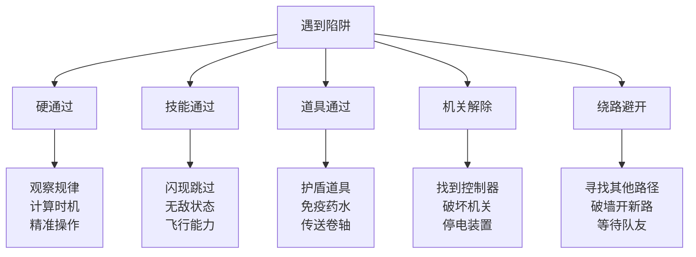
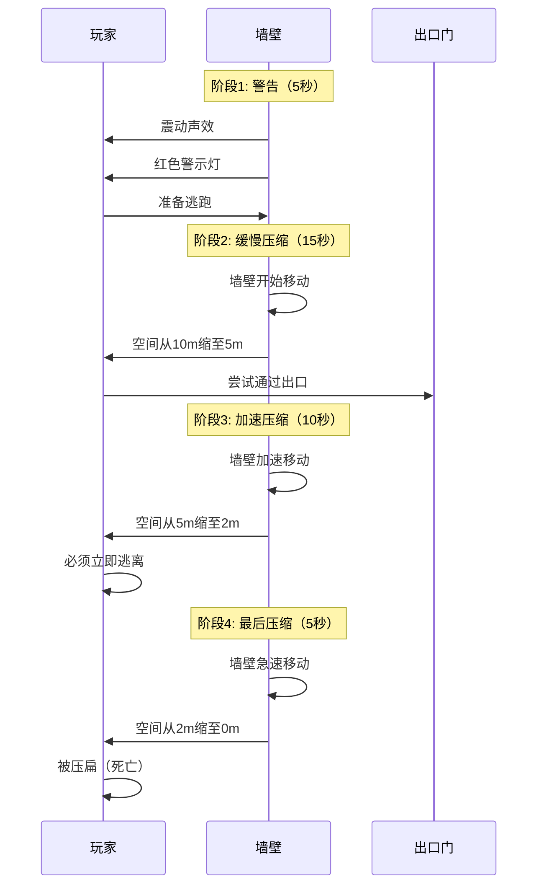
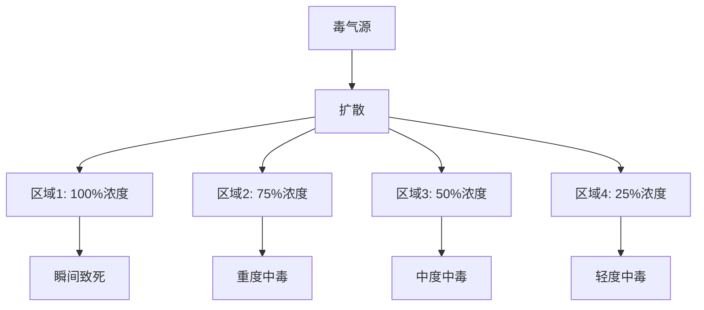
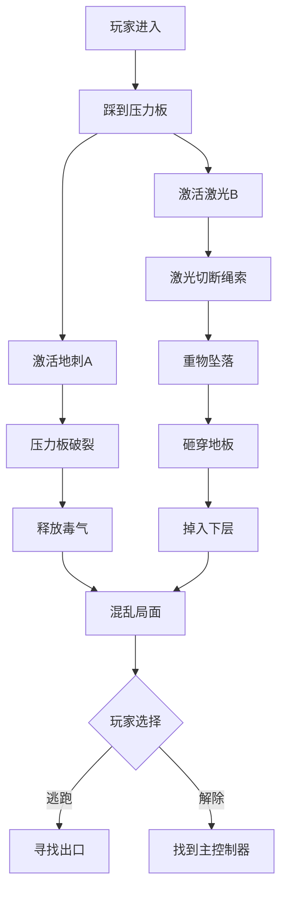
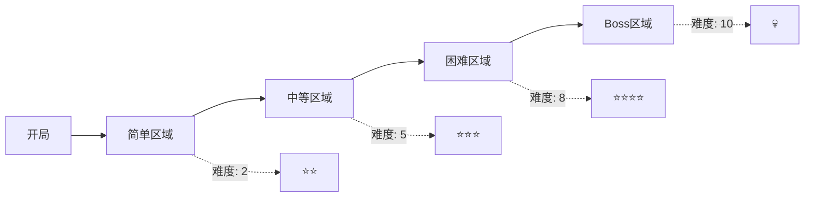

# Cube - 陷阱系统设计

## 文档信息
- **文档类型**：游戏设计文档
- **版本**：1.0
- **创建日期**：2026-01-22
- **最后更新**：2026-01-22
- **状态**：定稿
- **负责人**：关卡设计团队
- **所属模块**：核心玩法系统

---

## 目录

1. [陷阱设计哲学](#1-陷阱设计哲学)
2. [陷阱分类体系](#2-陷阱分类体系)
3. [物理陷阱详解](#3-物理陷阱详解)
4. [环境陷阱详解](#4-环境陷阱详解)
5. [战术陷阱详解](#5-战术陷阱详解)
6. [陷阱组合系统](#6-陷阱组合系统)
7. [陷阱难度设计](#7-陷阱难度设计)
8. [视觉语言设计](#8-视觉语言设计)
9. [技术实现](#9-技术实现)

---

## 1. 陷阱设计哲学

### 1.1 核心原则

#### 原则1：公平致命

**定义**：陷阱必须危险，但玩家必须有机会避免。

**实施**：
```
陷阱威胁 = 高伤害
+
陷阱可见性 = 有提示
+
陷阱可避免性 = 有对策
```

**反例**：
- ❌ 不可见且瞬间致死的陷阱
- ❌ 没有任何提示的陷阱
- ❌ 无法通过技巧避免的陷阱

**正例**：
- ✅ 激光网格：可见，可计算路径
- ✅ 旋转刀片：有声音提示，可计时通过
- ✅ 压缩墙：有倒计时，有逃生路线

---

#### 原则2：多解策略

**定义**：每个陷阱至少有3种应对方法。

**通用应对策略**：



**角色差异**：
- 坦克型：硬抗伤害通过
- 输出型：快速冲刺通过
- 辅助型：为队友提供保护
- 侦察型：找到安全路径

---

#### 原则3：风险回报

**定义**：危险的陷阱区域必有高价值奖励。

**平衡表**：

| 陷阱难度 | 死亡概率 | 通过时间 | 奖励价值 | 示例 |
|---------|---------|---------|---------|------|
| 简单 | 5% | 5秒 | 普通资源 | 单个地刺 |
| 中等 | 15% | 15秒 | 优秀装备 | 激光网格 |
| 困难 | 30% | 30秒 | 稀有装备 | 多重陷阱 |
| 极难 | 50% | 60秒 | 史诗装备 | 陷阱迷宫 |
| 地狱 | 75% | 90秒+ | 传说装备 | Boss级陷阱 |

---

#### 原则4：动态威胁

**定义**：陷阱状态会动态变化，保持不可预测性。

**变化维度**：

**时间维度**：
- 初次进入：陷阱未激活（给予观察时间）
- 5-10秒后：陷阱激活
- 长期停留：陷阱强化

**触发维度**：
- 玩家数量触发：单人安全，多人危险
- 行为触发：移动路径、停留位置
- 随机触发：增加不确定性

**适应维度**：
- 玩家成功通过：下次更难
- 玩家失败：提供提示
- 队伍配合：针对性调整

---

### 1.2 设计目标

#### 目标1：制造紧张感

**如何实现**：
- ⚡ **即时威胁**：陷阱可能瞬间致死
- 🎯 **精准要求**：需要精确操作
- ⏰ **时间压力**：倒计时、追赶等
- 🔊 **氛围营造**：紧张的音效和视觉

#### 目标2：考验团队协作

**协作场景**：
- 一人引开陷阱，其他人通过
- 一人关闭机关，其他人快速通过
- 相互掩护，轮流前进
- 救援倒地队友

#### 目标3：提供技巧表现空间

**高手表现**：
- 完美时机判断（零失误通过）
- 创意解法（利用环境机制）
- 极限操作（危险边缘行走）
- 教学队友（分享经验）

#### 目标4：呼应电影主题

**电影致敬元素**：
- 激光网格（经典场景）
- 数学谜题触发（质数坐标）
- 酸液池（腐蚀场景）
- 旋转刀片（机械陷阱）

---

## 2. 陷阱分类体系

### 2.1 分类标准

#### 按激活方式分类

```
主动陷阱（被动触发）
├─ 接触触发：踩到、碰到
├─ 接近触发：进入范围自动激活
├─ 延迟触发：进入后延迟激活
└─ 条件触发：特定条件满足

被动陷阱（主动激活）
├─ 始终激活：进入房间即存在
├─ 定时激活：按时间周期激活
├─ 手动激活：玩家/敌人触发开关
└─ 连锁激活：其他陷阱触发导致
```

#### 按伤害类型分类

```
瞬间伤害型
├─ 物理伤害：刀片、尖刺、撞击
├─ 能量伤害：激光、电击、爆炸
└─ 即死陷阱：无敌以外必死

持续伤害型
├─ DoT伤害：持续扣血
├─ 环境伤害：高温、缺氧、毒气
└─ 叠加伤害：越久越危险

控制效果型
├─ 束缚：减速、定身、困住
├─ 位移：击退、吸引、传送
├─ 干扰：致盲、失明、混乱
└─ 封锁：阻挡路径、困在区域
```

#### 按难度等级分类

| 等级 | 名称 | 描述 | 颜色标识 |
|------|------|------|----------|
| ⭐ | 入门级 | 新手教学用，几乎不致命 | 🟦 蓝色 |
| ⭐⭐ | 简单级 | 容易识别和避免 | 🟩 绿色 |
| ⭐⭐⭐ | 中等级 | 需要一定技巧 | 🟨 黄色 |
| ⭐⭐⭐⭐ | 困难级 | 需要精准操作或团队配合 | 🟧 橙色 |
| ⭐⭐⭐⭐⭐ | 地狱级 | 极高难度，大概率死亡 | 🟥 红色 |
| 💀 | Boss级 | 独特机制，需要特殊应对 | ⬛ 黑色 |

---

## 3. 物理陷阱详解

### 3.1 激光陷阱系列

#### 类型1：网格激光（Grid Laser）

**难度**：⭐⭐⭐⭐

**描述**：
房间中布满横纵交错的激光网，触碰即死。

**视觉设计**：
- 红色激光束（可见）
- 发射器有红色指示灯
- 激光交汇处有粒子效果
- 地面有激光投影（辅助判断）

**行为模式**：

**静态模式**：
```
激光固定不动
- 间距：1.5米（需要精确移动）
- 高度：0.5米、1.5米、2.5米（三层）
- 密度：15-20束激光
- 安全通道：存在但需计算
```

**动态模式**：
```
激光缓慢移动/旋转
- 移动速度：0.5米/秒
- 模式：横向扫描、纵向扫描、旋转
- 周期：10-15秒一个循环
- 预测：有规律可循
```

**应对方法**：
1. **观察计算**：
   - 找出激光间隙
   - 计算安全路径
   - 标记关键点位
   
2. **技能通过**：
   - 闪现/瞬移（直接跳过）
   - 无敌技能（短暂免疫）
   - 缩小体型（通过间隙）
   
3. **道具辅助**：
   - 反射镜（改变激光方向）
   - 护盾（抵挡一次）
   - 隐身（激光不检测）
   
4. **机关关闭**：
   - 找到电源控制器
   - 临时关闭30秒
   - 全队快速通过

**团队协作**：
- 侦察型：先行探路，标记安全点
- 坦克型：携带护盾道具，带队通过
- 辅助型：给予护盾buff
- 全队：按标记路线跟随前进

**奖励设置**：
- 房间中心：稀有装备箱
- 完美通过（零伤害）：额外奖励

---

#### 类型2：追踪激光（Tracking Laser）

**难度**：⭐⭐⭐⭐⭐

**描述**：
激光会自动锁定玩家并追踪。

**视觉设计**：
- 激光发射器有追踪摄像头
- 锁定时红色激光点瞄准玩家
- 蓄力时激光颜色变亮
- 发射有明显预警音效

**行为模式**：

```javascript
追踪激光行为：
1. 扫描阶段（2秒）
   - 激光发射器旋转扫描
   - 检测玩家位置
   
2. 锁定阶段（1秒）
   - 红色激光点出现
   - 蓄力音效
   - 玩家有反应时间
   
3. 发射阶段（0.5秒）
   - 激光束射出
   - 持续1秒
   - 命中造成大量伤害
   
4. 冷却阶段（3秒）
   - 激光发射器冷却
   - 重新开始扫描
```

**应对方法**：
1. **躲避走位**：
   - 观察激光发射器方向
   - 在锁定后快速移动
   - 利用掩体躲避
   
2. **破坏发射器**：
   - 远程攻击发射器
   - 造成足够伤害后失效
   - 永久解除威胁
   
3. **分散注意**：
   - 多名玩家分散站位
   - 激光只能锁定一个目标
   - 其他人趁机前进
   
4. **反制道具**：
   - 烟雾弹（阻挡视线）
   - 干扰器（干扰锁定）
   - 镜子（反射激光）

---

#### 类型3：不可见激光（Invisible Laser）

**难度**：⭐⭐⭐⭐⭐

**描述**：
激光不可见，需要通过其他方式探测。

**探测方法**：
1. **烟雾/粉尘**：
   - 使用烟雾弹
   - 激光束会在烟雾中显形
   - 临时可见
   
2. **特殊眼镜**：
   - 装备"激光探测眼镜"
   - 使激光可见
   - 限时道具
   
3. **侦察技能**：
   - 侦察型角色专属技能
   - "陷阱感知"
   - 显示所有陷阱位置
   
4. **试探前进**：
   - 投掷物品测试
   - 观察触发反应
   - 慢速推进

---

### 3.2 机械陷阱系列

#### 类型1：旋转刀片（Rotating Blades）

**难度**：⭐⭐⭐

**描述**：
大型旋转刀片横跨房间，定时旋转。

**配置参数**：
```javascript
const rotatingBlades = {
    size: {
        radius: 3,        // 刀片半径3米
        thickness: 0.1,   // 刀片厚度10cm
        count: 4          // 4片刀片
    },
    
    motion: {
        speed: 60,        // 60度/秒（6秒一圈）
        direction: 'clockwise',  // 顺时针
        acceleration: false      // 匀速
    },
    
    damage: {
        type: 'instant',  // 瞬间伤害
        value: 80,        // 80%生命值
        effect: 'bleeding' // 流血效果
    },
    
    safeZone: {
        center: true,     // 中心是安全区
        edge: true,       // 贴墙边缘安全
        height: 'full'    // 全高度危险
    }
};
```

**时机计算**：
```
通过时机计算：
1. 观察刀片转速（6秒/圈）
2. 计算安全窗口（刀片间隙通过时间）
3. 预判刀片位置
4. 在安全窗口冲刺通过

安全窗口 = 90度 / 360度 × 6秒 = 1.5秒
冲刺距离 = 5米
所需速度 = 5米 / 1.5秒 = 3.33米/秒

结论：需要冲刺技能或速度buff
```

**应对策略**：
- **新手**：等待多个周期，确保把握时机
- **熟练**：精准计算，一次通过
- **高手**：贴近刀片擦边通过，节省时间

---

#### 类型2：压缩墙壁（Crushing Walls）

**难度**：⭐⭐⭐⭐

**描述**：
房间两侧墙壁向中间挤压，将玩家压扁。

**阶段设计**：



**逃生方法**：
1. **快速通过出口门**：
   - 门在压缩过程中开启
   - 需要快速反应
   - 团队需要全部通过
   
2. **寻找安全凹槽**：
   - 墙壁上有凹槽空间
   - 可容纳1-2人
   - 暂时避难
   
3. **破坏机关**：
   - 房间角落有控制器
   - 破坏后墙壁停止
   - 需要承受伤害
   
4. **炸开墙壁**：
   - 使用爆破道具
   - 在墙壁上炸出洞口
   - 消耗稀有资源

---

#### 类型3：地刺陷阱（Floor Spikes）

**难度**：⭐⭐

**描述**：
地板下隐藏尖刺，定时弹出。

**模式类型**：

**随机模式**：
```
- 地刺随机位置弹出
- 无法预测
- 需要高度集中注意力
- 反应时间：0.5秒
```

**节奏模式**：
```
- 地刺按节奏弹出
- 有规律可循
- 像音乐节奏游戏
- 可以提前预判
```

**追逐模式**：
```
- 地刺追着玩家弹出
- 从后向前逐排弹出
- 迫使玩家快速前进
- 不能停留或后退
```

**全覆盖模式**：
```
- 所有地刺同时弹出
- 需要跳跃躲避
- 持续时间：2秒
- 冷却时间：5秒
```

**视觉提示**：
- 即将弹出的地板发光
- 提前0.5秒显示
- 颜色：黄色→橙色→红色（警告递增）
- 音效：蓄力声

---

### 3.3 能量陷阱系列

#### 类型1：电击陷阱（Electric Shock）

**难度**：⭐⭐⭐

**配置**：
- **通电地板**：踩上去持续电击
- **电弧**：空间中跳跃的电弧
- **电网**：墙壁上的高压电网
- **脉冲**：周期性电磁脉冲

**效果**：
- 伤害：中等伤害/秒
- 麻痹：移动速度-50%
- 干扰：技能冷却时间+50%
- 视觉：屏幕闪烁，视野受影响

**绝缘系统**：
```javascript
// 绝缘值系统
const insulationSystem = {
    player: {
        baseInsulation: 0,        // 基础绝缘值
        equipInsulation: 0,       // 装备加成
        buffInsulation: 0,        // Buff加成
        totalInsulation: 0        // 总绝缘值
    },
    
    trapDamage: {
        baseDamage: 30,           // 基础伤害
        finalDamage: function() {
            return Math.max(0, this.baseDamage - player.totalInsulation);
        }
    }
};

// 完全绝缘条件
if (player.totalInsulation >= 30) {
    electricDamage = 0;  // 免疫电击
}
```

---

#### 类型2：力场陷阱（Force Field）

**难度**：⭐⭐⭐⭐

**类型**：

**排斥力场**：
- 推开玩家
- 无法接近中心区域
- 力量随距离递减

**吸引力场**：
- 拉向中心
- 逃脱困难
- 中心有危险（如void）

**重力异常**：
- 改变局部重力
- 上下颠倒
- 移动方式改变

**禁魔力场**：
- 技能无法使用
- 只能物理移动
- 限制战术选择

---

## 4. 环境陷阱详解

### 4.1 温度陷阱

#### 极热房间（Inferno Room）

**难度**：⭐⭐⭐

**环境参数**：
```javascript
const infernoRoom = {
    temperature: 150,          // 摄氏度
    heatDamage: 5,            // 5点/秒
    visibility: 0.7,          // 视野70%（热浪扭曲）
    stamina: -0.5,           // 体力消耗加倍
    
    heatStroke: {
        threshold: 30,        // 30秒后中暑
        effects: [
            'movementSlow',   // 移动减速
            'visionBlur',     // 视野模糊
            'skillCooldown'   // 技能延长
        ]
    },
    
    cooldown: {
        waterSplash: 10,      // 水可降温10秒
        icePack: 30,          // 冰袋30秒
        coolArmor: 999        // 隔热装备持续
    }
};
```

**应对方法**：
- 快速通过（最多30秒）
- 携带降温道具
- 辅助给予降温buff
- 寻找空调通风口

---

#### 极寒房间（Cryo Room）

**难度**：⭐⭐⭐

**环境效果**：
- 温度：-50°C
- 移动速度：-30%
- 技能冷却：+20%
- 每10秒冻伤伤害
- 可能被冻住（无法移动）

**冻结机制**：
```
冻结值累积：
- 基础累积：每秒+5冻结值
- 移动累积：每秒额外+2
- 战斗累积：每秒额外+5
- 阈值：100冻结值 = 冻住3秒

解冻方法：
- 队友救援（互动2秒）
- 使用解冻道具（瞬间）
- 火焰技能（对自己释放）
- 等待自然解冻（5秒）
```

---

### 4.2 环境杀伤

#### 酸液池（Acid Pool）

**难度**：⭐⭐⭐

**设计**：
- 覆盖房间部分地面
- 绿色发光液体
- 冒泡和烟雾效果
- 腐蚀一切触碰物

**伤害机制**：
```javascript
const acidDamage = {
    contact: 50,              // 接触瞬间伤害
    perSecond: 20,            // 持续伤害/秒
    afterEffect: {
        duration: 10,         // 离开后持续10秒
        damage: 5,            // 5点/秒（腐蚀效果）
        decay: true           // 伤害递减
    },
    
    armorDamage: {
        reduction: 10,        // 护甲值-10/秒
        permanent: true       // 永久损失
    }
};
```

**通过方法**：
1. **跳跃通过**：
   - 利用平台/浮板
   - 跳跃技能
   - 飞行能力
   
2. **保护通过**：
   - 护盾道具
   - 辅助保护
   - 防腐装备
   
3. **环境利用**：
   - 推动箱子作桥
   - 冻结酸液表面
   - 中和化学剂

---

#### 毒气房间（Toxic Gas）

**难度**：⭐⭐⭐⭐

**毒气类型**：

**类型A：致命毒气**
- 颜色：绿色
- 效果：快速致死（10秒内）
- 范围：充满整个房间
- 应对：必须佩戴防毒面具

**类型B：麻痹毒气**
- 颜色：黄色
- 效果：麻痹、减速、致盲
- 持续：60秒
- 应对：解毒剂或等待消散

**类型C：腐蚀毒气**
- 颜色：紫色
- 效果：损坏装备和道具
- 持续：持续存在
- 应对：快速通过或净化

**毒气扩散**：


---

### 4.3 重力陷阱

#### 反重力区域（Anti-Gravity Zone）

**难度**：⭐⭐⭐⭐

**效果**：
- 进入区域后失重
- 漂浮在空中
- 移动方式改变
- 战斗难度增加

**移动机制**：
```javascript
// 反重力移动
const antiGravityMovement = {
    jump: 'float up',        // 跳跃变成向上漂浮
    move: 'push direction',  // 移动需要推动
    stop: 'drift',           // 停止后惯性继续
    wall: 'bounce',          // 碰到墙壁反弹
    
    control: {
        precision: 0.3,      // 精准度降低70%
        delay: 0.5,          // 0.5秒延迟
        overcorrection: true // 容易过度修正
    }
};
```

**战术运用**：
- 到达高处平台
- 躲避地面陷阱
- 空中战斗
- 快速逃脱

**危险组合**：
- 反重力 + 旋转刀片 = 极难躲避
- 反重力 + 追踪激光 = 无法走位
- 反重力 + 时间限制 = 极高压力

---

## 5. 战术陷阱详解

### 5.1 心理陷阱

#### 假门陷阱（Fake Door）

**难度**：⭐⭐

**设计**：
外观是正常的门，但实际是陷阱。

**类型**：

**类型1：假出口**
```
表现：看起来像出口
实际：通向危险区域
识别：
- 门框颜色略有不同
- 门把手位置异常
- 没有正常的门缝光线
```

**类型2：传送陷阱**
```
表现：正常的门
实际：传送到陷阱房间
后果：
- 被传送到危险区
- 与队伍分离
- 需要找到回来的路
```

**类型3：锁定陷阱**
```
表现：可以进入
实际：进入后门锁定
后果：
- 被困在小房间
- 空间开始缩小
- 或释放毒气
```

**识别方法**：
- 侦察技能"陷阱感知"
- 观察细节差异
- 先投掷物品测试
- 查看地图坐标规律

---

#### 假宝箱陷阱（Mimic Chest）

**难度**：⭐⭐⭐

**设计**：
外观是宝箱，打开时触发陷阱。

**陷阱类型**：
1. **爆炸**：AOE范围伤害
2. **毒气**：释放毒雾
3. **怪物**：宝箱变成怪物
4. **传送**：传送到远处
5. **诅咒**：获得负面状态

**识别特征**：
```javascript
const realChest = {
    texture: 'worn wood',    // 陈旧木质
    lock: 'standard',        // 标准锁
    breath: false,           // 不会"呼吸"
    eyes: false,             // 无眼睛
    tongue: false            // 无舌头
};

const mimicChest = {
    texture: 'too perfect',  // 过于完美
    lock: 'shiny',           // 闪亮的锁
    breath: true,            // 微微起伏（仔细看）
    eyes: true,              // 有细小眼睛
    tongue: true             // 有隐藏舌头
};
```

---

### 5.2 时间陷阱

#### 倒计时炸弹（Time Bomb）

**难度**：⭐⭐⭐⭐

**设计**：
房间内有炸弹倒计时，必须在时间内完成任务或逃离。

**倒计时设定**：
```
初始时间：60秒
警告阶段：
- 60-30秒：绿色，正常速度
- 30-10秒：黄色，声音加快
- 10-0秒：红色，急促声音
- 0秒：爆炸（房间全灭）
```

**任务类型**：
1. **找到拆弹工具**：
   - 房间内隐藏3个零件
   - 收集后可拆除炸弹
   - 获得大量奖励
   
2. **解除拆弹谜题**：
   - 炸弹上有密码锁
   - 解谜才能拆除
   - 失败会减少时间
   
3. **快速逃离**：
   - 不拆弹，直接跑
   - 门需要时间打开
   - 考验速度

**爆炸范围**：
- 核心区：瞬间死亡
- 主要区：90%生命值伤害
- 边缘区：50%生命值伤害
- 相邻房间：20%伤害

---

### 5.3 连锁陷阱

#### 多米诺陷阱（Domino Trap）

**难度**：⭐⭐⭐⭐⭐

**设计理念**：
触发一个陷阱导致连锁反应，激活所有陷阱。

**连锁模式**：

**线性连锁**：
```
A → B → C → D → E
触发A后，依次激活B、C、D、E
玩家可以预判下一个陷阱位置
```

**放射连锁**：
```
      B
      ↑
  D ← A → C
      ↓
      E
      
触发A后，同时激活B、C、D、E
四面八方都是威胁
```

**随机连锁**：
```
触发A后，随机激活2-3个陷阱
无法预判
需要快速反应
```

**示例设计：机关大厅**


**应对策略**：
- 极度小心，避免触发第一个
- 触发后立即判断连锁方向
- 寻找安全点躲避
- 或者一开始就找到主控制器

---

## 6. 陷阱组合系统

### 6.1 组合设计原则

#### 原则1：互补组合

**定义**：两种陷阱互相配合，让玩家难以同时应对。

**经典组合**：

**组合A：地刺 + 天花板压缩**
```
设计逻辑：
- 地刺迫使玩家跳跃
- 天花板降低，跳不高
- 玩家进退两难

应对方法：
- 精准控制跳跃高度
- 或使用无敌技能冲过
```

**组合B：激光网格 + 追击敌人**
```
设计逻辑：
- 激光要求精准移动
- 敌人追击要求快速移动
- 两者矛盾

应对方法：
- 团队分工（一人引怪，其他人过激光）
- 或先解决敌人再过激光
```

**组合C：毒气 + 迷宫**
```
设计逻辑：
- 迷宫需要时间探索
- 毒气限制停留时间
- 时间压力

应对方法：
- 侦察先行探路
- 或使用防毒装备
```

---

#### 原则2：递进组合

**定义**：陷阱难度递进，逐步提升压力。

**示例：三阶段陷阱房**

```javascript
// 阶段式陷阱房
const progressiveTrapRoom = {
    phase1: {
        duration: 30,
        traps: ['simple floor spikes'],
        difficulty: 2,
        objective: '熟悉环境'
    },
    
    phase2: {
        duration: 30,
        traps: ['floor spikes', 'rotating blades'],
        difficulty: 5,
        objective: '应对多重威胁'
    },
    
    phase3: {
        duration: 30,
        traps: ['floor spikes', 'rotating blades', 'tracking laser'],
        difficulty: 8,
        objective: '极限生存'
    },
    
    phase4: {
        duration: 'until escape',
        traps: 'all traps active + room shrinking',
        difficulty: 10,
        objective: '立即逃离'
    }
};
```

---

### 6.2 组合库

#### 组合1：激光迷宫（Laser Maze）

**难度**：⭐⭐⭐⭐

**组成**：
- 网格激光 × 3层
- 移动激光 × 2束
- 地刺陷阱（触发点）
- 时间限制：90秒

**布局**：
```
[入口]
   ↓
[激光层1：静态]
   ↓
[激光层2：旋转]
   ↓
[激光层3：移动]
   ↓
[地刺区域]
   ↓
[出口+奖励]
```

**通关路径**：
- 路径A：快速直冲（风险高，时间短）
- 路径B：绕道安全（风险低，时间长）
- 路径C：垂直移动（需要特殊能力）

---

#### 组合2：压缩陷阱室（Crush Chamber）

**难度**：⭐⭐⭐⭐⭐

**组成**：
- 压缩墙壁（主要威胁）
- 地刺（阻止躲避）
- 假门（误导）
- 真出口（需要解谜找到）

**生存策略**：
```
第1步：快速识别假门（10秒）
第2步：寻找真出口线索（20秒）
第3步：解开出口谜题（20秒）
第4步：全队撤离（10秒）

总计：60秒
墙壁压缩时间：60秒

时间刚好，容错率极低！
```

---

#### 组合3：元素炼狱（Elemental Hell）

**难度**：💀 (Boss级)

**组成**：
- 火焰喷射器
- 冰冻地面
- 电击墙壁
- 酸液池
- 毒气释放

**设计理念**：
五种元素陷阱在房间内共存，需要精准走位。

**区域划分**：
```
[电击墙] [火焰区] [电击墙]
[冰冻地]   [安全]   [酸液池]
[电击墙] [毒气源] [电击墙]
   ↑       ↑       ↑
 [入口]  [宝箱]  [出口]
```

**挑战**：
- 从入口到宝箱：穿越冰冻区和毒气
- 从宝箱到出口：穿越酸液池和火焰
- 全程不能碰墙（电击）
- 时间限制：120秒

**奖励**：
- 传说级装备
- 大量资源
- 特殊成就

---

## 7. 陷阱难度设计

### 7.1 难度评估体系

#### 评估维度

```javascript
function calculateTrapDifficulty(trap) {
    let difficulty = 0;
    
    // 1. 致命性 (0-10分)
    difficulty += trap.lethality;
    
    // 2. 反应时间 (0-10分)
    // 反应时间越短越难
    difficulty += (10 - trap.reactionTime);
    
    // 3. 可见性 (0-10分)
    // 越不可见越难
    difficulty += (10 - trap.visibility);
    
    // 4. 预测性 (0-10分)
    // 越难预测越难
    difficulty += (10 - trap.predictability);
    
    // 5. 应对方法数量 (0-10分)
    // 应对方法越少越难
    difficulty += (10 - trap.counterMethods);
    
    // 6. 组合复杂度 (0-10分)
    difficulty += trap.combinationComplexity;
    
    // 总分 0-60
    // 0-10: ⭐
    // 11-20: ⭐⭐
    // 21-30: ⭐⭐⭐
    // 31-40: ⭐⭐⭐⭐
    // 41-50: ⭐⭐⭐⭐⭐
    // 51-60: 💀
    
    return difficulty;
}
```

---

### 7.2 难度曲线

#### 单局难度曲线



#### 难度调节机制

**动态难度调整（DDA）**：

```javascript
const dynamicDifficulty = {
    // 监测指标
    tracking: {
        playerDeaths: 0,
        timeInRoom: 0,
        successRate: 0,
        skillLevel: 'medium'
    },
    
    // 调整策略
    adjustment: {
        ifTooEasy: {
            // 玩家通过太顺利
            action: 'increase difficulty',
            methods: [
                'faster trap activation',
                'more traps',
                'shorter reaction time'
            ]
        },
        
        ifTooHard: {
            // 玩家死亡多次
            action: 'decrease difficulty',
            methods: [
                'show hints',
                'longer reaction time',
                'fewer traps active'
            ]
        }
    },
    
    // 调整限制
    limits: {
        minDifficulty: 1,
        maxDifficulty: 10,
        adjustmentSpeed: 'gradual'  // 渐进调整
    }
};
```

---

## 8. 视觉语言设计

### 8.1 陷阱视觉识别

#### 危险程度色彩编码

```
🟦 蓝色 = 安全/可交互
- 安全机关
- 可破坏的障碍
- 友好装置

🟩 绿色 = 低危险
- 轻度陷阱
- 可轻松避免
- 教学向

🟨 黄色 = 中危险  
- 中等陷阱
- 需要技巧
- 警告提示

🟧 橙色 = 高危险
- 困难陷阱
- 可能致死
- 强烈警告

🟥 红色 = 极危险
- 致命陷阱
- 几乎必死
- 紧急警告

⬛ 黑色 = 未知/特殊
- 独特机制
- 需要特殊应对
- Boss级陷阱
```

---

### 8.2 视觉提示系统

#### 提示分级

**第1级：环境提示（玩家需要观察）**
```
- 墙壁上的划痕（有东西移动过）
- 地面的血迹（有人死在这里）
- 烧焦的痕迹（有火焰陷阱）
- 腐蚀的痕迹（有酸液）
```

**第2级：直接提示（明显标识）**
```
- 地板颜色不同（陷阱位置）
- 发光的警示灯
- 警告标志
- 音效提示
```

**第3级：UI提示（屏幕提示）**
```
- 危险警告文字
- 陷阱类型图标
- 倒计时显示
- 逃生方向指示
```

**第4级：新手辅助（可选）**
```
- 安全路径高亮
- 时机指示器
- 操作提示
- 慢动作（练习模式）
```

---

### 8.3 音效设计

#### 陷阱音效层次

**环境音**（持续播放）：
- 机械运转声
- 电流声
- 液体流动声
- 气体泄漏声

**预警音**（触发前）：
- 蓄力声（激光）
- 齿轮声（机械）
- 倒计时音
- 警报声

**触发音**（激活时）：
- 激光发射声
- 刀片挥舞声
- 爆炸声
- 电击声

**伤害音**（造成伤害）：
- 撞击声
- 切割声
- 燃烧声
- 腐蚀声

---

## 9. 技术实现

### 9.1 陷阱基类设计

```csharp
// 陷阱基类
public abstract class Trap : MonoBehaviour
{
    [Header("基础属性")]
    public string trapId;
    public TrapType type;
    public int difficultyLevel;
    public TrapColor colorCode;
    
    [Header("伤害设置")]
    public float damage;
    public DamageType damageType;
    public bool isLethal;
    
    [Header("激活设置")]
    public TriggerMode triggerMode;
    public float activationDelay;
    public float cooldownTime;
    
    [Header("状态")]
    public bool isActive;
    public bool isOnCooldown;
    public List<Player> playersInRange;
    
    // 生命周期方法
    public virtual void Initialize() { }
    public virtual void Activate() { }
    public virtual void Deactivate() { }
    public virtual void Reset() { }
    
    // 触发方法
    public abstract void OnPlayerEnter(Player player);
    public abstract void OnPlayerExit(Player player);
    public abstract void OnTrigger();
    
    // 伤害方法
    public virtual void DealDamage(Player player)
    {
        if (player.HasImmunity(damageType))
            return;
            
        float finalDamage = CalculateDamage(player);
        player.TakeDamage(finalDamage, damageType);
        
        OnDamageDealt(player, finalDamage);
    }
    
    protected virtual float CalculateDamage(Player player)
    {
        float baseDamage = damage;
        float resistance = player.GetResistance(damageType);
        return baseDamage * (1 - resistance);
    }
    
    // 视觉反馈
    public abstract void ShowWarning();
    public abstract void PlayActivationEffect();
    public abstract void PlayDamageEffect();
    
    // 音效
    public abstract void PlayWarningSound();
    public abstract void PlayActivationSound();
    public abstract void PlayDamageSound();
}
```

---

### 9.2 具体陷阱实现示例

```csharp
// 激光网格陷阱
public class LaserGridTrap : Trap
{
    [Header("激光设置")]
    public List<LaserBeam> horizontalLasers;
    public List<LaserBeam> verticalLasers;
    public float laserDamage = 100f;  // 即死
    
    [Header("移动设置")]
    public bool isMoving;
    public float moveSpeed;
    public LaserPattern pattern;
    
    private float currentPhase;
    
    public override void Initialize()
    {
        base.Initialize();
        GenerateLaserGrid();
        isActive = false;
    }
    
    public override void OnPlayerEnter(Player player)
    {
        playersInRange.Add(player);
        
        if (!isActive && activationDelay > 0)
        {
            ShowWarning();
            Invoke(nameof(Activate), activationDelay);
        }
    }
    
    public override void Activate()
    {
        isActive = true;
        foreach (var laser in AllLasers())
        {
            laser.Enable();
        }
        PlayActivationEffect();
    }
    
    void Update()
    {
        if (!isActive) return;
        
        if (isMoving)
        {
            UpdateLaserMovement();
        }
        
        CheckLaserCollisions();
    }
    
    private void UpdateLaserMovement()
    {
        currentPhase += Time.deltaTime * moveSpeed;
        
        switch (pattern)
        {
            case LaserPattern.Scanning:
                // 扫描模式
                UpdateScanningPattern();
                break;
            case LaserPattern.Rotating:
                // 旋转模式
                UpdateRotatingPattern();
                break;
            case LaserPattern.Random:
                // 随机模式
                UpdateRandomPattern();
                break;
        }
    }
    
    private void CheckLaserCollisions()
    {
        foreach (var player in playersInRange)
        {
            if (IsPlayerTouchingLaser(player))
            {
                DealDamage(player);
                OnPlayerHitLaser(player);
            }
        }
    }
    
    private bool IsPlayerTouchingLaser(Player player)
    {
        foreach (var laser in AllLasers())
        {
            if (laser.IsActive && laser.CheckCollision(player.Position))
            {
                return true;
            }
        }
        return false;
    }
    
    private void OnPlayerHitLaser(Player player)
    {
        // 视觉效果
        PlayDamageEffect();
        
        // 音效
        PlayDamageSound();
        
        // 粒子效果
        SpawnImpactParticles(player.Position);
        
        // 统计
        RecordPlayerDeath(player);
    }
    
    private IEnumerable<LaserBeam> AllLasers()
    {
        return horizontalLasers.Concat(verticalLasers);
    }
}
```

---

### 9.3 陷阱管理器

```csharp
// 房间陷阱管理器
public class TrapManager : MonoBehaviour
{
    [Header("陷阱列表")]
    public List<Trap> traps;
    
    [Header("激活设置")]
    public TrapActivationMode activationMode;
    public float globalActivationDelay;
    
    [Header("难度调整")]
    public bool useDynamicDifficulty;
    public DifficultyAdjuster difficultyAdjuster;
    
    private bool isInitialized;
    
    void Start()
    {
        InitializeAllTraps();
    }
    
    private void InitializeAllTraps()
    {
        foreach (var trap in traps)
        {
            trap.Initialize();
        }
        
        ApplyActivationMode();
        isInitialized = true;
    }
    
    private void ApplyActivationMode()
    {
        switch (activationMode)
        {
            case TrapActivationMode.AllAtOnce:
                ActivateAllTraps();
                break;
                
            case TrapActivationMode.Sequential:
                StartCoroutine(ActivateSequentially());
                break;
                
            case TrapActivationMode.OnPlayerEnter:
                // 等待玩家触发
                break;
                
            case TrapActivationMode.Random:
                StartCoroutine(ActivateRandomly());
                break;
        }
    }
    
    private void ActivateAllTraps()
    {
        foreach (var trap in traps)
        {
            trap.Activate();
        }
    }
    
    private IEnumerator ActivateSequentially()
    {
        foreach (var trap in traps)
        {
            trap.Activate();
            yield return new WaitForSeconds(2f);
        }
    }
    
    private IEnumerator ActivateRandomly()
    {
        while (true)
        {
            if (traps.Count > 0)
            {
                var randomTrap = traps[Random.Range(0, traps.Count)];
                if (!randomTrap.isActive)
                {
                    randomTrap.Activate();
                }
            }
            
            yield return new WaitForSeconds(Random.Range(3f, 8f));
        }
    }
    
    // 动态难度调整
    public void AdjustDifficulty(float playerPerformance)
    {
        if (!useDynamicDifficulty) return;
        
        difficultyAdjuster.Adjust(playerPerformance);
        
        foreach (var trap in traps)
        {
            ApplyDifficultyToTrap(trap);
        }
    }
    
    private void ApplyDifficultyToTrap(Trap trap)
    {
        float modifier = difficultyAdjuster.GetDifficultyModifier();
        
        // 调整伤害
        trap.damage *= modifier;
        
        // 调整激活延迟
        trap.activationDelay /= modifier;
        
        // 调整冷却时间
        trap.cooldownTime /= modifier;
    }
}
```

---

## 10. 测试与平衡

### 10.1 测试清单

#### 功能测试
- [ ] 所有陷阱正确触发
- [ ] 伤害计算准确
- [ ] 视觉效果显示正常
- [ ] 音效播放正常
- [ ] 玩家可以通过所有陷阱

#### 难度测试
- [ ] 新手通过率 > 50%
- [ ] 熟练玩家通过率 > 80%
- [ ] 高手可以零伤害通过
- [ ] 难度梯度平滑

#### 性能测试
- [ ] 多个陷阱同时激活不卡顿
- [ ] 粒子效果不影响帧率
- [ ] 碰撞检测准确
- [ ] 内存占用合理

---

### 10.2 平衡性指标

```javascript
const balanceMetrics = {
    deathRate: {
        target: 0.3,          // 目标死亡率30%
        acceptable: [0.2, 0.4],  // 可接受范围
        current: 0.35         // 当前数据
    },
    
    averageTime: {
        target: 30,           // 目标30秒通过
        acceptable: [20, 45],
        current: 28
    },
    
    skipRate: {
        target: 0.1,          // 目标10%玩家选择跳过
        acceptable: [0.05, 0.2],
        current: 0.15
    },
    
    satisfaction: {
        target: 4.0,          // 目标4.0/5.0满意度
        acceptable: [3.5, 5.0],
        current: 4.2
    }
};
```

---

## 11. 附录

### 11.1 陷阱设计检查清单

设计新陷阱时：
- [ ] 符合电影主题
- [ ] 有明确的视觉提示
- [ ] 有至少3种应对方法
- [ ] 可以被技能/道具克制
- [ ] 有合理的难度分级
- [ ] 奖励与风险匹配
- [ ] 有独特的机制
- [ ] 性能开销可接受

### 11.2 术语表

| 术语 | 解释 |
|------|------|
| 即死陷阱 | 触碰后立即死亡的陷阱 |
| DoT | Damage over Time，持续伤害 |
| AOE | Area of Effect，范围效果 |
| 连锁反应 | 一个陷阱触发导致其他陷阱激活 |
| 动态难度 | 根据玩家表现自动调整难度 |

---

## 文档变更历史

| 版本 | 日期 | 变更内容 | 修改人 |
|------|------|---------|--------|
| 1.0 | 2026-01-22 | 创建文档，完成初稿 | System |

---

**文档状态**：✅ 定稿

**相关文档**：
- [02-动态房间系统设计](./02-动态房间系统设计.md)
- [04-谜题系统设计](./04-谜题系统设计.md)
