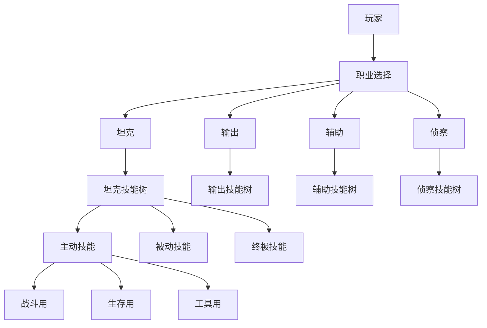

# Cube - 技能体系设计

## 文档信息
- **文档类型**：游戏设计文档
- **版本**：1.0
- **创建日期**：2026-01-22
- **最后更新**：2026-01-22
- **状态**：定稿
- **负责人**：战斗设计团队
- **所属模块**：核心玩法系统

---

## 目录

1. [技能体系概述](#1-技能体系概述)
2. [角色职业系统](#2-角色职业系统)
3. [技能分类](#3-技能分类)
4. [技能设计详解](#4-技能设计详解)
5. [技能升级系统](#5-技能升级系统)
6. [技能组合系统](#6-技能组合系统)
7. [技能平衡](#7-技能平衡)
8. [技术实现](#8-技术实现)

---

## 1. 技能体系概述

### 1.1 设计理念

#### 核心理念：生存与战术

**定义**：在Cube的迷宫环境中，技能不仅用于战斗，更是生存和解谜的工具。

```
技能三大用途：
├─ 战斗：对抗敌人和其他玩家
├─ 生存：应对陷阱和环境危险
└─ 解谜：辅助解开谜题和探索
```

**设计原则**：
```
1. 多功能性
   每个技能至少有2种用途
   鼓励创意使用

2. 战术深度
   技能有冷却时间
   需要策略性使用
   团队配合产生协同效应

3. 风险与回报
   强力技能有更长冷却
   某些技能有副作用
   时机把握至关重要

4. 环境交互
   技能与环境产生互动
   可以改变房间状态
   影响陷阱和机关
```

---

### 1.2 技能系统架构



---

### 1.3 技能获取方式

```
初始技能（职业自带）
├─ 基础攻击技能 × 1
├─ 基础防御技能 × 1
└─ 职业特色技能 × 1

升级获得
├─ 每5级解锁1个新技能槽
├─ 从技能树中选择学习
└─ 最多装备6个主动技能

探索获得
├─ 房间内发现技能书
├─ 击败Boss获得
└─ 完成特殊挑战奖励

合成获得
├─ 组合两个已有技能
├─ 创造新的融合技能
└─ 独特效果和机制
```

---

## 2. 角色职业系统

### 2.1 坦克（Tank） - 巨盾守护者

#### 职业特点

**定位**：前排承伤、保护队友、控制战场

**属性倾向**：
```javascript
const tankStats = {
    health: 150,        // 高生命值
    defense: 80,        // 高防御
    damage: 30,         // 低伤害
    speed: 60,          // 中等速度
    
    specialStats: {
        damageReduction: 0.3,    // 30%伤害减免
        knockbackResist: 0.5,    // 50%击退抗性
        tauntRadius: 10          // 嘲讽范围10米
    }
};
```

---

#### 坦克技能树

**分支1：不屈防御**

**技能1：铁壁（Iron Wall）**
```
类型：主动防御
冷却：15秒
持续：3秒

效果：
- 进入防御姿态
- 伤害减免+50%
- 移动速度-30%
- 格挡正面所有攻击

战术用途：
- 抵挡Boss大招
- 保护队友通过危险区
- 格挡激光等陷阱伤害

升级路径：
Lv1: 基础版本
Lv2: 持续时间+1秒
Lv3: 格挡范围扩大（保护身后队友）
Lv4: 格挡时反弹部分伤害
Lv5: 冷却时间-5秒
```

**技能2：坚定立场（Steadfast）**
```
类型：主动姿态
冷却：20秒
持续：5秒

效果：
- 免疫击退和位移效果
- 免疫控制效果
- 体积增大，可以挡住队友

战术用途：
- 对抗吸引/推斥力场
- 站在压力板上不被推开
- 挡住追击的敌人

升级路径：
Lv1: 基础版本
Lv2: 持续时间+2秒
Lv3: 周围队友也获得抗击退
Lv4: 形成小范围的安全区
Lv5: 踩踏地面，眩晕周围敌人
```

---

**分支2：战地医疗**

**技能3：守护光环（Guardian Aura）**
```
类型：被动光环
范围：8米半径

效果：
- 范围内队友护甲+20
- 队友受到致命伤害时，转移50%伤害给坦克
- 坦克生命值低于30%时光环失效

战术用途：
- 保护脆皮队友
- 团队生存能力提升
- 配合辅助形成双重保护

升级路径：
Lv1: 基础版本
Lv2: 范围扩大到10米
Lv3: 转移伤害比例提升到70%
Lv4: 坦克每承受伤害，回复少量生命
Lv5: 光环持续生效直到坦克倒地
```

---

**分支3：战场控制**

**技能4：震地（Seismic Slam）**
```
类型：主动范围控制
冷却：12秒
范围：5米半径

效果：
- 重击地面造成震动
- 击飞范围内的敌人
- 造成少量伤害（基础攻击的50%）
- 打断敌人技能施放

战术用途：
- 控制敌人位置
- 触发压力板机关
- 打断Boss蓄力技能
- 破坏脆弱地面

升级路径：
Lv1: 基础版本
Lv2: 范围+2米
Lv3: 击飞后敌人眩晕1秒
Lv4: 可以震碎特定墙壁
Lv5: 冷却时间-4秒
```

---

**终极技能：不朽堡垒（Immortal Fortress）**
```
类型：终极技能
充能：需要承受500点伤害
持续：8秒

效果：
- 进入无敌状态
- 形成10米半径保护罩
- 罩内队友伤害减免80%
- 罩内敌人移动速度-50%
- 持续期间无法移动

战术用途：
- 团队绝境翻盘
- 保护全队通过死亡陷阱
- 强行占领关键点位
- 抵挡Boss狂暴阶段

冷却：120秒（使用后）
```

---

### 2.2 输出（DPS） - 影刃杀手

#### 职业特点

**定位**：高伤害、快速击杀、灵活走位

**属性倾向**：
```javascript
const dpsStats = {
    health: 100,        // 中等生命值
    defense: 40,        // 低防御
    damage: 80,         // 高伤害
    speed: 90,          // 高速度
    
    specialStats: {
        critChance: 0.25,        // 25%暴击率
        critDamage: 2.0,         // 200%暴击伤害
        attackSpeed: 1.5         // 1.5倍攻速
    }
};
```

---

#### 输出技能树

**分支1：极速连击**

**技能1：影刃突击（Shadow Dash）**
```
类型：主动位移+攻击
冷却：8秒
距离：8米

效果：
- 瞬间冲刺到目标位置
- 路径上的第一个敌人受到伤害（基础攻击的150%）
- 冲刺期间无敌0.3秒

战术用途：
- 快速接近敌人
- 躲避陷阱和攻击
- 通过危险区域
- 逃离危险

升级路径：
Lv1: 基础版本
Lv2: 距离+2米
Lv3: 可以穿过敌人（伤害路径所有敌人）
Lv4: 无敌时间+0.2秒
Lv5: 可储存2次使用次数
```

**技能2：致命打击（Lethal Strike）**
```
类型：主动强化攻击
冷却：10秒

效果：
- 下一次攻击必定暴击
- 暴击伤害额外+50%
- 击杀目标则刷新冷却时间

战术用途：
- Burst伤害
- 快速清理小怪
- 击杀关键目标
- 连环击杀

升级路径：
Lv1: 基础版本
Lv2: 暴击伤害额外+100%
Lv3: 击中后获得3秒加速buff
Lv4: 击杀刷新+额外获得护盾
Lv5: 可对陷阱使用（破坏陷阱）
```

---

**分支2：毒刃流派**

**技能3：毒素涂层（Toxic Coating）**
```
类型：被动持续伤害
持续：5秒/层

效果：
- 攻击附带毒素
- 每秒造成3%最大生命值伤害
- 可叠加3层

战术用途：
- 对抗高血量敌人
- 持续压制
- 离开后仍造成伤害
- 配合走位风筝

升级路径：
Lv1: 基础版本
Lv2: 最大叠加层数+2
Lv3: 持续时间+3秒
Lv4: 中毒敌人治疗效果-50%
Lv5: 中毒致死的敌人爆炸，扩散毒素
```

---

**分支3：完美刺客**

**技能4：隐匿（Stealth）**
```
类型：主动潜行
冷却：30秒
持续：10秒

效果：
- 进入隐身状态
- 移动速度+30%
- 下一次攻击造成额外伤害+100%
- 攻击后脱离隐身

战术用途：
- 偷袭敌人
- 安全探索
- 躲避追击
- 通过守卫区域
- 绕过陷阱触发器

升级路径：
Lv1: 基础版本
Lv2: 持续时间+5秒
Lv3: 隐身期间不触发陷阱
Lv4: 偷袭伤害+200%
Lv5: 偷袭附带眩晕效果（2秒）
```

**技能5：背刺（Backstab）**
```
类型：被动伤害加成

效果：
- 从背后攻击伤害+50%
- 从背后暴击率+25%
- 背刺击杀回复20%生命值

战术用途：
- 走位绕背
- 配合隐匿
- 高额爆发
- 持续生存

升级路径：
Lv1: 基础版本
Lv2: 背刺伤害+75%
Lv3: 背刺暴击伤害+50%
Lv4: 背刺附带缴械效果
Lv5: 背刺可对Boss生效
```

---

**终极技能：死亡之舞（Dance of Death）**
```
类型：终极技能
充能：造成1000点伤害
持续：6秒

效果：
- 攻击速度+200%
- 移动速度+100%
- 每次攻击造成额外真实伤害
- 无视护甲和防御
- 期间无法使用其他技能

战术用途：
- 快速击杀Boss
- 团战收割
- 清理大量敌人
- 时间关卡冲刺

动画效果：
- 角色周围形成刀刃旋风
- 残影效果
- 攻击轨迹可见

冷却：100秒（使用后）
```

---

### 2.3 辅助（Support） - 圣光救赎者

#### 职业特点

**定位**：治疗、增益、团队支援

**属性倾向**：
```javascript
const supportStats = {
    health: 110,        // 中等生命值
    defense: 50,        // 中等防御
    damage: 40,         // 低伤害
    speed: 75,          // 中等速度
    
    specialStats: {
        healingPower: 1.5,       // 150%治疗效果
        buffDuration: 1.3,       // 130%增益持续
        resurrectSpeed: 2.0      // 2倍复活速度
    }
};
```

---

#### 辅助技能树

**分支1：神圣治疗**

**技能1：治疗之光（Healing Light）**
```
类型：主动单体治疗
冷却：6秒
范围：15米

效果：
- 治疗目标35%最大生命值
- 施法时间：1.5秒
- 可以对自己施放

战术用途：
- 基础治疗技能
- 战斗中恢复
- 陷阱后恢复
- 保持团队生命值

升级路径：
Lv1: 基础版本
Lv2: 治疗量+10%
Lv3: 施法时间-0.5秒
Lv4: 治疗后目标获得护盾（吸收20%最大生命值伤害）
Lv5: 可储存2次使用次数
```

**技能2：圣域（Sanctuary）**
```
类型：主动范围治疗
冷却：20秒
范围：6米半径
持续：6秒

效果：
- 在地面创造治疗圣域
- 每秒治疗范围内友军5%最大生命值
- 范围内友军伤害减免20%

战术用途：
- 团队恢复点
- 压力板任务（站桩）
- 对抗持续伤害环境
- 团战续航

升级路径：
Lv1: 基础版本
Lv2: 范围+2米
Lv3: 治疗量+3%/秒
Lv4: 范围内友军移除DoT效果
Lv5: 持续时间+4秒
```

---

**分支2：强化增益**

**技能3：力量祝福（Blessing of Strength）**
```
类型：主动单体增益
冷却：15秒
持续：20秒
范围：20米

效果：
- 目标攻击力+40%
- 目标攻击速度+25%
- 可对自己施放

战术用途：
- 强化主输出
- Boss战爆发
- 快速清怪
- 破坏陷阱机关

升级路径：
Lv1: 基础版本
Lv2: 持续时间+10秒
Lv3: 攻击力加成+60%
Lv4: 附加暴击率+15%
Lv5: 可同时对2个目标施放
```

**技能4：迅捷祝福（Blessing of Swiftness）**
```
类型：主动单体增益
冷却：15秒
持续：15秒
范围：20米

效果：
- 目标移动速度+50%
- 目标冷却时间-20%
- 可对自己施放

战术用途：
- 快速通过陷阱区
- 追击/逃跑
- 提升技能循环
- 探索加速

升级路径：
Lv1: 基础版本
Lv2: 持续时间+10秒
Lv3: 移动速度+75%
Lv4: 免疫减速效果
Lv5: 目标留下加速路径（其他队友踩上也加速）
```

---

**分支3：复活与救援**

**技能5：复活（Resurrect）**
```
类型：主动复活
冷却：60秒
施法时间：3秒

效果：
- 复活倒地队友
- 复活后队友50%生命值
- 复活后队友无敌3秒

战术用途：
- 救援队友
- 避免团灭
- 保持战力
- 关键时刻翻盘

升级路径：
Lv1: 基础版本
Lv2: 施法时间-1秒
Lv3: 复活后生命值100%
Lv4: 复活后队友所有技能刷新
Lv5: 冷却时间-30秒
```

**技能6：殉道（Martyrdom）**
```
类型：被动牺牲

效果：
- 辅助倒地时，自动释放治疗波
- 治疗所有队友50%最大生命值
- 并给予10秒护盾（吸收30%最大生命值）

战术用途：
- 最后的保护
- 牺牲换取团队生存
- 翻盘机会

升级路径：
Lv1: 基础版本
Lv2: 治疗量+30%
Lv3: 护盾吸收量+20%
Lv4: 队友获得5秒伤害加成
Lv5: 有10%几率辅助不死（保留1点生命）
```

---

**终极技能：天使降临（Angelic Descent）**
```
类型：终极技能
充能：治疗2000点生命值
持续：10秒

效果：
- 进入天使形态
- 飞行能力
- 所有治疗技能无冷却
- 所有治疗效果+100%
- 自动治疗视线内生命最低的队友（每秒）

战术用途：
- 团队濒死救场
- 高难度战斗保障
- 连续治疗输出
- 飞行探索/躲避

视觉效果：
- 背后展开光翼
- 全身发光
- 治疗光束特效

冷却：90秒（使用后）
```

---

### 2.4 侦察（Scout） - 幽影探索者

#### 职业特点

**定位**：探索、陷阱解除、信息收集

**属性倾向**：
```javascript
const scoutStats = {
    health: 90,         // 较低生命值
    defense: 45,        // 较低防御
    damage: 60,         // 中等伤害
    speed: 100,         // 最高速度
    
    specialStats: {
        visionRange: 2.0,        // 2倍视野
        trapDetection: 1.0,      // 100%陷阱显示
        movementNoise: 0.3       // 70%噪音减少
    }
};
```

---

#### 侦察技能树

**分支1：陷阱专家**

**技能1：陷阱感知（Trap Sense）**
```
类型：被动探测

效果：
- 显示25米内所有陷阱
- 陷阱类型和危险等级
- 安全路径高亮（可选显示）

战术用途：
- 带队安全通过陷阱区
- 提前规划路线
- 发现隐藏机关
- 避免团队损失

升级路径：
Lv1: 基础版本（15米）
Lv2: 范围扩大到25米
Lv3: 显示陷阱触发范围
Lv4: 显示陷阱触发条件
Lv5: 队友共享视野（所有队友都能看到）
```

**技能2：解除陷阱（Disarm Trap）**
```
类型：主动交互
冷却：10秒
施法时间：2秒

效果：
- 永久解除一个陷阱
- 或临时禁用30秒（复杂陷阱）
- 解除后获得少量材料

战术用途：
- 清理危险区域
- 创造安全通道
- 获取资源
- 简化战斗环境

升级路径：
Lv1: 基础版本
Lv2: 施法时间-0.5秒
Lv3: 临时禁用时间+20秒
Lv4: 可以反转陷阱（对敌人生效）
Lv5: 范围解除（3米内所有陷阱）
```

---

**分支2：侦察专家**

**技能3：鹰眼（Eagle Eye）**
```
类型：主动侦察
冷却：20秒
持续：10秒

效果：
- 大幅扩展视野范围
- 可以看穿墙壁（10米内）
- 显示敌人轮廓和数量
- 显示宝箱和特殊物品

战术用途：
- 探索未知区域
- 侦察敌情
- 寻找隐藏宝箱
- 规划进攻路线

升级路径：
Lv1: 基础版本
Lv2: 持续时间+5秒
Lv3: 显示敌人等级和类型
Lv4: 显示下一个房间的布局
Lv5: 队友共享视野
```

**技能4：侦察标记（Scout Mark）**
```
类型：主动标记
冷却：5秒
范围：无限（视线内）

效果：
- 标记敌人/陷阱/物品
- 标记对所有队友可见
- 被标记的敌人受到额外伤害+15%
- 最多同时3个标记

战术用途：
- 团队沟通
- 优先目标指定
- 危险提示
- 战术协调

升级路径：
Lv1: 基础版本
Lv2: 最多标记5个
Lv3: 伤害加成+25%
Lv4: 标记敌人移动速度-20%
Lv5: 标记自动追踪（敌人移动标记也移动）
```

---

**分支3：生存大师**

**技能5：轻身术（Featherfall）**
```
类型：被动/主动
被动效果：
- 掉落伤害-80%
- 跳跃高度+50%

主动效果（冷却15秒）：
- 短暂飞行/滑翔（3秒）
- 期间移动速度+50%

战术用途：
- 到达高处
- 安全坠落
- 跨越障碍
- 躲避地面陷阱

升级路径：
Lv1: 基础版本
Lv2: 跳跃高度+100%
Lv3: 飞行时间+2秒
Lv4: 飞行期间隐身
Lv5: 完全免疫坠落伤害
```

**技能6：逃脱大师（Escape Artist）**
```
类型：被动脱困

效果：
- 控制效果持续时间-50%
- 被困时可使用技能
- 移动限制效果减弱
- 每30秒可以瞬间解除一个控制效果

战术用途：
- 对抗控制技能
- 逃离困境
- 保持机动性
- 陷阱快速脱困

升级路径：
Lv1: 基础版本
Lv2: 控制时间-70%
Lv3: 瞬间解除冷却-10秒
Lv4: 解除控制后获得3秒加速
Lv5: 完全免疫下一个控制效果（触发后60秒冷却）
```

---

**终极技能：幽影步（Shadow Step）**
```
类型：终极技能
充能：探索5个未知房间
冷却：3秒（使用后）
储存：3次使用次数

效果：
- 瞬间传送到视线内任意位置（50米内）
- 传送后隐身2秒
- 可穿越墙壁和障碍
- 不触发陷阱

战术用途：
- 快速探索
- 紧急逃脱
- 绕过障碍
- 支援队友
- 偷取宝箱

视觉效果：
- 化为影子消失
- 目标位置出现
- 影子粒子效果

限制：
- 储存3次后需重新充能
- 每次探索新房间+1次使用次数
```

---

## 3. 技能分类

### 3.1 按功能分类

```
攻击类技能
├─ 单体伤害
├─ 范围伤害
├─ 持续伤害（DoT）
└─ 爆发伤害

防御类技能
├─ 护盾吸收
├─ 伤害减免
├─ 闪避/格挡
└─ 反伤

治疗类技能
├─ 单体治疗
├─ 范围治疗
├─ 持续治疗（HoT）
└─ 复活

控制类技能
├─ 眩晕/击飞
├─ 减速/定身
├─ 沉默/缴械
└─ 嘲讽/魅惑

位移类技能
├─ 冲刺/闪现
├─ 跳跃/飞行
├─ 传送
└─ 击退/拉取

辅助类技能
├─ 增益buff
├─ 减益debuff
├─ 侦察/探索
└─ 交互/解谜
```

---

### 3.2 按冷却时间分类

```
短冷却技能（5-10秒）
- 基础战斗技能
- 可以频繁使用
- 战斗循环核心

中冷却技能（15-30秒）
- 战术技能
- 需要择时使用
- 影响战局

长冷却技能（45-60秒）
- 重要技能
- 关键时刻使用
- 扭转局势

超长冷却技能（90-120秒）
- 终极技能
- 每场战斗1-2次
- 决定胜负
```

---

## 4. 技能设计详解

### 4.1 通用技能（所有职业可学）

#### 技能：闪现（Blink）

```
类型：主动位移
冷却：20秒
距离：10米

效果：
- 瞬间传送到指定位置
- 传送期间无敌
- 可穿越薄墙（厚度<1米）

战术用途：
- 躲避攻击
- 通过陷阱
- 位置调整
- 逃跑/追击

获取方式：
- 技能商店购买（5000金币）
- 或完成"位移大师"成就

升级路径：
Lv1: 基础版本
Lv2: 距离+3米
Lv3: 冷却-5秒
Lv4: 可储存2次使用次数
Lv5: 传送后下一个技能冷却重置
```

---

#### 技能：急救包（First Aid Kit）

```
类型：主动自我治疗
冷却：45秒

效果：
- 立即恢复40%最大生命值
- 使用时间：瞬发

战术用途：
- 紧急自救
- 独立生存
- 减少对辅助依赖

获取方式：
- 初始技能（所有职业自带）

升级路径：
Lv1: 基础版本（40%）
Lv2: 恢复量+10%
Lv3: 冷却-15秒
Lv4: 同时移除一个负面效果
Lv5: 使用后3秒无敌
```

---

### 4.2 环境交互技能

#### 技能：破坏（Demolish）

```
类型：主动破坏
冷却：30秒

效果：
- 破坏可破坏的墙壁/障碍
- 损坏机关和陷阱
- 造成范围伤害（基础攻击的200%）

战术用途：
- 开辟新路径
- 破坏陷阱
- 改变房间结构
- 解谜

获取方式：
- 探索发现（特定房间）

限制：
- 只能破坏标记为"可破坏"的物体
- 某些物体需要多次破坏
```

---

#### 技能：冰冻（Freeze）

```
类型：主动控制
冷却：15秒
持续：3秒

效果：
- 冻结目标（敌人/机关/液体）
- 冻结的敌人无法行动
- 冻结的液体可以踩踏

战术用途：
战斗：
- 控制敌人
- 打断技能

解谜：
- 冻结酸液/水面（创造通路）
- 冻结机关（暂停运作）
- 冻结熔岩（安全通过）

获取方式：
- 击败"冰霜守卫"Boss

升级路径：
Lv1: 基础版本
Lv2: 持续时间+2秒
Lv3: 冻结后敌人防御-50%
Lv4: 范围冻结（3米）
Lv5: 冻结的敌人被攻击时碎裂（AOE伤害）
```

---

#### 技能：时间膨胀（Time Dilation）

```
类型：主动区域效果
冷却：60秒
范围：8米半径
持续：5秒

效果：
- 范围内时间流速变慢50%
- 敌人/陷阱/机关都受影响
- 施放者不受影响

战术用途：
战斗：
- 争取反应时间
- 躲避多重攻击
- 重新定位

解谜/生存：
- 减慢旋转刀片
- 减慢倒计时
- 通过高速陷阱

获取方式：
- 完成"时间悖论"房间

限制：
- 对Boss效果减半
- 消耗大量精力（使用后降低移动速度5秒）
```

---

### 4.3 融合技能

#### 融合机制

```
机制：
- 两个已学习的技能可以尝试融合
- 成功率取决于技能相性
- 融合后原技能保留，额外获得融合技能
- 每个玩家最多3个融合技能

融合方法：
1. 前往"技能融合室"
2. 选择两个技能
3. 消耗"融合水晶"
4. 有几率成功

相性系统：
- 高相性（90%成功率）：同类型技能
- 中相性（60%成功率）：互补技能
- 低相性（30%成功率）：无关技能
- 零相性（0%）：冲突技能
```

---

#### 融合示例

**融合1：火焰冲刺（影刃突击 + 火焰）**

```
融合材料：
- 影刃突击（DPS技能）
- 火焰护甲（假设存在的火焰系技能）
- 融合水晶 × 3

融合技能：火焰冲刺
类型：主动位移+持续伤害
冷却：12秒

效果：
- 冲刺到目标位置
- 路径留下火焰轨迹（持续5秒）
- 火焰轨迹造成持续伤害
- 敌人踩上持续受伤

战术用途：
- 创造伤害区域
- 阻断追击
- 团队配合（引敌入陷阱）
```

**融合2：治疗光环（治疗之光 + 守护光环）**

```
融合材料：
- 治疗之光（辅助技能）
- 守护光环（坦克技能）
- 融合水晶 × 5

融合技能：治疗光环
类型：主动持续范围治疗
冷却：30秒
持续：8秒

效果：
- 在自身周围形成移动光环（6米）
- 每秒治疗范围内友军8%最大生命值
- 移动速度不受影响

战术用途：
- 移动治疗站
- 配合冲锋治疗
- 追着队友治疗
```

**融合3：暗影毁灭（隐匿 + 破坏）**

```
融合材料：
- 隐匿（DPS技能）
- 破坏（通用技能）
- 融合水晶 × 4

融合技能：暗影毁灭
类型：主动隐身+爆破
冷却：45秒

效果：
- 进入隐身状态（5秒）
- 隐身期间放置炸弹（最多3个）
- 脱离隐身时炸弹同时引爆
- 每个炸弹造成300%基础伤害

战术用途：
- 布置陷阱
- 大范围清场
- 破坏多个目标
- 战术撤退（放炸弹后逃跑）
```

---

## 5. 技能升级系统

### 5.1 升级方式

```
使用升级（经验值）
├─ 技能每次使用获得经验
├─ 经验满则自动升级
├─ Lv1→Lv2：100次使用
├─ Lv2→Lv3：300次使用
├─ Lv3→Lv4：600次使用
└─ Lv4→Lv5：1000次使用

材料升级（消耗资源）
├─ 消耗"技能点"直接升级
├─ 获取：升级/成就/任务奖励
├─ Lv1→Lv2：1点
├─ Lv2→Lv3：2点
├─ Lv3→Lv4：3点
└─ Lv4→Lv5：5点

任务升级（特殊任务）
├─ 完成技能专属任务
├─ 例如："使用影刃突击击杀100个敌人"
├─ 奖励：技能直接升1级
└─ 每个技能有专属任务链
```

---

### 5.2 技能专精系统

```
专精概念：
- 技能达到Lv5后，可以选择专精方向
- 每个技能有2-3个专精分支
- 专精改变技能机制或添加新效果
- 专精后无法更改（慎重选择）

示例：影刃突击 Lv5 专精

分支A：穿云箭
- 距离+100%（16米）
- 伤害-30%
- 可以二段跳跃
用途：极限机动，探索优先

分支B：连环刺
- 可以连续使用3次
- 每次冷却1秒
- 第三次伤害+100%
用途：战斗连招，爆发优先

分支C：幽灵突击
- 突击后留下残影
- 残影持续3秒，可以迷惑敌人
- 残影被攻击则传送回残影位置
用途：战术欺骗，PvP优先
```

---

## 6. 技能组合系统

### 6.1 技能连携（Combo）

```
连携机制：
- 特定技能按顺序释放产生额外效果
- 队友之间也可以连携
- 连携成功有音效+视觉提示
- 连携奖励额外伤害/效果/奖励

连携类型：

个人连携（Self-Combo）
- 同一玩家的技能连携
- 示例：冻结 → 致命打击 = 碎裂（+50%伤害）

双人连携（Duo-Combo）
- 两名玩家配合
- 示例：坦克震地 → DPS致命打击 = 空中处决（+100%伤害）

团队连携（Team-Combo）
- 三人及以上配合
- 示例：坦克嘲讽 → DPS集火 → 辅助增益 = 聚歼（伤害×2）

终极连携（Ultimate-Combo）
- 多个终极技能同时释放
- 产生超强效果
- 示例：4个终极技能一起释放 = 时空毁灭（清空房间所有敌人）
```

---

### 6.2 连携示例

#### 连携1：冰火两重天

```
参与技能：
- 冰冻（控制技能）
- 火焰攻击（假设的技能）

连携顺序：
1. 使用冰冻冻结敌人
2. 3秒内使用火焰攻击

连携效果：
- 冰火冲击，造成300%伤害
- 范围爆炸，波及周围敌人
- 被击中的敌人陷入"冷热交替"状态（持续受伤）

视觉效果：
- 冰块爆裂
- 火焰爆炸
- 蒸汽效果
```

---

#### 连携2：处决连击

```
参与技能：
- 坦克：震地（击飞）
- DPS：致命打击（爆发）

连携顺序：
1. 坦克震地击飞敌人
2. 敌人在空中时，DPS使用致命打击

连携效果：
- "空中处决"
- 伤害+200%
- 必定暴击
- 敌人被钉在地上2秒无法动弹

视觉效果：
- 慢动作特写
- 震撼音效
- 地面碎裂
```

---

#### 连携3：神圣审判

```
参与技能：
- 辅助：力量祝福
- 坦克：不朽堡垒
- DPS：死亡之舞

连携顺序：
1. 辅助给DPS力量祝福
2. 坦克开启不朽堡垒
3. DPS在堡垒内开启死亡之舞

连携效果：
- "神圣审判"
- DPS伤害×3
- 持续时间延长50%
- 范围扩大
- 击杀回复全队生命值

视觉效果：
- 金光笼罩
- 神圣音乐
- 天使翅膀特效

团队定位：
- 用于Boss最后阶段
- 一波终结战斗
```

---

## 7. 技能平衡

### 7.1 平衡原则

```
原则1：无最强职业
- 每个职业都有优势和劣势
- 不同场景下不同职业发光
- 团队配合优于个人强度

原则2：技能冷却平衡
- 强度 × 频率 = 常数
- 强力技能必须长冷却
- 高频技能效果适中

原则3：代价系统
- 强力效果需要代价
- 代价可以是：生命值、移动速度、其他技能冷却
- 风险与回报成正比

原则4：反制存在
- 每个强力技能都有反制方法
- 可以通过装备/技能/走位克制
- 没有无解组合
```

---

### 7.2 平衡参数

```javascript
// 技能平衡评估
const skillBalance = {
    // DPS评估
    dpsValue: function(skill) {
        return (skill.damage * skill.frequency) / skill.cooldown;
    },
    
    // 生存价值评估
    survivalValue: function(skill) {
        let value = 0;
        if (skill.heal) value += skill.heal * 1.5;
        if (skill.shield) value += skill.shield * 1.2;
        if (skill.damageReduction) value += skill.damageReduction * 2.0;
        return value;
    },
    
    // 工具价值评估（难以量化）
    utilityValue: function(skill) {
        let value = 0;
        if (skill.movementSpeed) value += 50;
        if (skill.vision) value += 30;
        if (skill.trapDisarm) value += 70;
        if (skill.resurrection) value += 100;
        return value;
    },
    
    // 总体价值
    totalValue: function(skill) {
        return this.dpsValue(skill) + 
               this.survivalValue(skill) + 
               this.utilityValue(skill);
    },
    
    // 平衡检查
    isBalanced: function(skill) {
        let total = this.totalValue(skill);
        let expected = 100; // 基准值
        let tolerance = 20; // 允许偏差
        
        return Math.abs(total - expected) <= tolerance;
    }
};
```

---

### 7.3 动态平衡

```javascript
// 基于数据的动态调整
const dynamicBalance = {
    // 监测数据
    tracking: {
        skillUsageRate: {},      // 技能使用率
        skillWinRate: {},        // 技能胜率
        skillBanRate: {},        // 技能禁用率（PvP）
        playerFeedback: {}       // 玩家反馈
    },
    
    // 调整策略
    adjust: function(skillId) {
        let skill = SkillDatabase.get(skillId);
        let data = this.tracking;
        
        // 使用率过高
        if (data.skillUsageRate[skillId] > 0.8) {
            // 削弱
            skill.cooldown += 2;
            skill.damage *= 0.9;
            console.log(`技能 ${skillId} 使用率过高，进行削弱`);
        }
        
        // 使用率过低
        if (data.skillUsageRate[skillId] < 0.1) {
            // 增强
            skill.cooldown -= 2;
            skill.damage *= 1.1;
            console.log(`技能 ${skillId} 使用率过低，进行增强`);
        }
        
        // 胜率异常
        if (data.skillWinRate[skillId] > 0.7) {
            // 需要调整
            this.nerf(skill);
        }
    }
};
```

---

## 8. 技术实现

### 8.1 技能基类

```csharp
// 技能基类
public abstract class Skill : MonoBehaviour
{
    [Header("基础属性")]
    public string skillId;
    public string skillName;
    public SkillType type;
    public SkillRarity rarity;
    
    [Header("等级")]
    public int currentLevel = 1;
    public int maxLevel = 5;
    public int experience = 0;
    
    [Header("冷却")]
    public float baseCooldown;
    public float currentCooldown = 0;
    public bool isOnCooldown => currentCooldown > 0;
    
    [Header("消耗")]
    public int manaCost;
    public int healthCost;
    
    [Header("目标")]
    public TargetType targetType;
    public float range;
    public float radius;  // 范围技能半径
    
    [Header("效果")]
    public float duration;
    public List<SkillEffect> effects;
    
    [Header("动画")]
    public string animationTrigger;
    public float castTime;
    
    [Header("音效/特效")]
    public AudioClip castSound;
    public GameObject castEffect;
    public GameObject hitEffect;
    
    // 拥有者
    protected Character owner;
    
    // 初始化
    public virtual void Initialize(Character owner)
    {
        this.owner = owner;
        OnInitialize();
    }
    
    protected virtual void OnInitialize() { }
    
    // 使用技能
    public virtual bool TryUse(Vector3 targetPosition, Character targetCharacter = null)
    {
        // 检查冷却
        if (isOnCooldown)
        {
            OnCooldownNotReady();
            return false;
        }
        
        // 检查消耗
        if (!owner.HasEnoughResource(manaCost, healthCost))
        {
            OnNotEnoughResource();
            return false;
        }
        
        // 检查距离
        if (targetCharacter != null)
        {
            float distance = Vector3.Distance(owner.transform.position, targetCharacter.transform.position);
            if (distance > range)
            {
                OnOutOfRange();
                return false;
            }
        }
        
        // 执行技能
        Use(targetPosition, targetCharacter);
        
        return true;
    }
    
    protected virtual void Use(Vector3 targetPosition, Character targetCharacter)
    {
        // 消耗资源
        owner.ConsumeResource(manaCost, healthCost);
        
        // 播放动画
        if (!string.IsNullOrEmpty(animationTrigger))
        {
            owner.Animator.SetTrigger(animationTrigger);
        }
        
        // 播放音效
        if (castSound != null)
        {
            AudioManager.Instance.PlaySound(castSound, owner.transform.position);
        }
        
        // 施法时间
        if (castTime > 0)
        {
            StartCoroutine(CastRoutine(targetPosition, targetCharacter));
        }
        else
        {
            ExecuteSkill(targetPosition, targetCharacter);
        }
        
        // 开始冷却
        StartCooldown();
        
        // 增加经验
        GainExperience(1);
        
        // 触发事件
        OnSkillUsed?.Invoke(this);
    }
    
    private IEnumerator CastRoutine(Vector3 targetPosition, Character targetCharacter)
    {
        owner.IsCasting = true;
        owner.CurrentCastSkill = this;
        
        yield return new WaitForSeconds(castTime);
        
        // 检查是否被打断
        if (!owner.IsCasting)
        {
            OnCastInterrupted();
            yield break;
        }
        
        ExecuteSkill(targetPosition, targetCharacter);
        
        owner.IsCasting = false;
        owner.CurrentCastSkill = null;
    }
    
    protected abstract void ExecuteSkill(Vector3 targetPosition, Character targetCharacter);
    
    // 冷却系统
    protected virtual void StartCooldown()
    {
        currentCooldown = GetActualCooldown();
    }
    
    protected virtual float GetActualCooldown()
    {
        float cooldown = baseCooldown;
        
        // 应用冷却缩减
        cooldown *= (1 - owner.Stats.CooldownReduction);
        
        // 应用等级减免
        cooldown *= (1 - (currentLevel - 1) * 0.05f);
        
        return Mathf.Max(1f, cooldown);
    }
    
    void Update()
    {
        if (currentCooldown > 0)
        {
            currentCooldown -= Time.deltaTime;
            
            if (currentCooldown <= 0)
            {
                currentCooldown = 0;
                OnCooldownReady();
            }
        }
    }
    
    // 经验和升级
    public virtual void GainExperience(int amount)
    {
        if (currentLevel >= maxLevel)
            return;
        
        experience += amount;
        
        int requiredExp = GetRequiredExperience(currentLevel);
        if (experience >= requiredExp)
        {
            LevelUp();
        }
    }
    
    protected virtual int GetRequiredExperience(int level)
    {
        return level switch
        {
            1 => 100,
            2 => 300,
            3 => 600,
            4 => 1000,
            _ => 9999
        };
    }
    
    protected virtual void LevelUp()
    {
        currentLevel++;
        experience = 0;
        
        OnLevelUp();
        OnSkillLevelUp?.Invoke(this, currentLevel);
        
        UIManager.Instance.ShowSkillLevelUpNotification(this);
    }
    
    protected virtual void OnLevelUp()
    {
        // 子类重写实现升级效果
    }
    
    // 事件
    public event Action<Skill> OnSkillUsed;
    public event Action<Skill, int> OnSkillLevelUp;
    
    // 回调
    protected virtual void OnCooldownNotReady() { }
    protected virtual void OnNotEnoughResource() { }
    protected virtual void OnOutOfRange() { }
    protected virtual void OnCooldownReady() { }
    protected virtual void OnCastInterrupted() { }
}
```

---

### 8.2 具体技能实现示例

```csharp
// 示例：影刃突击技能
public class ShadowDashSkill : Skill
{
    [Header("影刃突击参数")]
    public float dashDistance = 8f;
    public float dashSpeed = 30f;
    public float damage = 150f;
    public float invulnerabilityDuration = 0.3f;
    
    private Vector3 dashTarget;
    private bool isDashing = false;
    
    protected override void OnInitialize()
    {
        skillId = "shadow_dash";
        skillName = "影刃突击";
        type = SkillType.Movement;
        rarity = SkillRarity.Common;
        
        baseCooldown = 8f;
        manaCost = 20;
        range = dashDistance;
        castTime = 0;  // 瞬发
    }
    
    protected override void ExecuteSkill(Vector3 targetPosition, Character targetCharacter)
    {
        // 计算冲刺目标点
        Vector3 direction = (targetPosition - owner.transform.position).normalized;
        dashTarget = owner.transform.position + direction * dashDistance;
        
        // 检查是否可到达
        if (Physics.Raycast(owner.transform.position, direction, out RaycastHit hit, dashDistance))
        {
            dashTarget = hit.point;
        }
        
        // 开始冲刺
        StartCoroutine(DashRoutine());
    }
    
    private IEnumerator DashRoutine()
    {
        isDashing = true;
        
        // 无敌时间
        owner.SetInvulnerable(true);
        
        // 视觉效果
        GameObject trail = Instantiate(castEffect, owner.transform.position, Quaternion.identity);
        trail.transform.SetParent(owner.transform);
        
        // 冲刺移动
        Vector3 startPos = owner.transform.position;
        float distance = Vector3.Distance(startPos, dashTarget);
        float duration = distance / dashSpeed;
        float elapsed = 0;
        
        while (elapsed < duration)
        {
            elapsed += Time.deltaTime;
            float t = elapsed / duration;
            
            owner.transform.position = Vector3.Lerp(startPos, dashTarget, t);
            
            // 检测路径上的敌人
            CheckDamageAlongPath();
            
            yield return null;
        }
        
        owner.transform.position = dashTarget;
        
        // 结束无敌
        yield return new WaitForSeconds(invulnerabilityDuration);
        owner.SetInvulnerable(false);
        
        isDashing = false;
        
        // 清理效果
        Destroy(trail, 1f);
    }
    
    private void CheckDamageAlongPath()
    {
        Collider[] hits = Physics.OverlapSphere(owner.transform.position, 1f);
        
        foreach (var hit in hits)
        {
            if (hit.CompareTag("Enemy"))
            {
                Character enemy = hit.GetComponent<Character>();
                if (enemy != null && !enemy.HasBeenHitByThisDash)
                {
                    // 造成伤害
                    float actualDamage = damage * (1 + (currentLevel - 1) * 0.2f);
                    enemy.TakeDamage(actualDamage, owner);
                    
                    // 标记已击中（避免重复伤害）
                    enemy.HasBeenHitByThisDash = true;
                    
                    // 特效
                    if (hitEffect != null)
                    {
                        Instantiate(hitEffect, enemy.transform.position, Quaternion.identity);
                    }
                    
                    // 只伤害第一个敌人（除非升级到Lv3）
                    if (currentLevel < 3)
                        break;
                }
            }
        }
    }
    
    protected override void OnLevelUp()
    {
        switch (currentLevel)
        {
            case 2:
                dashDistance += 2f;
                range = dashDistance;
                UIManager.Instance.ShowMessage("影刃突击: 距离+2米");
                break;
            
            case 3:
                // Lv3：可穿透敌人
                UIManager.Instance.ShowMessage("影刃突击: 可穿透敌人");
                break;
            
            case 4:
                invulnerabilityDuration += 0.2f;
                UIManager.Instance.ShowMessage("影刃突击: 无敌时间+0.2秒");
                break;
            
            case 5:
                // Lv5：可储存2次（在SkillManager中实现）
                UIManager.Instance.ShowMessage("影刃突击: 可储存2次使用");
                break;
        }
    }
}
```

---

### 8.3 技能管理器

```csharp
// 角色技能管理器
public class SkillManager : MonoBehaviour
{
    [Header("技能槽")]
    public List<Skill> equippedSkills = new List<Skill>();
    public int maxSkillSlots = 6;
    
    [Header("技能库")]
    public List<Skill> learnedSkills = new List<Skill>();
    
    [Header("技能点")]
    public int skillPoints = 0;
    
    private Character owner;
    private Dictionary<KeyCode, Skill> keyBindings;
    
    void Start()
    {
        owner = GetComponent<Character>();
        InitializeKeyBindings();
    }
    
    private void InitializeKeyBindings()
    {
        keyBindings = new Dictionary<KeyCode, Skill>
        {
            { KeyCode.Q, GetSkillInSlot(0) },
            { KeyCode.W, GetSkillInSlot(1) },
            { KeyCode.E, GetSkillInSlot(2) },
            { KeyCode.R, GetSkillInSlot(3) },
            { KeyCode.T, GetSkillInSlot(4) },
            { KeyCode.F, GetSkillInSlot(5) }
        };
    }
    
    void Update()
    {
        HandleInput();
        UpdateCooldowns();
    }
    
    private void HandleInput()
    {
        foreach (var binding in keyBindings)
        {
            if (Input.GetKeyDown(binding.Key))
            {
                if (binding.Value != null)
                {
                    TryUseSkill(binding.Value);
                }
            }
        }
    }
    
    public void TryUseSkill(Skill skill)
    {
        if (skill == null) return;
        
        // 获取目标
        Vector3 targetPos = GetTargetPosition(skill);
        Character targetChar = GetTargetCharacter(skill);
        
        // 尝试使用
        bool success = skill.TryUse(targetPos, targetChar);
        
        if (success)
        {
            // UI反馈
            UIManager.Instance.PlaySkillAnimation(skill);
        }
    }
    
    private Vector3 GetTargetPosition(Skill skill)
    {
        switch (skill.targetType)
        {
            case TargetType.Self:
                return owner.transform.position;
            
            case TargetType.Ground:
                return GetMouseWorldPosition();
            
            case TargetType.Direction:
                Vector3 direction = GetMouseDirection();
                return owner.transform.position + direction * skill.range;
            
            default:
                return owner.transform.position;
        }
    }
    
    private Character GetTargetCharacter(Skill skill)
    {
        if (skill.targetType == TargetType.Enemy || 
            skill.targetType == TargetType.Ally)
        {
            return GetNearestTarget(skill);
        }
        
        return null;
    }
    
    // 学习技能
    public bool LearnSkill(Skill skill)
    {
        if (learnedSkills.Contains(skill))
        {
            UIManager.Instance.ShowMessage("已经学习过这个技能了！");
            return false;
        }
        
        learnedSkills.Add(skill);
        skill.Initialize(owner);
        
        UIManager.Instance.ShowSkillLearnedNotification(skill);
        
        return true;
    }
    
    // 装备技能
    public bool EquipSkill(Skill skill, int slotIndex)
    {
        if (slotIndex < 0 || slotIndex >= maxSkillSlots)
            return false;
        
        if (!learnedSkills.Contains(skill))
        {
            UIManager.Instance.ShowMessage("未学习该技能！");
            return false;
        }
        
        // 替换技能槽
        if (slotIndex < equippedSkills.Count)
        {
            equippedSkills[slotIndex] = skill;
        }
        else
        {
            equippedSkills.Add(skill);
        }
        
        // 更新按键绑定
        InitializeKeyBindings();
        
        return true;
    }
    
    // 升级技能（消耗技能点）
    public bool UpgradeSkill(Skill skill)
    {
        int requiredPoints = skill.currentLevel;
        
        if (skillPoints < requiredPoints)
        {
            UIManager.Instance.ShowMessage($"技能点不足！需要{requiredPoints}点");
            return false;
        }
        
        if (skill.currentLevel >= skill.maxLevel)
        {
            UIManager.Instance.ShowMessage("技能已达最高等级！");
            return false;
        }
        
        skillPoints -= requiredPoints;
        skill.LevelUp();
        
        return true;
    }
    
    private Skill GetSkillInSlot(int index)
    {
        if (index >= 0 && index < equippedSkills.Count)
            return equippedSkills[index];
        
        return null;
    }
}
```

---

## 9. 总结

### 9.1 技能设计核心

```
1. 多用途设计
   - 战斗 + 生存 + 解谜
   - 鼓励创意使用

2. 职业特色
   - 坦克：防御+控制
   - DPS：伤害+机动
   - 辅助：治疗+增益
   - 侦察：探索+工具

3. 团队协作
   - 技能连携
   - 相互配合
   - 集体大于个体

4. 持续成长
   - 升级系统
   - 专精分支
   - 融合技能

5. 平衡机制
   - 动态调整
   - 无最强职业
   - 反制系统
```

---

## 文档变更历史

| 版本 | 日期 | 变更内容 | 修改人 |
|------|------|---------|--------|
| 1.0 | 2026-01-22 | 创建文档，完成初稿 | System |

---

**文档状态**：✅ 定稿

**相关文档**：
- [03-陷阱系统设计](./03-陷阱系统设计.md)
- [04-谜题系统设计](./04-谜题系统设计.md)
- [06-竞技玩法设计](./06-竞技玩法设计.md)
