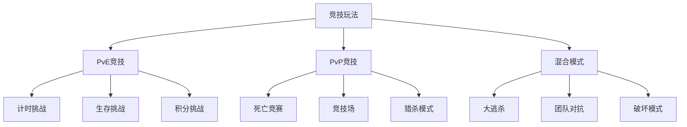
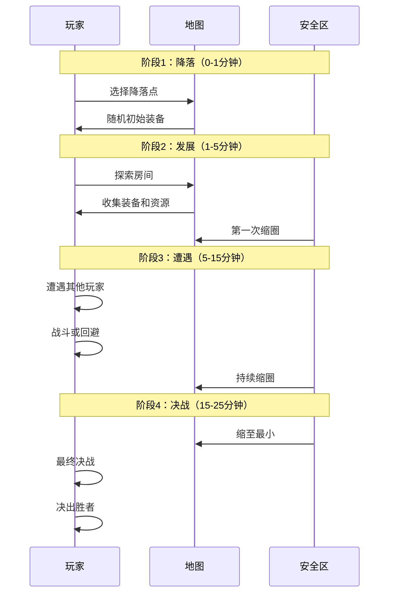

# Cube - 竞技玩法设计

## 文档信息
- **文档类型**：游戏设计文档
- **版本**：1.0
- **创建日期**：2026-01-22
- **最后更新**：2026-01-22
- **状态**：定稿
- **负责人**：多人游戏设计团队
- **所属模块**：核心玩法系统

---

## 目录

1. [竞技玩法概述](#1-竞技玩法概述)
2. [PvE竞技模式](#2-pve竞技模式)
3. [PvP竞技模式](#3-pvp竞技模式)
4. [混合竞技模式](#4-混合竞技模式)
5. [排行榜与赛季](#5-排行榜与赛季)
6. [奖励系统](#6-奖励系统)
7. [反作弊机制](#7-反作弊机制)
8. [技术实现](#8-技术实现)

---

## 1. 竞技玩法概述

### 1.1 设计理念

#### 核心理念：生存竞技

**定义**：在Cube的迷宫世界中，竞技不仅是战斗，更是智慧、生存和策略的综合较量。

```
竞技三大要素：
├─ 生存能力：应对陷阱和环境
├─ 战斗能力：对抗敌人和玩家
└─ 策略能力：解谜、探索、资源管理
```

---

#### 设计原则

```
原则1：公平竞争
- 技巧决定胜负，而非氪金
- 匹配机制保证水平相近
- 反作弊系统严格

原则2：多样性
- 多种竞技模式
- 不同玩法适应不同玩家
- 持续更新内容

原则3：观赏性
- 精彩时刻高光
- 观战系统
- 回放分享

原则4：奖励合理
- 参与有奖
- 胜利更优
- 排名激励
```

---

### 1.2 竞技模式分类



---

### 1.3 匹配系统

#### ELO分数系统

```javascript
const eloSystem = {
    // 初始分数
    initialRating: 1200,
    
    // K因子（影响分数变化幅度）
    kFactor: {
        newbie: 40,      // 新手（<10场）
        normal: 20,      // 普通玩家
        veteran: 10      // 老手（>100场）
    },
    
    // 计算期望胜率
    calculateExpected: function(ratingA, ratingB) {
        return 1 / (1 + Math.pow(10, (ratingB - ratingA) / 400));
    },
    
    // 计算新分数
    calculateNewRating: function(oldRating, expectedScore, actualScore, k) {
        return oldRating + k * (actualScore - expectedScore);
    },
    
    // 示例
    example: function() {
        let playerA = 1500;  // A玩家分数
        let playerB = 1400;  // B玩家分数
        
        // A的期望胜率
        let expectedA = this.calculateExpected(playerA, playerB);
        // expectedA ≈ 0.64 (64%胜率)
        
        // A赢了（actualScore = 1）
        let newRatingA = this.calculateNewRating(playerA, expectedA, 1, 20);
        // newRatingA = 1500 + 20 * (1 - 0.64) = 1507
        
        // A输了（actualScore = 0）
        let newRatingA2 = this.calculateNewRating(playerA, expectedA, 0, 20);
        // newRatingA2 = 1500 + 20 * (0 - 0.64) = 1487
    }
};
```

---

#### 匹配队列

```javascript
const matchmaking = {
    // 队列类型
    queues: {
        ranked: {
            name: "排位赛",
            minPlayers: 2,
            maxPlayers: 8,
            matchingTime: 60,      // 60秒匹配时间
            ratingRange: 100,      // 初始分差范围±100
            expandRate: 10         // 每10秒扩大范围10分
        },
        
        casual: {
            name: "休闲赛",
            minPlayers: 2,
            maxPlayers: 16,
            matchingTime: 30,
            ratingRange: 999,      // 不限分差
            expandRate: 0
        },
        
        custom: {
            name: "自定义",
            minPlayers: 1,
            maxPlayers: 32,
            matchingTime: 999,
            ratingRange: 999,
            expandRate: 0
        }
    },
    
    // 匹配算法
    findMatch: function(player, queueType) {
        let queue = this.queues[queueType];
        let waitTime = 0;
        let currentRange = queue.ratingRange;
        
        while (waitTime < queue.matchingTime) {
            // 查找分数范围内的玩家
            let candidates = this.findPlayersInRange(
                player.rating, 
                currentRange
            );
            
            // 找到足够玩家
            if (candidates.length >= queue.minPlayers) {
                return this.createMatch(candidates);
            }
            
            // 扩大搜索范围
            waitTime += 10;
            currentRange += queue.expandRate;
        }
        
        // 超时，放入下一轮
        return null;
    }
};
```

---

## 2. PvE竞技模式

### 2.1 计时挑战（Time Attack）

#### 模式描述

**目标**：以最快速度通过指定迷宫关卡。

**规则**：
```
1. 单人或团队（2-4人）
2. 固定地图布局（公平竞技）
3. 记录完成时间
4. 时间越短，排名越高
5. 死亡会增加罚时
```

---

#### 地图设计

**地图特点**：
- 固定布局（每周/每月更换）
- 多条路径（速度vs安全）
- 捷径存在（需要技巧或特殊技能）
- 危险区域（高风险高回报）

**示例地图：迅雷迷宫**

```
地图结构：
[起点] → [安全路径] → [终点]
   ↓
[捷径] → [陷阱区] → [终点]

安全路径：
- 距离：1000米
- 陷阱：少量简单陷阱
- 时间：~10分钟

捷径：
- 距离：600米
- 陷阱：大量致命陷阱
- 时间：~6分钟（成功）或死亡（失败）

策略选择：
- 稳定玩家选择安全路径
- 激进玩家选择捷径
- 高手可能探索多条捷径
```

---

#### 计分系统

```javascript
const timeAttackScoring = {
    calculateScore: function(completionTime, deaths, collectibles, difficulty) {
        // 基础分：完成时间
        let baseScore = 10000 - completionTime;  // 秒
        
        // 死亡惩罚
        let deathPenalty = deaths * 120;  // 每次死亡-120秒
        
        // 收集品奖励
        let collectibleBonus = collectibles * 30;  // 每个收集品-30秒
        
        // 难度倍率
        let difficultyMultiplier = difficulty; // 1.0, 1.5, 2.0
        
        // 最终得分
        let finalTime = completionTime + deathPenalty - collectibleBonus;
        let finalScore = Math.max(0, 10000 - finalTime) * difficultyMultiplier;
        
        return {
            time: completionTime,
            deaths: deaths,
            collectibles: collectibles,
            finalTime: finalTime,
            score: Math.round(finalScore)
        };
    },
    
    // 示例
    example: function() {
        // 场景1：速通高手
        let pro = this.calculateScore(360, 0, 5, 2.0);
        // 时间：6分钟，0死亡，5个收集品
        // 最终时间：360 - 150 = 210秒
        // 得分：(10000-210) * 2.0 = 19580分
        
        // 场景2：稳健玩家
        let safe = this.calculateScore(600, 1, 10, 1.5);
        // 时间：10分钟，1死亡，10个收集品
        // 最终时间：600 + 120 - 300 = 420秒
        // 得分：(10000-420) * 1.5 = 14370分
        
        console.log("速通高手得分更高！");
    }
};
```

---

#### 排行榜

```
全球排行榜
├─ 总榜（所有难度）
├─ 难度分榜（简单/普通/困难/地狱）
└─ 职业分榜（坦克/输出/辅助/侦察）

区域排行榜
├─ 国家/地区排名
└─ 服务器排名

好友排行榜
├─ 只显示好友成绩
└─ 便于比较

周/月排行榜
├─ 每周重置
├─ 赛季奖励
└─ 保持新鲜感
```

---

### 2.2 生存挑战（Survival）

#### 模式描述

**目标**：在无尽迷宫中生存尽可能长的时间。

**规则**：
```
1. 单人模式
2. 随机生成的无尽房间
3. 难度递增
4. 生存时间越长，排名越高
5. 只有1条命（死亡即结束）
6. 资源有限，需要管理
```

---

#### 难度递增机制

```javascript
const survivalDifficulty = {
    // 基于时间的难度曲线
    getDifficulty: function(survivalTime) {
        // survivalTime单位：秒
        let minutes = survivalTime / 60;
        
        return {
            // 敌人数量倍率
            enemyCount: 1 + minutes * 0.2,
            
            // 敌人生命值倍率
            enemyHealth: 1 + minutes * 0.15,
            
            // 敌人伤害倍率
            enemyDamage: 1 + minutes * 0.1,
            
            // 陷阱密度
            trapDensity: Math.min(1.0, 0.3 + minutes * 0.05),
            
            // 陷阱伤害
            trapDamage: 1 + minutes * 0.08,
            
            // 资源生成率
            resourceSpawn: Math.max(0.2, 1 - minutes * 0.05),
            
            // Boss出现概率
            bossChance: Math.min(0.5, minutes * 0.02),
            
            // 总难度等级
            level: Math.floor(minutes / 5) + 1
        };
    },
    
    // 示例难度
    showExamples: function() {
        console.log("5分钟：", this.getDifficulty(300));
        console.log("15分钟：", this.getDifficulty(900));
        console.log("30分钟：", this.getDifficulty(1800));
        console.log("60分钟：", this.getDifficulty(3600));
    }
};
```

---

#### 资源管理

**资源类型**：
```
生命值
├─ 不会自动恢复
├─ 只能通过治疗包恢复
└─ 治疗包稀有

弹药/法力
├─ 缓慢自动恢复
├─ 可以找到补给
└─ 节约使用

装备耐久
├─ 使用会磨损
├─ 损坏后效果降低
└─ 需要修理工具

食物/水
├─ 长期生存需求
├─ 缺乏会降低属性
└─ 需要定期补充
```

**策略选择**：
- 激进流：快速探索，收集大量资源
- 保守流：慢速前进，节约资源
- 风险流：挑战危险区域，获取稀有补给

---

#### 里程碑系统

```
里程碑（解锁额外奖励）：

5分钟
└─ 解锁：白银宝箱

10分钟
└─ 解锁：黄金宝箱 + 额外技能槽

15分钟
└─ 解锁：铂金宝箱 + 生命上限+20%

20分钟
└─ 解锁：钻石宝箱 + 伤害+25%

25分钟
└─ 解锁：传说宝箱 + 复活机会（1次）

30分钟+
└─ 每5分钟：史诗宝箱 + 随机强化
```

---

### 2.3 积分挑战（Score Attack）

#### 模式描述

**目标**：在固定时间内获得最高积分。

**规则**：
```
1. 时间限制：30分钟
2. 多种获得积分方式
3. 连击系统（Combo）
4. 积分越高，排名越高
```

---

#### 积分来源

```
击杀敌人
├─ 普通敌人：10-50分
├─ 精英敌人：100-300分
├─ Boss敌人：500-2000分
└─ 连击倍率：×1.5, ×2.0, ×3.0

完成谜题
├─ 简单谜题：50分
├─ 中等谜题：150分
├─ 困难谜题：500分
└─ 速度奖励：额外50%

发现秘密
├─ 隐藏房间：200分
├─ 秘密通道：100分
├─ 彩蛋：500分
└─ 收集品：50分/个

完美表现
├─ 零伤害通过房间：+100分
├─ 一击必杀：+50分
├─ 完美闪避：+30分
└─ 技巧击杀：+100分
```

---

#### 连击系统

```javascript
const comboSystem = {
    combo: 0,
    comboTimer: 0,
    comboDecayTime: 5,  // 5秒无动作combo断
    
    multipliers: [
        { min: 0, max: 9, multiplier: 1.0 },
        { min: 10, max: 29, multiplier: 1.5 },
        { min: 30, max: 49, multiplier: 2.0 },
        { min: 50, max: 99, multiplier: 2.5 },
        { min: 100, max: 999, multiplier: 3.0 }
    ],
    
    // 增加combo
    addCombo: function(amount = 1) {
        this.combo += amount;
        this.comboTimer = this.comboDecayTime;
        
        this.showComboUI();
    },
    
    // 获取当前倍率
    getMultiplier: function() {
        for (let tier of this.multipliers) {
            if (this.combo >= tier.min && this.combo <= tier.max) {
                return tier.multiplier;
            }
        }
        return 3.0;  // 最高倍率
    },
    
    // 计算得分
    calculateScore: function(baseScore) {
        let multiplier = this.getMultiplier();
        return Math.round(baseScore * multiplier);
    },
    
    // 更新（每帧调用）
    update: function(deltaTime) {
        if (this.combo > 0) {
            this.comboTimer -= deltaTime;
            
            if (this.comboTimer <= 0) {
                this.breakCombo();
            }
        }
    },
    
    // combo断裂
    breakCombo: function() {
        if (this.combo >= 50) {
            // 高combo断裂有惩罚感
            this.showComboBreakEffect();
        }
        
        this.combo = 0;
        this.comboTimer = 0;
    }
};
```

---

## 3. PvP竞技模式

### 3.1 死亡竞赛（Deathmatch）

#### 模式描述

**目标**：在限定时间内击杀最多玩家。

**规则**：
```
玩家数量：4-16人
时间限制：10分钟
地图：小型竞技场地图
重生机制：死亡后5秒重生
胜利条件：击杀数最多
```

---

#### 地图设计

**竞技场特点**：
- 对称设计（公平性）
- 多层结构（垂直玩法）
- 掩体布局（战术走位）
- 资源点（争夺焦点）
- 陷阱区域（环境杀伤）

**示例地图：审判竞技场**

```
地图布局：
         [高台狙击点]
              ↓
    [掩体区] ← [中央平台] → [掩体区]
        ↓                      ↓
   [资源点A]              [资源点B]
        ↓                      ↓
    [陷阱区] ← [下层通道] → [陷阱区]

关键区域：
- 中央平台：高地优势，易被围攻
- 高台狙击点：远程输出点，难以到达
- 资源点：补给生成，必争之地
- 陷阱区：危险但有捷径

战术要点：
- 控制中央平台=控制全局视野
- 资源点争夺是关键
- 利用陷阱杀敌
- 高台狙击需要保护
```

---

#### 计分系统

```javascript
const deathmatchScoring = {
    // 击杀得分
    killScore: 100,
    
    // 助攻得分
    assistScore: 50,
    
    // 连杀奖励
    streakBonus: {
        2: 50,    // 双杀
        3: 150,   // 三杀
        4: 300,   // 四杀
        5: 500    // 五杀
    },
    
    // 特殊击杀
    specialKills: {
        headshot: 50,      // 爆头
        environmental: 100, // 环境击杀（陷阱）
        revenge: 50,       // 复仇
        savior: 100,       // 救援击杀
        firstBlood: 200    // 首杀
    },
    
    // 死亡惩罚
    deathPenalty: -20,
    
    // 计算总分
    calculateTotalScore: function(player) {
        let score = 0;
        
        // 基础击杀分
        score += player.kills * this.killScore;
        
        // 助攻分
        score += player.assists * this.assistScore;
        
        // 连杀奖励
        for (let streak in player.killStreaks) {
            score += player.killStreaks[streak] * (this.streakBonus[streak] || 0);
        }
        
        // 特殊击杀
        for (let type in player.specialKills) {
            score += player.specialKills[type] * (this.specialKills[type] || 0);
        }
        
        // 死亡惩罚
        score += player.deaths * this.deathPenalty;
        
        return score;
    }
};
```

---

#### 武器平衡

**武器分级**：
```
初始武器（重生自带）
├─ 基础近战武器
├─ 基础远程武器
└─ 平衡但不强

地图武器（需要争夺）
├─ 中级武器：地图固定刷新
├─ 高级武器：中央区域刷新
└─ 超级武器：定时刷新（2分钟一次）

示例武器：
- 狙击枪：高伤害，慢射速，难度高
- 霰弹枪：近距离强，远距离弱
- 火箭筒：范围伤害，弹药少，自伤风险
- 激光枪：持续伤害，需要精准瞄准
```

---

### 3.2 竞技场（Arena）

#### 模式描述

**目标**：1v1或2v2小队对战，回合制淘汰。

**规则**：
```
模式：1v1 或 2v2
回合制：Bo3（三局两胜）或 Bo5（五局三胜）
地图：小型封闭竞技场
复活：无（一回合一条命）
胜利条件：击杀所有对手
```

---

#### 竞技场特色

**禁选系统（Ban/Pick）**：
```
阶段1：Ban技能
- 每方可以Ban 2个技能
- 被Ban技能无法使用

阶段2：Pick角色
- 选择职业和技能
- 不能重复选择（同队）

阶段3：地图选择
- 双方轮流Ban地图
- 最后剩余的为比赛地图

示例流程（2v2）：
1. 蓝方 Ban 技能A
2. 红方 Ban 技能B
3. 蓝方 Ban 技能C
4. 红方 Ban 技能D
5. 蓝方 Pick 角色
6. 红方 Pick 角色
7. 选择地图
8. 比赛开始
```

---

#### 地图池

**竞技地图特点**：
- 小型封闭空间
- 对称设计
- 少量掩体
- 无陷阱（纯技术对战）
- 部分地图有特殊机制

**地图示例**：

**地图1：对称竞技场**
```
[柱子] [空地] [柱子]
         
[空地] [中央] [空地]
         
[柱子] [空地] [柱子]

特点：
- 完全对称
- 4根柱子提供掩体
- 中央是空旷区域
- 考验走位和瞄准
```

**地图2：高低差竞技场**
```
    [高台]
      ↓
[斜坡] [中央] [斜坡]
      ↓
    [低地]

特点：
- 高台优势
- 低地劣势
- 争夺高地是关键
```

**地图3：障碍竞技场**
```
[墙] [空] [墙]
[空] [柱] [空]
[墙] [空] [墙]

特点：
- 大量墙壁和柱子
- 限制视野
- 近战友好
- 远程受限
```

---

#### 天梯系统

```
段位划分：
├─ 青铜（Bronze）：0-999分
├─ 白银（Silver）：1000-1499分
├─ 黄金（Gold）：1500-1999分
├─ 铂金（Platinum）：2000-2499分
├─ 钻石（Diamond）：2500-2999分
├─ 大师（Master）：3000-3499分
└─ 传说（Legend）：3500+分

升降级机制：
- 胜利：+20-30分（取决于对手分数）
- 失败：-15-25分
- 连胜奖励：+5分（最多3连胜）
- 保级机制：从高段位降级需连续失败

赛季机制：
- 每赛季3个月
- 赛季末奖励
- 新赛季段位软重置（下降2个小段位）
- 定位赛：新赛季前5场决定起始分数
```

---

### 3.3 猎杀模式（Hunt）

#### 模式描述

**目标**：猎人追杀逃亡者，逃亡者需要生存或逃离。

**规则**：
```
玩家分配：
- 1名猎人（随机选择）
- 3-7名逃亡者

猎人目标：
- 击杀所有逃亡者
- 有强化能力

逃亡者目标：
- 生存15分钟
- 或找到并激活3个逃生点

特殊规则：
- 逃亡者可以复活队友（需要30秒）
- 猎人击杀后可看到所有逃亡者位置（5秒）
- 逃亡者死亡后变成"游魂"（辅助队友）
```

---

#### 猎人能力

**猎人强化**：
```
被动能力：
- 生命值 +100%
- 移动速度 +30%
- 视野范围 +50%
- 攻击力 +50%

主动技能：
- 追踪（30秒CD）：显示最近的逃亡者方向
- 嗜血（60秒CD）：移动速度+100%，持续10秒
- 恐吓（45秒CD）：范围内逃亡者移动速度-50%

终极技能：
- 狂猎（120秒CD）：
  - 无限体力
  - 穿墙移动
  - 攻击速度+200%
  - 持续15秒
```

---

#### 逃亡者策略

**生存策略**：
```
分散策略
- 四处分散
- 降低团灭风险
- 独立求生
风险：孤立无援

团队策略
- 抱团行动
- 相互掩护
- 集体逃生
风险：一网打尽

声东击西策略
- 一人引开猎人
- 其他人激活逃生点
- 配合默契
风险：诱饵牺牲
```

**逃生点机制**：
```
逃生点分布：
- 地图上有5个逃生点
- 需要激活3个
- 激活需要30秒（可被打断）
- 激活时发出明显提示（猎人可见）

激活后：
- 该逃生点开启传送门
- 所有逃亡者可使用
- 猎人也可以进入（但会被传送到远处）
```

---

## 4. 混合竞技模式

### 4.1 大逃杀（Battle Royale）

#### 模式描述

**目标**：在缩圈的迷宫地图中，成为最后的幸存者。

**规则**：
```
玩家数量：20-50人
模式：单人/双人/四人小队
地图：大型随机生成迷宫
毒圈机制：定时缩圈
胜利条件：最后存活
```

---

#### 游戏流程



---

#### 缩圈机制

```javascript
const shrinkingZone = {
    phases: [
        {
            phase: 1,
            waitTime: 120,       // 等待2分钟
            shrinkTime: 90,      // 缩圈1.5分钟
            damagePerSecond: 2,  // 圈外伤害
            finalRadius: 500     // 最终半径500米
        },
        {
            phase: 2,
            waitTime: 90,
            shrinkTime: 60,
            damagePerSecond: 5,
            finalRadius: 300
        },
        {
            phase: 3,
            waitTime: 60,
            shrinkTime: 45,
            damagePerSecond: 10,
            finalRadius: 150
        },
        {
            phase: 4,
            waitTime: 45,
            shrinkTime: 30,
            damagePerSecond: 20,
            finalRadius: 75
        },
        {
            phase: 5,
            waitTime: 30,
            shrinkTime: 30,
            damagePerSecond: 50,
            finalRadius: 20
        }
    ],
    
    currentPhase: 0,
    
    // 获取当前圈外伤害
    getCurrentDamage: function() {
        if (this.currentPhase < this.phases.length) {
            return this.phases[this.currentPhase].damagePerSecond;
        }
        return 100;  // 最终阶段伤害极高
    }
};
```

---

#### 装备系统

**装备品质**：
```
白色（普通）
├─ 基础属性
└─ 常见

绿色（优秀）
├─ 属性+20%
└─ 较常见

蓝色（稀有）
├─ 属性+50%
├─ 附加1个特效
└─ 稀有

紫色（史诗）
├─ 属性+100%
├─ 附加2个特效
└─ 很稀有

金色（传说）
├─ 属性+200%
├─ 附加3个特效
├─ 独特技能
└─ 极其稀有
```

**装备分布**：
- 普通房间：白色、绿色
- 精英房间：蓝色、紫色
- Boss房间：紫色、金色
- 空投：必出紫色或金色

---

#### 空投机制

```
空投生成：
- 第一次空投：5分钟
- 后续空投：每3分钟一次
- 随机位置（远离当前安全区中心）
- 明显的光柱和音效

空投内容：
- 1件紫色或金色装备
- 大量补给资源
- 特殊道具（复活币、侦察无人机等）

风险：
- 吸引所有附近玩家
- 容易被伏击
- 需要争夺
```

---

### 4.2 团队对抗（Team vs Environment）

#### 模式描述

**目标**：两队（各4人）竞争完成目标，同时对抗环境威胁。

**规则**：
```
两队并行挑战相同地图
无直接PvP（不同"实例"）
但有间接对抗机制
完成目标更快的队伍获胜
```

---

#### 对抗机制

**间接对抗**：
```
资源争夺
- 共享资源池
- A队拾取，B队就没了

破坏系统
- 花费资源破坏对方
- 例如：激活对方地图的额外陷阱
- 或：召唤Boss到对方地图

进度对比
- 实时显示双方进度
- 落后方获得小幅增益
- 领先方压力更大

最终对决（可选）
- 前80%是间接对抗
- 最后20%两队进入同一地图
- 直接PvP决出胜负
```

---

### 4.3 破坏模式（Sabotage）

#### 模式描述

**目标**：完成自己的目标，同时破坏对手进度。

**规则**：
```
4-8名玩家
每人有秘密任务
完成任务获得分数
可以破坏他人任务
最终分数最高者获胜
```

---

#### 任务类型

```
收集任务
- 收集特定物品
- 可被他人抢夺
- 需要防守

解谜任务
- 解开特定谜题
- 可被他人破坏进度
- 需要速度

击杀任务
- 击杀特定目标
- 其他玩家也会竞争
- 需要战斗

生存任务
- 生存特定时间
- 可被他人追杀
- 需要躲藏
```

---

#### 破坏手段

```
直接破坏
- 攻击他人
- 抢夺物品
- 阻止行动

间接破坏
- 引怪到他人位置
- 激活陷阱
- 散布虚假情报

合作破坏
- 暂时结盟
- 共同对抗领先者
- 然后背叛
```

---

## 5. 排行榜与赛季

### 5.1 排行榜系统

```
排行榜类型：

全球榜
├─ 实时更新
├─ 显示Top 1000
└─ 可查询自己排名

区域榜
├─ 国家/地区
├─ 服务器
└─ 好友

专项榜
├─ 职业榜（每个职业单独排名）
├─ 模式榜（每个模式单独排名）
└─ 成就榜（特殊成就排名）

显示信息：
- 排名
- 玩家名
- 分数/时间/数据
- 职业/等级
- 变化趋势（↑↓）
```

---

### 5.2 赛季系统

```javascript
const seasonSystem = {
    // 赛季配置
    seasonDuration: 90,  // 天数
    
    seasonRewards: {
        bronze: {
            currency: 1000,
            cosmetics: ["青铜边框"],
            title: "青铜勇士"
        },
        silver: {
            currency: 2500,
            cosmetics: ["白银边框", "白银武器皮肤"],
            title: "白银斗士"
        },
        gold: {
            currency: 5000,
            cosmetics: ["黄金边框", "黄金武器皮肤", "黄金特效"],
            title: "黄金英雄"
        },
        platinum: {
            currency: 10000,
            cosmetics: ["铂金边框", "铂金全套皮肤"],
            title: "铂金传奇"
        },
        diamond: {
            currency: 20000,
            cosmetics: ["钻石边框", "钻石全套皮肤", "钻石坐骑"],
            title: "钻石大师"
        },
        master: {
            currency: 50000,
            cosmetics: ["大师边框", "大师全套", "大师光环"],
            title: "无双大师"
        },
        legend: {
            currency: 100000,
            cosmetics: ["传说边框", "传说全套", "传说光环", "专属动作"],
            title: "传说巅峰"
        }
    },
    
    // 段位衰减
    rankDecay: {
        enabled: true,
        inactivityDays: 7,    // 7天不活跃
        decayAmount: 10,       // 每天-10分
        minimumRank: "gold"    // 黄金及以上才衰减
    },
    
    // 赛季重置
    seasonReset: {
        softReset: true,       // 软重置
        resetFormula: function(oldRating) {
            // 新分数 = (旧分数 + 1200) / 2
            return Math.floor((oldRating + 1200) / 2);
        }
    }
};
```

---

### 5.3 成就系统

```
竞技成就：

速度成就
├─ 计时挑战 < 5分钟
├─ 计时挑战 < 3分钟
└─ 计时挑战 < 1分钟

生存成就
├─ 生存 > 30分钟
├─ 生存 > 60分钟
└─ 生存 > 120分钟

战斗成就
├─ 单局10杀
├─ 单局20杀
├─ 五杀成就
└─ 团灭成就

特殊成就
├─ 零伤害胜利
├─ 使用陷阱击杀10人
├─ 连胜10场
└─ 所有职业上大师

成就奖励：
- 成就点数
- 专属称号
- 特殊装饰
- 解锁隐藏内容
```

---

## 6. 奖励系统

### 6.1 奖励类型

```
游戏内货币
├─ 金币（基础货币）
├─ 钻石（高级货币）
└─ 赛季代币（限时货币）

装备/皮肤
├─ 角色皮肤
├─ 武器皮肤
├─ 特效皮肤
└─ 装备外观

功能性奖励
├─ 经验加成卡
├─ 金币加成卡
├─ 技能点
└─ 宝箱钥匙

收藏品
├─ 称号
├─ 头像框
├─ 表情/动作
└─ 坐骑/宠物
```

---

### 6.2 奖励获取

```
对局奖励
├─ 基础参与奖
├─ 胜利额外奖
├─ 表现加成
└─ 首胜奖励（每日）

排名奖励
├─ 赛季结算（赛季末）
├─ 周排行榜（每周）
├─ 月度排行榜（每月）
└─ Top玩家额外奖

成就奖励
├─ 完成成就解锁
├─ 一次性奖励
└─ 持续效果

活动奖励
├─ 限时活动
├─ 特殊挑战
├─ 节日活动
└─ 合作活动
```

---

### 6.3 奖励平衡

```javascript
const rewardBalance = {
    // 每小时期望收益
    expectedHourlyReward: {
        casual: {
            gold: 500,
            experience: 1000
        },
        ranked: {
            gold: 800,
            experience: 1500,
            rankPoints: 60  // 平均（考虑胜负）
        },
        competitive: {
            gold: 1200,
            experience: 2000
        }
    },
    
    // 防止刷奖励机制
    antiAbuse: {
        // AFK检测
        afkDetection: true,
        afkPenalty: 0,  // AFK无奖励
        
        // 快速投降惩罚
        earlySurrenderPenalty: 0.5,  // 50%奖励
        
        // 故意送人头惩罚
        feedingDetection: true,
        feedingPenalty: 0,  // 无奖励+警告
        
        // 连续失败保护
        losingStreakProtection: true,
        minRewardPercent: 0.3  // 即使失败也有30%奖励
    }
};
```

---

## 7. 反作弊机制

### 7.1 作弊类型

```
常见作弊：
├─ 外挂（Hack）
│   ├─ 自瞄（Aimbot）
│   ├─ 透视（Wallhack）
│   ├─ 加速（Speedhack）
│   └─ 无敌（Godmode）
│
├─ 脚本（Script）
│   ├─ 自动操作
│   └─ 宏操作
│
├─ 利用Bug
│   ├─ 地图Bug
│   ├─ 技能Bug
│   └─ 刷分Bug
│
└─ 其他
    ├─ 组队作弊
    ├─ 恶意挂机
    └─ 辱骂/骚扰
```

---

### 7.2 检测机制

```javascript
const antiCheat = {
    // 客户端检测
    clientSideDetection: {
        // 内存检测
        memoryScanning: true,
        
        // 进程检测
        processMonitoring: true,
        
        // 完整性检查
        fileIntegrityCheck: true,
        
        // 注入检测
        injectionDetection: true
    },
    
    // 服务器端检测
    serverSideDetection: {
        // 数据异常检测
        dataAnomalyDetection: function(player) {
            let flags = 0;
            
            // 异常高的命中率
            if (player.accuracy > 0.95) flags++;
            
            // 异常高的反应速度
            if (player.avgReactionTime < 50) flags++;  // 50ms
            
            // 异常的移动速度
            if (player.avgSpeed > player.maxSpeed * 1.1) flags++;
            
            // 看穿墙壁（视线追踪）
            if (player.wallTrackingCount > 10) flags++;
            
            // 异常的击杀距离
            if (player.avgKillDistance > 200) flags++;  // 远距离狙击过多
            
            return flags >= 3;  // 3个以上异常标记
        },
        
        // 行为模式分析
        behaviorAnalysis: function(player) {
            // 机器学习模型
            let mlScore = ML.predict(player.behaviorData);
            
            // 与正常玩家对比
            let isAnomalous = mlScore > 0.95;
            
            return isAnomalous;
        },
        
        // 统计分析
        statisticalAnalysis: function(player) {
            // 对比同水平玩家数据
            let similarPlayers = Database.getSimilarRankedPlayers(player.rank);
            let avgStats = calculateAverage(similarPlayers);
            
            // 显著偏离
            let deviation = calculateDeviation(player.stats, avgStats);
            
            return deviation > 3;  // 3个标准差以上
        }
    },
    
    // 社区举报
    communityReport: {
        enabled: true,
        
        // 举报审核
        reviewSystem: function(report) {
            // 自动审核
            if (report.reportCount > 10) {
                // 多人举报，自动调查
                this.investigate(report.playerId);
            }
            
            // 人工审核
            if (report.evidence) {
                // 有证据（录像），人工审核
                AdminPanel.addToReviewQueue(report);
            }
        },
        
        // 录像系统
        replaySystem: true,
        saveLastNGames: 10,  // 保存最近10场比赛录像
        
        // 举报奖励
        reportReward: {
            validReport: 100,  // 有效举报奖励
            invalidReport: -10  // 无效举报惩罚（防止滥用）
        }
    }
};
```

---

### 7.3 惩罚措施

```
惩罚等级：

警告（Warning）
├─ 首次轻微违规
├─ 警告记录
└─ 无实质惩罚

禁言（Mute）
├─ 语言违规
├─ 禁止聊天
└─ 持续：1天-永久

排位禁赛（Ranked Ban）
├─ 恶意挂机/送人头
├─ 禁止排位
├─ 持续：1天-7天
└─ 可玩休闲模式

临时封号（Temporary Ban）
├─ 严重违规
├─ 使用外挂/脚本
├─ 持续：7天-30天
└─ 无法登录

永久封号（Permanent Ban）
├─ 多次严重违规
├─ 使用外挂
├─ 恶意破坏游戏
└─ 永久无法登录

硬件封禁（Hardware Ban）
├─ 极端情况
├─ 封禁硬件ID
└─ 换号无用
```

---

## 8. 技术实现

### 8.1 网络同步

```csharp
// 网络同步管理器
public class NetworkSyncManager : MonoBehaviour
{
    [Header("同步频率")]
    public int tickRate = 64;  // 64Hz服务器更新率
    public int clientSendRate = 30;  // 客户端发送30Hz
    
    [Header("延迟补偿")]
    public bool lagCompensation = true;
    public float maxCompensationTime = 0.2f;  // 最大补偿200ms
    
    [Header("预测")]
    public bool clientPrediction = true;
    public bool serverReconciliation = true;
    
    private float tickDelta;
    private float clientSendDelta;
    
    void Start()
    {
        tickDelta = 1f / tickRate;
        clientSendDelta = 1f / clientSendRate;
        
        StartCoroutine(ServerTickLoop());
        StartCoroutine(ClientSendLoop());
    }
    
    // 服务器Tick循环
    private IEnumerator ServerTickLoop()
    {
        while (true)
        {
            yield return new WaitForSeconds(tickDelta);
            
            if (NetworkManager.IsServer)
            {
                ServerTick();
            }
        }
    }
    
    private void ServerTick()
    {
        // 1. 处理客户端输入
        ProcessClientInputs();
        
        // 2. 更新游戏状态
        UpdateGameState();
        
        // 3. 发送状态到客户端
        SendStateToClients();
    }
    
    // 客户端发送循环
    private IEnumerator ClientSendLoop()
    {
        while (true)
        {
            yield return new WaitForSeconds(clientSendDelta);
            
            if (NetworkManager.IsClient)
            {
                SendInputToServer();
            }
        }
    }
    
    // 延迟补偿
    public Vector3 GetCompensatedPosition(Player player, float latency)
    {
        if (!lagCompensation)
            return player.Position;
        
        // 限制补偿时间
        latency = Mathf.Min(latency, maxCompensationTime);
        
        // 回溯到客户端看到的时间点
        float compensationTime = Time.time - latency;
        
        // 从历史位置中插值
        return InterpolateHistoricalPosition(player, compensationTime);
    }
    
    // 客户端预测
    public void PredictMovement(Player player, Vector3 input)
    {
        if (!clientPrediction)
            return;
        
        // 立即应用移动（不等服务器确认）
        player.Move(input);
        
        // 记录预测
        RecordPrediction(player, input);
    }
    
    // 服务器校正
    public void ReconcilePosition(Player player, Vector3 serverPosition, int serverTick)
    {
        if (!serverReconciliation)
            return;
        
        // 如果位置差异过大，校正
        float差异 = Vector3.Distance(player.Position, serverPosition);
        
        if (差异 > 0.5f)  // 50cm误差
        {
            // 平滑校正
            player.Position = Vector3.Lerp(player.Position, serverPosition, 0.1f);
            
            // 重新应用之后的输入
            ReplayInputsSince(player, serverTick);
        }
    }
}
```

---

### 8.2 匹配系统实现

```csharp
// 匹配管理器
public class MatchmakingManager : MonoBehaviour
{
    [Header("匹配配置")]
    public int minPlayers = 2;
    public int maxPlayers = 16;
    public float matchTimeout = 120f;  // 120秒超时
    
    [Header("分数范围")]
    public int initialRatingRange = 100;
    public int rangeExpansionRate = 10;  // 每秒扩大10分
    public int maxRatingRange = 500;
    
    private Dictionary<string, MatchmakingQueue> queues;
    
    void Start()
    {
        queues = new Dictionary<string, MatchmakingQueue>();
        InitializeQueues();
    }
    
    // 加入队列
    public void JoinQueue(Player player, string queueType)
    {
        if (!queues.ContainsKey(queueType))
        {
            Debug.LogError($"队列类型不存在: {queueType}");
            return;
        }
        
        var queue = queues[queueType];
        
        // 创建匹配请求
        var request = new MatchmakingRequest
        {
            player = player,
            rating = player.RankedRating,
            joinTime = Time.time,
            currentRange = initialRatingRange
        };
        
        queue.AddRequest(request);
        
        // 通知玩家
        UIManager.Instance.ShowMatchmakingUI(player);
        
        // 开始匹配
        StartCoroutine(MatchmakingRoutine(request, queue));
    }
    
    // 匹配循环
    private IEnumerator MatchmakingRoutine(MatchmakingRequest request, MatchmakingQueue queue)
    {
        float elapsed = 0;
        
        while (elapsed < matchTimeout)
        {
            yield return new WaitForSeconds(1f);
            elapsed += 1f;
            
            // 扩大搜索范围
            request.currentRange = Mathf.Min(
                initialRatingRange + (int)elapsed * rangeExpansionRate,
                maxRatingRange
            );
            
            // 尝试匹配
            var match = TryCreateMatch(request, queue);
            
            if (match != null)
            {
                // 匹配成功
                OnMatchFound(match);
                yield break;
            }
        }
        
        // 超时
        OnMatchTimeout(request);
    }
    
    // 尝试创建比赛
    private Match TryCreateMatch(MatchmakingRequest initiator, MatchmakingQueue queue)
    {
        // 查找范围内的玩家
        var candidates = queue.FindPlayersInRange(
            initiator.rating,
            initiator.currentRange
        );
        
        // 不够玩家
        if (candidates.Count < minPlayers - 1)  // -1因为包括发起者
            return null;
        
        // 创建比赛
        var match = new Match
        {
            matchId = GenerateMatchId(),
            players = new List<Player> { initiator.player }
        };
        
        // 添加其他玩家
        for (int i = 0; i < Mathf.Min(candidates.Count, maxPlayers - 1); i++)
        {
            match.players.Add(candidates[i].player);
        }
        
        // 从队列移除
        foreach (var player in match.players)
        {
            queue.RemovePlayer(player);
        }
        
        return match;
    }
    
    // 匹配成功
    private void OnMatchFound(Match match)
    {
        // 通知所有玩家
        foreach (var player in match.players)
        {
            UIManager.Instance.ShowMatchFoundNotification(player);
        }
        
        // 创建房间
        StartCoroutine(CreateMatchRoom(match));
    }
    
    private IEnumerator CreateMatchRoom(Match match)
    {
        // 准备阶段（10秒）
        yield return new WaitForSeconds(10f);
        
        // 创建游戏实例
        var room = NetworkRoomManager.CreateRoom(match);
        
        // 传送玩家进入
        foreach (var player in match.players)
        {
            NetworkRoomManager.TransferPlayerToRoom(player, room);
        }
        
        // 开始游戏
        room.StartMatch();
    }
}
```

---

### 8.3 排行榜实现

```csharp
// 排行榜管理器
public class LeaderboardManager : MonoBehaviour
{
    [Header("数据库")]
    public DatabaseConnection database;
    
    [Header("缓存")]
    public int cacheSize = 1000;
    private Dictionary<string, LeaderboardCache> cache;
    
    void Start()
    {
        cache = new Dictionary<string, LeaderboardCache>();
        
        // 定期更新排行榜
        InvokeRepeating(nameof(UpdateLeaderboards), 0f, 300f);  // 每5分钟
    }
    
    // 获取排行榜
    public async Task<List<LeaderboardEntry>> GetLeaderboard(
        string leaderboardType,
        int offset = 0,
        int limit = 100
    )
    {
        // 检查缓存
        if (cache.ContainsKey(leaderboardType))
        {
            var cachedData = cache[leaderboardType];
            
            // 缓存未过期
            if (Time.time - cachedData.timestamp < 300f)  // 5分钟有效
            {
                return cachedData.entries.GetRange(offset, limit);
            }
        }
        
        // 从数据库查询
        var entries = await database.QueryAsync<LeaderboardEntry>(
            $@"SELECT 
                player_id,
                player_name,
                score,
                rank
              FROM leaderboard_{leaderboardType}
              ORDER BY score DESC
              LIMIT {limit} OFFSET {offset}"
        );
        
        // 更新缓存
        cache[leaderboardType] = new LeaderboardCache
        {
            entries = entries,
            timestamp = Time.time
        };
        
        return entries;
    }
    
    // 更新玩家分数
    public async Task UpdatePlayerScore(string playerId, string leaderboardType, int newScore)
    {
        // 查询当前分数
        var currentScore = await database.QuerySingleAsync<int>(
            $@"SELECT score 
              FROM leaderboard_{leaderboardType}
              WHERE player_id = @playerId",
            new { playerId }
        );
        
        // 如果新分数更高，更新
        if (newScore > currentScore)
        {
            await database.ExecuteAsync(
                $@"UPDATE leaderboard_{leaderboardType}
                  SET score = @newScore,
                      updated_at = NOW()
                  WHERE player_id = @playerId",
                new { playerId, newScore }
            );
            
            // 重新计算排名
            await RecalculateRanks(leaderboardType);
            
            // 清除缓存
            cache.Remove(leaderboardType);
        }
    }
    
    // 重新计算排名
    private async Task RecalculateRanks(string leaderboardType)
    {
        await database.ExecuteAsync(
            $@"UPDATE leaderboard_{leaderboardType} lb1
              JOIN (
                SELECT player_id,
                       ROW_NUMBER() OVER (ORDER BY score DESC) as new_rank
                FROM leaderboard_{leaderboardType}
              ) lb2 ON lb1.player_id = lb2.player_id
              SET lb1.rank = lb2.new_rank"
        );
    }
    
    // 获取玩家排名
    public async Task<int> GetPlayerRank(string playerId, string leaderboardType)
    {
        var rank = await database.QuerySingleAsync<int>(
            $@"SELECT rank
              FROM leaderboard_{leaderboardType}
              WHERE player_id = @playerId",
            new { playerId }
        );
        
        return rank;
    }
    
    // 定期更新排行榜
    private void UpdateLeaderboards()
    {
        var leaderboardTypes = new string[] 
        {
            "time_attack",
            "survival",
            "score_attack",
            "deathmatch",
            "arena"
        };
        
        foreach (var type in leaderboardTypes)
        {
            _ = RecalculateRanks(type);
        }
    }
}
```

---

## 9. 总结

### 9.1 竞技玩法核心

```
1. 多样化模式
   - PvE竞技：技巧与速度
   - PvP竞技：战斗与策略
   - 混合模式：综合挑战

2. 公平机制
   - 匹配系统
   - 反作弊
   - 平衡调整

3. 持续激励
   - 排行榜
   - 赛季奖励
   - 成就系统

4. 社交互动
   - 团队合作
   - 竞争对抗
   - 观战分享

5. 技术保障
   - 网络优化
   - 延迟补偿
   - 服务器稳定
```

---

## 文档变更历史

| 版本 | 日期 | 变更内容 | 修改人 |
|------|------|---------|--------|
| 1.0 | 2026-01-22 | 创建文档，完成初稿 | System |

---

**文档状态**：✅ 定稿

**相关文档**：
- [02-动态房间系统设计](./02-动态房间系统设计.md)
- [03-陷阱系统设计](./03-陷阱系统设计.md)
- [04-谜题系统设计](./04-谜题系统设计.md)
- [05-技能体系设计](./05-技能体系设计.md)
