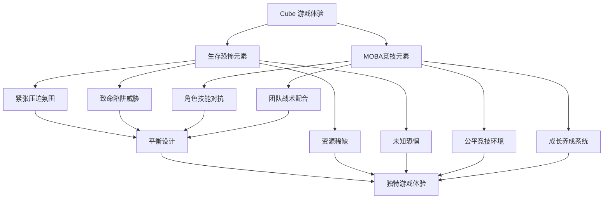
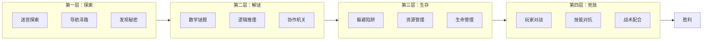
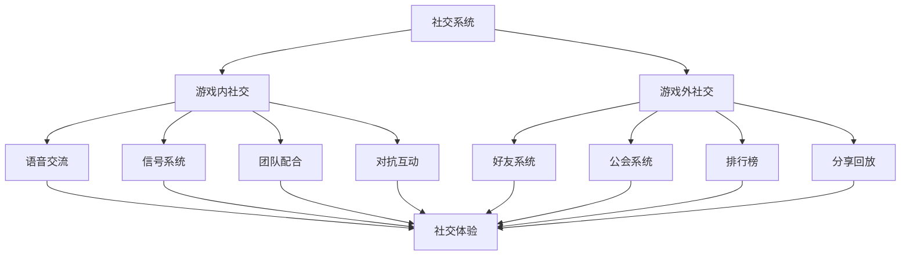
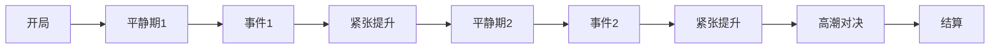
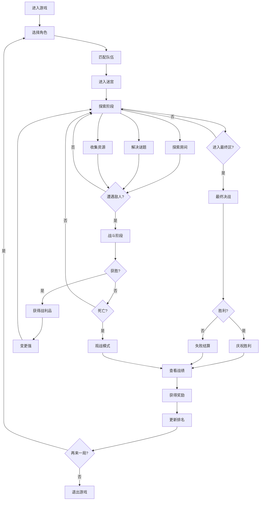

# Cube - 异次元杀阵 项目愿景与设计理念

## 文档信息
- **文档类型**：项目设计文档
- **版本**：1.0
- **创建日期**：2026-01-22
- **最后更新**：2026-01-22
- **状态**：定稿
- **所属模块**：项目整体设计

---

## 目录

1. [项目愿景](#1-项目愿景)
2. [设计哲学](#2-设计哲学)
3. [核心体验目标](#3-核心体验目标)
4. [游戏世界观](#4-游戏世界观)
5. [创新要素](#5-创新要素)
6. [玩家情感曲线](#6-玩家情感曲线)
7. [长期发展规划](#7-长期发展规划)
8. [成功标准](#8-成功标准)

---

## 1. 项目愿景

### 1.1 愿景声明

**打造一款融合《Cube》电影世界观的创新型迷宫竞技游戏，将生存恐怖与 MOBA 竞技完美结合，为玩家提供紧张刺激且策略性强的多人在线游戏体验。**

### 1.2 愿景解读

#### 1.2.1 为什么选择《Cube》作为世界观？

《Cube》系列电影以其独特的密室逃脱设定、数学谜题和心理张力，在科幻恐怖片领域具有独特地位：

**电影特色**：
- 🎯 **极简空间设计**：立方体房间构成的迷宫，视觉冲击力强
- 🧮 **数学逻辑谜题**：质数识别、坐标计算等智力挑战
- ⚠️ **致命陷阱机关**：激光网格、旋转刀片等创意陷阱
- 🤝 **人性考验**：极端环境下的团队合作与背叛
- 🔮 **神秘未知**：迷宫来源和目的的悬念

**游戏化优势**：
- ✅ 强烈的视觉识别度，易于建立品牌形象
- ✅ 天然的游戏化场景，无需过度改编
- ✅ 丰富的玩法可能性（解谜、生存、竞技）
- ✅ 深厚的粉丝基础，自带话题性
- ✅ 适合多人在线协作/对抗

#### 1.2.2 生存恐怖与竞技的融合

**传统问题**：
- 纯生存恐怖游戏：易疲劳，重复游玩性差
- 纯竞技游戏：门槛高，新手体验差

**我们的创新**：


**融合策略**：
1. **探索阶段**：生存恐怖为主（70%），竞技对抗为辅（30%）
2. **对抗阶段**：竞技对抗为主（70%），环境威胁为辅（30%）
3. **结算阶段**：成长养成，为下一局做准备

#### 1.2.3 多人在线体验的重要性

**单机 vs 多人对比**：

| 维度 | 单机游戏 | 多人在线游戏（我们的选择） |
|------|---------|------------------------|
| 重复游玩性 | 低 | 高（人类对手不可预测） |
| 社交价值 | 无 | 高（团队配合、竞技对抗） |
| 内容更新 | 高成本 | 玩家创造内容 |
| 长期运营 | 困难 | 持续付费模式 |
| 情感投入 | 中 | 高（与真人互动） |

**多人体验设计**：
- **4v4 团队对抗**：既要协作又要对抗
- **临时联盟**：可以短暂结盟共同对抗环境
- **信任与背叛**：呼应电影主题
- **语音交流**：增强沉浸感和策略深度
- **赛季排行榜**：提供长期追求目标

### 1.3 核心价值主张

#### 价值主张 1：独特世界观

**承诺**：基于经典科幻恐怖电影《Cube》，营造神秘压迫的游戏氛围

**如何实现**：
- 🎨 **视觉设计**：
  - 立方体房间的几何美学
  - 冷色调为主的色彩方案（蓝、绿、灰）
  - 工业机械风格的陷阱设计
  - 微光照明营造压迫感

- 🎵 **音效设计**：
  - 环境音效：机械运转声、回声、静电噪音
  - 陷阱音效：激光蜂鸣、刀片切割、酸液腐蚀
  - 背景音乐：电子合成器、极简主义
  - 空间音效：利用立体声增强方向感

- 📖 **叙事设计**：
  - 碎片化叙事：通过房间中的线索拼凑真相
  - 玩家推测：谁建造了迷宫？为什么被困在这里？
  - 季节性剧情：每个赛季揭示部分谜团
  - NPC 日志：散落的遗言和记录

**差异化优势**：
- 市场上缺少基于《Cube》的游戏作品
- 科幻恐怖 + 竞技的组合非常少见
- 强烈的视觉符号易于识别和传播

---

#### 价值主张 2：创新玩法

**承诺**：将迷宫探索、解谜、生存与 MOBA 竞技元素深度融合

**玩法层次设计**：



**深度融合机制**：

1. **探索 + 解谜**：
   - 探索发现谜题房间
   - 解谜获得地图信息
   - 破解捷径缩短行程

2. **解谜 + 生存**：
   - 谜题失败触发陷阱
   - 时间限制增加压力
   - 团队配合共同破解

3. **生存 + 竞技**：
   - 陷阱可引诱敌人触发
   - 利用环境优势战斗
   - 资源争夺引发冲突

4. **竞技 + 探索**：
   - 击杀获得地图碎片
   - 控制关键房间
   - 封锁敌人路线

**创新点**：
- ✨ 不是简单的元素叠加，而是深度融合
- ✨ 每种玩法都服务于核心体验
- ✨ 玩家可以选择不同的策略路线
- ✨ 每局游戏体验都不同

---

#### 价值主张 3：策略深度

**承诺**：房间陷阱、资源争夺、角色配合，多维度策略决策

**策略维度分析**：

**维度 1：角色选择策略**

| 角色类型 | 优势 | 劣势 | 适合玩家 |
|---------|------|------|---------|
| 坦克型 | 高生存、保护队友 | 输出低、机动差 | 喜欢前排、团队领袖 |
| 输出型 | 高伤害、快速击杀 | 脆皮、易被集火 | 喜欢秀操作、carry |
| 辅助型 | 治疗、增益、控制 | 依赖队友、单挑弱 | 喜欢辅助、团队玩家 |
| 侦察型 | 高机动、探图快 | 中等输出和防御 | 喜欢探索、游走支援 |

**维度 2：路线规划策略**

```
起点
├─ 路线A：快速通道（陷阱多，资源少）
├─ 路线B：资源丰富（绕路远，易被堵）
└─ 路线C：中庸路线（平衡安全与效率）

策略选择：
- 激进打法：选A，快速到中心争夺
- 发育打法：选B，积累资源后期对抗
- 稳健打法：选C，根据情况调整
```

**维度 3：团队配合策略**

**标准4人队伍配置**：
- 配置 1：坦克 + 输出×2 + 辅助（均衡）
- 配置 2：坦克×2 + 输出 + 辅助（肉盾流）
- 配置 3：侦察 + 输出×2 + 辅助（快攻流）
- 配置 4：侦察×2 + 输出×2（分路流）

**维度 4：资源管理策略**

**资源类型**：
- 🔋 **能量**：释放技能消耗
- 💊 **药品**：恢复生命值
- 🗝️ **钥匙**：开启特殊房间
- 📦 **装备**：提升属性
- 📜 **地图**：揭示迷宫布局

**管理决策**：
- 现在用还是留到关键时刻？
- 给谁用更有价值？
- 是否值得冒险争夺？

**维度 5：信息对抗策略**

**信息优势**：
- 己方：已探索的房间、陷阱位置、敌人踪迹
- 对方：同样拥有自己的信息

**策略运用**：
- 🎭 **虚张声势**：假装去A路，实际走B路
- 🕵️ **侦察先行**：派侦察型角色探路
- 🚫 **封锁信息**：控制关键观察点
- 🪤 **设下陷阱**：引诱敌人进入危险区

**策略深度保证**：
- 没有绝对最优解
- 需要根据实时情况调整
- 团队沟通和协作至关重要
- 高手和新手有明显差距

---

#### 价值主张 4：社交互动

**承诺**：团队协作与竞技对抗并存，强化玩家互动体验

**社交系统设计**：



**游戏内社交**：

1. **语音交流**
   - 队内语音：实时战术沟通
   - 全局语音：特定时刻（如谈判）
   - 快捷语音：预设短语快速沟通
   - 语音转文字：照顾无麦克风玩家

2. **信号系统**
   - 标记敌人位置
   - 标记危险陷阱
   - 标记资源物品
   - 请求支援/集合
   - 战术指令（前进/撤退）

3. **团队配合时刻**
   - 协作破解谜题
   - 共同对抗强敌
   - 救援队友
   - 资源分配
   - 战术规划

4. **对抗互动**
   - 正面交锋
   - 战术博弈
   - 追击与逃脱
   - 心理战
   - 赛后复盘

**游戏外社交**：

1. **好友系统**
   - 添加好友
   - 好友组队
   - 查看好友战绩
   - 好友对战
   - 好友推荐

2. **公会系统**
   - 创建/加入公会
   - 公会聊天频道
   - 公会战
   - 公会排行榜
   - 公会专属皮肤

3. **排行榜**
   - 个人评分排行
   - 赛季排行
   - 角色使用排行
   - 公会排行
   - 区域排行

4. **分享系统**
   - 精彩击杀回放
   - 全场最佳表现
   - 战绩分享
   - 社交媒体分享

**社交价值**：
- 🤝 **建立关系**：从陌生人到队友再到朋友
- 🏆 **共同目标**：一起冲击排行榜
- 🎭 **身份认同**：成为某个角色的专精玩家
- 📖 **共同回忆**：难忘的逆风翻盘、精彩操作
- 🌐 **社区归属**：游戏社区、公会、玩家群

---

### 1.4 目标用户画像

#### 用户群体 1：核心 MOBA 玩家

**人口特征**：
- 年龄：18-30岁
- 性别：男性为主（70%）
- 游戏经验：3年以上 MOBA 经验
- 游戏时长：每天 2-4 小时

**游戏偏好**：
- ✅ 喜欢技能对抗和操作
- ✅ 享受团队配合的成就感
- ✅ 追求排名和竞技
- ✅ 愿意投入时间研究策略

**痛点**：
- 😫 传统 MOBA 过于套路化
- 😫 单局时间太长（40-60分钟）
- 😫 新英雄推出慢
- 😫 同质化严重

**我们的吸引力**：
- 🎯 创新的迷宫+MOBA玩法
- 🎯 单局时间适中（20-30分钟）
- 🎯 每局地图不同，新鲜感强
- 🎯 策略深度不输传统MOBA

---

#### 用户群体 2：解谜/探索爱好者

**人口特征**：
- 年龄：25-40岁
- 性别：男女比例均衡
- 游戏经验：喜欢解谜、生存、恐怖类游戏
- 游戏时长：每周 5-10 小时

**游戏偏好**：
- ✅ 享受智力挑战
- ✅ 喜欢探索未知
- ✅ 欣赏精巧的关卡设计
- ✅ 喜欢独特的游戏氛围

**痛点**：
- 😫 单机解谜游戏重复游玩性差
- 😫 内容更新慢
- 😫 缺少社交互动
- 😫 通关后失去动力

**我们的吸引力**：
- 🎯 程序化生成，无限重玩性
- 🎯 持续更新的谜题和陷阱
- 🎯 多人协作解谜更有趣
- 🎯 竞技元素提供长期目标

---

#### 用户群体 3：《Cube》电影粉丝

**人口特征**：
- 年龄：25-45岁
- 性别：男女比例均衡
- 影视偏好：科幻恐怖片爱好者
- 游戏经验：中度到重度玩家

**情感需求**：
- ❤️ 重温电影经典场景
- ❤️ 体验身临其境的迷宫冒险
- ❤️ 探索电影未解之谜
- ❤️ 与同好交流讨论

**痛点**：
- 😫 市场上缺少相关游戏
- 😫 影视改编游戏质量堪忧
- 😫 简单的换皮游戏难以满足

**我们的吸引力**：
- 🎯 高度还原电影氛围和设定
- 🎯 扩展电影世界观
- 🎯 尊重原作的创新改编
- 🎯 邀请电影主创参与设计（如可能）

---

### 1.5 市场定位

#### 细分市场定位

```
竞技性
  ↑
  │ 传统MOBA          吃鸡游戏
  │ (LOL/Dota)       (PUBG)
  │
  │     【我们的位置】
  │        Cube
  │      ★ ★ ★
  │
  │ 休闲竞技         派对游戏
  │ (守望先锋)       (Fall Guys)
  │
  └──────────────────────→ 休闲性
```

**定位说明**：
- **竞技性**：中高（7/10）- 有竞技深度但不过于硬核
- **休闲性**：中（5/10）- 易上手但需要学习
- **独特性**：高（9/10）- 市场上几乎没有直接竞品

#### 竞品分析

| 游戏 | 类型 | 相似点 | 差异点 | 我们的优势 |
|------|------|--------|--------|-----------|
| Dead by Daylight | 非对称竞技 | 恐怖氛围、多人在线 | 1v4模式、单方碾压 | 公平对抗、更平衡 |
| Among Us | 社交推理 | 密室环境、信任背叛 | 玩法简单、无操作 | 深度策略、技能对抗 |
| Fall Guys | 派对竞技 | 闯关+对抗 | 休闲向、低策略 | 硬核策略、世界观 |
| Escape from Tarkov | 生存射击 | 高压力、资源争夺 | 写实向、门槛高 | 科幻风、更易上手 |

**市场空白**：
- ✅ 科幻恐怖氛围的竞技游戏
- ✅ 迷宫探索+MOBA的融合
- ✅ 智力挑战+操作竞技的结合
- ✅ 基于经典IP的创新改编

---

## 2. 设计哲学

### 2.1 核心设计原则

#### 原则 1：公平竞技

**定义**：确保所有玩家在技能、策略层面公平对抗，胜负取决于实力而非运气或付费。

**实施**：
- ❌ **拒绝**：
  - 付费购买战力
  - 抽卡式角色获取
  - 随机性过强的机制
  
- ✅ **采用**：
  - 所有角色免费解锁
  - 充值仅购买外观
  - 平衡的随机性（地图生成有规则）
  - 匹配评分系统

**例外情况**：
- 新手保护期：新玩家匹配机制倾斜
- 赛季奖励：给予高排名玩家专属皮肤（不影响数值）

---

#### 原则 2：易学难精

**定义**：新手能快速上手，但要精通需要大量练习和学习。

**学习曲线设计**：

```
技能掌握度
  ↑
  │         精通区域
  │        ╱
  │       ╱ （需要长期积累）
  │      ╱
  │    ╱ 提升区域
  │   ╱ （技巧、策略学习）
  │  ╱
  │ ╱ 入门区域
  │╱ （基础操作）
  └────────────────→ 游戏时长
```

**实施策略**：
- **第一个小时**：
  - 教程引导基础操作
  - 单人训练模式熟悉机制
  - 简单AI对战建立信心
  
- **1-10 小时**：
  - 解锁所有基础内容
  - 学习不同角色特点
  - 理解基础策略
  
- **10-100 小时**：
  - 精通 2-3 个角色
  - 学习高级战术
  - 理解元游戏（meta）
  
- **100+ 小时**：
  - 冲击高排名
  - 参与竞技比赛
  - 成为社区专家

---

#### 原则 3：紧张刺激

**定义**：保持玩家肾上腺素水平，创造紧张刺激的体验。

**节奏设计**：



**紧张感来源**：
1. **环境威胁**：
   - 致命陷阱
   - 房间坍塌倒计时
   - 有限的可见范围
   
2. **对手压力**：
   - 随时可能遭遇敌人
   - 被追杀的压力
   - 战斗前的心理博弈
   
3. **资源稀缺**：
   - 生命值不可恢复
   - 关键物品有限
   - 安全区越来越小
   
4. **时间压力**：
   - 毒圈机制（可选）
   - 限时目标
   - 技能冷却

---

#### 原则 4：策略深度

**定义**：提供多层次的策略决策空间，奖励思考和计划。

**策略层次**：

```
元游戏策略（Meta）
  ↑
战术策略（Tactics）
  ↑
操作技巧（Mechanics）
  ↑
基础理解（Basics）
```

**实施方法**：
- **基础层**：移动、攻击、使用技能
- **技巧层**：走位、技能连招、资源管理
- **战术层**：路线选择、团队配合、时机把握
- **元游戏层**：阵容搭配、版本理解、针对性战术

**避免陷阱**：
- ❌ 策略过于复杂，新手无法理解
- ❌ 数值膨胀，后期变成计算器游戏
- ❌ 最优解过于明显，失去选择性

---

#### 原则 5：社交驱动

**定义**：鼓励玩家互动，让社交成为游戏体验的核心。

**社交层次**：

1. **强制社交**（必须）：
   - 4人组队才能开始游戏
   - 团队配合才能解谜
   - 语音交流提升胜率
   
2. **鼓励社交**（推荐）：
   - 好友组队奖励
   - 公会任务
   - 赛后聊天室
   
3. **自然社交**（发生）：
   - 精彩时刻想要分享
   - 寻找同水平队友
   - 社区讨论策略

**社交激励**：
- 🎁 **奖励**：组队经验加成、好友礼物
- 🏆 **荣誉**：队伍排行榜、公会战
- 📢 **展示**：战绩分享、高光时刻

---

### 2.2 游戏体验支柱

#### 支柱 1：探索发现

**目标**：让玩家享受探索未知的乐趣和发现秘密的满足感。

**设计元素**：
- 🗺️ **迷雾系统**：未探索区域被迷雾遮盖
- 🎁 **隐藏奖励**：秘密房间、彩蛋、稀有物品
- 📖 **世界构建**：散落的日志、线索、故事碎片
- 🎯 **探索挑战**：成就系统奖励深度探索

**玩家反馈**：
- "我发现了一个隐藏的捷径！"
- "这个房间的日志暗示了迷宫的秘密..."
- "我们是第一个找到这个彩蛋的队伍！"

---

#### 支柱 2：智力挑战

**目标**：提供有趣且有意义的谜题，奖励聪明和团队协作。

**谜题类型**：

1. **数学谜题**（呼应电影）
   - 质数识别
   - 数列计算
   - 坐标推算
   
2. **逻辑谜题**
   - 排列组合
   - 因果推理
   - 图案规律
   
3. **空间谜题**
   - 迷宫导航
   - 3D 旋转
   - 镜像对称
   
4. **协作谜题**
   - 多人同时操作
   - 分工配合
   - 信息共享

**难度平衡**：
- 简单谜题：5秒-30秒
- 中等谜题：30秒-2分钟
- 困难谜题：2-5分钟
- 可以跳过（付出代价）

---

#### 支柱 3：技能对抗

**目标**：提供爽快的战斗体验和精彩的操作时刻。

**战斗设计**：
- ⚔️ **技能释放**：流畅的动画和明确的反馈
- 🎯 **瞄准系统**：需要瞄准，奖励精准操作
- 💨 **走位躲避**：可以通过移动躲避技能
- 🔄 **技能连招**：技能之间有组合效果

**爽快时刻**：
- 完美预判敌人位置释放技能
- 低血量1v2反杀
- 团队配合秒杀敌方核心
- 关键时刻的终极技能改变战局

---

#### 支柱 4：团队协作

**目标**：让玩家感受到团队配合的价值和成就感。

**协作场景**：
- 🤝 **角色互补**：坦克保护输出，辅助增益队友
- 🧩 **谜题配合**：需要多人同时操作才能解开
- 🚑 **互相救援**：倒地队友可以被救起
- 💬 **信息共享**：标记敌人、陷阱、资源

**协作奖励**：
- 助攻奖励（协助击杀）
- 救援奖励（救起队友）
- 配合奖励（技能连招）
- MVP评选（最佳队友）

---

#### 支柱 5：成长满足

**目标**：提供清晰的进度感和成长动力。

**成长系统**：

1. **局内成长**（单局）
   - 角色等级提升
   - 装备收集
   - 技能升级
   
2. **局外成长**（持久）
   - 玩家等级
   - 排位评分
   - 成就收集
   - 皮肤解锁

**成长曲线**：
- 前期：快速成长，频繁奖励
- 中期：稳定成长，追求精通
- 后期：缓慢成长，追求荣誉

---

## 3. 核心体验目标

### 3.1 情感体验目标

我们希望玩家在游戏过程中体验到以下情感：

#### 情感 1：紧张兴奋

**场景**：
- 在陷阱房间中小心前进
- 听到脚步声知道敌人接近
- 血量很低但还在坚持
- 倒计时最后几秒

**设计手段**：
- 音效设计（心跳声、紧急音乐）
- 视觉效果（屏幕边缘发红、镜头晃动）
- 倒计时UI
- 有限的视野

---

#### 情感 2：成就满足

**场景**：
- 成功破解复杂谜题
- 完成1v2反杀
- 带领团队赢得胜利
- 达成稀有成就

**设计手段**：
- 华丽的击杀特效
- 成就弹窗和音效
- 战后MVP展示
- 战绩分享功能

---

#### 情感 3：团队归属

**场景**：
- 队友救援你于危难
- 团队配合完美击杀
- 公会一起冲击排名
- 赛后复盘讨论

**设计手段**：
- 队伍语音交流
- 助攻和配合奖励
- 公会系统
- 观战功能

---

#### 情感 4：智慧优越

**场景**：
- 想到绝妙的战术
- 预判敌人的行动
- 发现隐藏的秘密
- 完美的资源分配

**设计手段**：
- 策略多样性
- 信息对抗
- 隐藏内容
- 复杂决策

---

### 3.2 核心游戏循环



### 3.3 单局游戏流程设计

**时间轴**：总计 20-30 分钟

```
0:00 - 2:00   | 出生准备阶段
              | - 选择出生点
              | - 购买初始装备
              | - 团队策略讨论
              |
2:00 - 10:00  | 探索发育阶段
              | - 探索迷宫
              | - 收集资源
              | - 解决谜题
              | - 零星遭遇战
              |
10:00 - 18:00 | 对抗争夺阶段
              | - 控制关键区域
              | - 团战频发
              | - 资源争夺激烈
              | - 部分队伍淘汰
              |
18:00 - 25:00 | 最终决战阶段
              | - 安全区缩小
              | - 2-3支队伍决战
              | - 高强度对抗
              | - 分出胜负
              |
25:00 - 30:00 | 结算展示阶段
              | - 战绩展示
              | - MVP评选
              | - 奖励发放
              | - 排名更新
```

---

## 4. 游戏世界观

### 4.1 世界观背景

#### 核心设定

**迷宫的起源**：

在未来某个平行时空，一个神秘组织创造了"立方体迷宫"（The Cube）作为终极实验场。这个迷宫由数千个相同的立方体房间组成，每个房间都可能包含致命的陷阱或珍贵的资源。

**实验的目的**（谜团）：
- 测试人类在极端环境下的生存能力？
- 筛选具有特殊能力的个体？
- 某种更黑暗的目的？

**参与者的身份**：

玩家扮演的角色来自不同背景：
- 🔬 **科学家**：试图理解迷宫的运作原理
- ⚔️ **战士**：被强制参与的战斗人员
- 🔧 **工程师**：曾参与迷宫建造的工作人员
- 🕵️ **间谍**：渗透进来收集情报的特工

**生存法则**：
- 迷宫没有规则，只有生存
- 信任是奢侈品，背叛是常态
- 唯一的出路是到达中心或击败所有对手

---

### 4.2 迷宫设定

#### 房间结构

**基础房间**：
- 尺寸：10m × 10m × 10m
- 6个面：上下左右前后
- 每个面可能有门连接其他房间
- 墙壁材质：金属、塑料、玻璃等

**房间颜色编码**（呼应电影）：
- 🔵 **蓝色**：相对安全
- 🟢 **绿色**：可能有轻度陷阱
- 🟡 **黄色**：中度危险
- 🟠 **橙色**：高度危险
- 🔴 **红色**：致命陷阱
- ⚪ **白色**：未知/随机

**坐标系统**：
每个房间有三维坐标 (X, Y, Z)
- 坐标可能暗示陷阱信息
- 质数坐标更危险（呼应电影）
- 玩家可以通过计算预判

---

#### 陷阱类型

**物理陷阱**：
1. **激光网格**
   - 不可见的激光束
   - 触碰即死
   - 需要观察和计算路径
   
2. **旋转刀片**
   - 定时旋转的锋利刀片
   - 需要计算时机通过
   
3. **酸液喷射**
   - 从墙壁喷出腐蚀性液体
   - 造成持续伤害
   
4. **重力场**
   - 改变房间重力方向
   - 影响移动和战斗
   
5. **电击地板**
   - 定时通电的地板
   - 需要跳跃躲避

**环境陷阱**：
1. **缺氧房间**
   - 逐渐消耗氧气
   - 限制停留时间
   
2. **极端温度**
   - 极热或极冷
   - 持续扣血
   
3. **有毒气体**
   - 降低可见度
   - 持续掉血

---

### 4.3 角色背景故事

#### 角色 1：艾登（Aiden）- 坦克型

**背景**：
- 前特种部队成员
- 在一次任务中被背叛，醒来后发现自己在迷宫中
- 强壮、可靠，天生的领导者
- 目标：找到背叛者并逃出迷宫

**性格**：
- 勇敢、正直
- 保护弱小
- 不轻易相信他人

**技能主题**：
- 防御、保护、冲锋

---

#### 角色 2：莉娅（Lea）- 输出型

**背景**：
- 天才黑客
- 被组织盯上，被迫参与实验
- 敏捷、聪明、独立
- 目标：破解迷宫系统，揭露真相

**性格**：
- 独立、自信
- 不喜欢团队
- 实际上很关心队友

**技能主题**：
- 高伤害、机动性、技术

---

#### 角色 3：泽维尔（Xavier）- 辅助型

**背景**：
- 医生
- 自愿参加实验以寻找失踪的妻子
- 温和、善良、意志坚定
- 目标：找到妻子，救助他人

**性格**：
- 善良、冷静
- 医者仁心
- 关键时刻果断

**技能主题**：
- 治疗、增益、保护

---

#### 角色 4：瑞文（Raven）- 侦察型

**背景**：
- 职业小偷
- 被抓后选择进入迷宫而非监狱
- 机警、狡猾、灵活
- 目标：找到传说中的"迷宫宝藏"

**性格**：
- 自私、贪婪
- 但讲义气
- 关键时刻可靠

**技能主题**：
- 侦察、隐身、速度

---

## 5. 创新要素

### 5.1 程序化迷宫生成

**创新点**：每局游戏地图不同

**技术实现**：
- 基于种子的随机生成
- 规则系统保证可通过性
- 难度梯度控制
- 平衡性保证

**玩家价值**：
- 无限重玩性
- 无法背图
- 每局都是新鲜体验
- 适应能力比记忆力更重要

---

### 5.2 知识就是力量

**创新点**：信息优势决定胜负

**设计机制**：
- 已探索的房间会在地图上标记
- 陷阱信息可以共享给队友
- 可以留下标记误导敌人
- 敌人位置信息至关重要

**战术运用**：
- 侦察型角色价值巨大
- 控制关键观察点
- 信息战和心理战
- 谁掌握信息谁主动

---

### 5.3 环境即武器

**创新点**：陷阱既是威胁也是武器

**玩法设计**：
- 可以引诱敌人触发陷阱
- 某些技能可以激活陷阱
- 陷阱可以改变战斗地形
- 利用环境优势作战

**战术深度**：
- 地形选择很重要
- 诱敌深入
- 环境伤害可能比技能更致命
- 转危为机

---

### 5.4 动态风险平衡

**创新点**：高风险高回报的动态平衡

**设计原则**：
- 危险区域有更好的资源
- 快速路线有更多陷阱
- 冒险可能获得巨大优势
- 但也可能全军覆没

**玩家选择**：
- 稳健打法 vs 激进打法
- 规避风险 vs 博取机会
- 根据局势动态调整

---

## 6. 玩家情感曲线

### 6.1 单局情感曲线

```
情感强度
  ↑
  │         高潮        
  │          /\        【最终决战】
  │         /  \       
  │        /    \      
  │   紧张/      \紧张  【频繁遭遇】
  │      /        \    
  │平静 /   兴奋   \悬念 【探索发现】
  │    /            \  
  │   /      成长     \ 【收获奖励】
  │  /                \
  │ /准备              \
  │/___________________\满足
  └──────────────────────→ 时间
  开始  探索  对抗  决战  结算
```

### 6.2 长期参与动机

**短期动机**（单局）：
- 赢得这一局
- 完成击杀/助攻
- 成功逃脱陷阱
- 发现隐藏内容

**中期动机**（周/月）：
- 提升排位段位
- 精通新角色
- 完成赛季任务
- 达成特殊成就

**长期动机**（季/年）：
- 赛季排名奖励
- 公会荣誉
- 收集所有皮肤
- 成为社区名人

---

## 7. 长期发展规划

### 7.1 内容更新路线图

#### Year 1：核心体验完善

**Q1**：
- ✅ 3个基础角色
- ✅ 10种房间类型
- ✅ 5种陷阱
- ✅ 2种游戏模式

**Q2**：
- 新增2个角色
- 新增5种房间
- 新增3种陷阱
- 排位赛系统

**Q3**：
- 新增2个角色
- 赛季系统
- 公会系统
- 新游戏模式

**Q4**：
- 年度总结
- 大型活动
- 平衡性调整
- 第一届官方比赛

---

#### Year 2：深化和扩展

**主题**：深化玩法，扩展内容

**内容**：
- 新增5个角色（共12个）
- 新增迷宫主题（冰、火、电等）
- 新增游戏模式
- 观战系统
- 回放系统
- 自定义游戏

---

#### Year 3及以后：IP扩展

**可能方向**：
- 单人剧情模式
- 合作PVE模式
- 手游版本
- 动画/漫画改编
- 电竞赛事体系

---

### 7.2 商业化策略

#### 收费模式：基础免费 + 内购

**免费内容**：
- 所有角色
- 所有游戏模式
- 所有地图
- 基础皮肤

**付费内容**：
- 角色皮肤
- 武器皮肤
- 特效
- 语音包
- 表情/喷漆
- 战斗通行证（Battle Pass）

**定价策略**：
- 皮肤：$5-$20
- 战斗通行证：$10/赛季
- 礼包：$30-$50
- VIP（加速解锁）：$5-$10/月

**预期**：
- ARPPU：$20-50
- 付费率：5-10%
- 主要收入来源：皮肤和通行证

---

## 8. 成功标准

### 8.1 技术指标

| 指标 | 短期（6个月） | 中期（12个月） | 长期（24个月） |
|------|--------------|---------------|---------------|
| 客户端性能 | 60fps @ 1080p | 60fps @ 1440p | 60fps @ 4K |
| 服务器延迟 | <50ms | <30ms | <20ms |
| 并发支持 | 1,000人 | 10,000人 | 100,000人 |
| 匹配时间 | <2分钟 | <1分钟 | <30秒 |
| 崩溃率 | <1% | <0.5% | <0.1% |

---

### 8.2 用户指标

| 指标 | 短期（6个月） | 中期（12个月） | 长期（24个月） |
|------|--------------|---------------|---------------|
| 注册用户 | 10,000+ | 100,000+ | 1,000,000+ |
| 日活用户（DAU） | 1,000+ | 5,000+ | 50,000+ |
| 月活用户（MAU） | 5,000+ | 30,000+ | 300,000+ |
| 次日留存 | 30%+ | 40%+ | 50%+ |
| 7日留存 | 15%+ | 20%+ | 30%+ |
| 30日留存 | 8%+ | 12%+ | 20%+ |

---

### 8.3 商业指标

| 指标 | 短期（6个月） | 中期（12个月） | 长期（24个月） |
|------|--------------|---------------|---------------|
| 付费率 | 3%+ | 5%+ | 10%+ |
| ARPU | $2+ | $5+ | $10+ |
| ARPPU | $20+ | $30+ | $50+ |
| 月流水 | $10K+ | $150K+ | $1.5M+ |
| LTV | $10+ | $20+ | $50+ |

---

### 8.4 社区指标

| 指标 | 短期（6个月） | 中期（12个月） | 长期（24个月） |
|------|--------------|---------------|---------------|
| Discord成员 | 1,000+ | 10,000+ | 50,000+ |
| 社交媒体关注 | 5,000+ | 50,000+ | 200,000+ |
| 直播观看 | 100+ | 1,000+ | 10,000+ |
| UGC内容 | 50+ | 500+ | 5,000+ |
| 评分 | 3.5+ | 4.0+ | 4.5+ |

---

## 9. 附录

### 9.1 设计灵感来源

**电影**：
- Cube (1997)
- Cube 2: Hypercube (2002)
- Cube Zero (2004)
- Saw 系列
- The Platform (2019)

**游戏**：
- Portal
- The Witness
- Dead by Daylight
- Among Us
- Escape from Tarkov
- League of Legends

**其他**：
- 综艺节目《Running Man》
- 密室逃脱真人游戏
- 数学谜题书籍

---

### 9.2 参考资料

- 《游戏设计艺术》- Jesse Schell
- 《心流》- Mihaly Csikszentmihalyi
- 《游戏化思维》- Kevin Werbach
- GDC 演讲：MOBA 设计
- GDC 演讲：程序化生成
- Cube 电影分析文章

---

### 9.3 术语表

| 术语 | 解释 |
|------|------|
| MOBA | Multiplayer Online Battle Arena，多人在线战术竞技游戏 |
| PvP | Player vs Player，玩家对战 |
| PvE | Player vs Environment，玩家对环境 |
| Meta | 元游戏，当前版本的流行策略 |
| AOI | Area of Interest，兴趣区域 |
| DAU | Daily Active Users，日活跃用户 |
| ARPU | Average Revenue Per User，每用户平均收入 |
| LTV | Lifetime Value，用户生命周期价值 |

---

## 文档变更历史

| 版本 | 日期 | 变更内容 | 修改人 |
|------|------|---------|--------|
| 1.0 | 2026-01-22 | 创建文档，完成初稿 | System |

---

**文档状态**：✅ 定稿

**下一步行动**：
1. 团队评审
2. 细化各子系统设计
3. 制作原型验证核心玩法
4. 开始技术预研

---

**备注**：
本文档是项目的北极星，所有后续设计决策都应该回溯到这里的核心理念。当面临设计选择时，问自己：这个设计是否符合我们的愿景和设计哲学？
