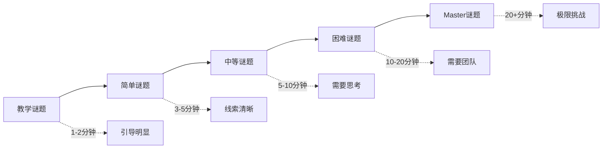

# Cube - 谜题系统设计

## 文档信息
- **文档类型**：游戏设计文档
- **版本**：1.0
- **创建日期**：2026-01-22
- **最后更新**：2026-01-22
- **状态**：定稿
- **负责人**：游戏设计团队
- **所属模块**：核心玩法系统

---

## 目录

1. [谜题设计哲学](#1-谜题设计哲学)
2. [谜题分类体系](#2-谜题分类体系)
3. [数学谜题](#3-数学谜题)
4. [物理谜题](#4-物理谜题)
5. [逻辑谜题](#5-逻辑谜题)
6. [环境谜题](#6-环境谜题)
7. [团队谜题](#7-团队谜题)
8. [提示系统](#8-提示系统)
9. [技术实现](#9-技术实现)

---

## 1. 谜题设计哲学

### 1.1 核心原则

#### 原则1：公平挑战

**定义**：谜题必须可解，玩家拥有解题所需的所有信息。

**实施**：
```
谜题 = 已知信息 + 逻辑推理
≠ 已知信息 + 猜测运气
```

**反例**：
- ❌ 需要外部知识才能解答（如特定文化常识）
- ❌ 答案是随机的，无法推理
- ❌ 隐藏关键信息，玩家无法获取

**正例**：
- ✅ 所有线索都在房间内可见
- ✅ 通过观察和推理可得出答案
- ✅ 有多种解题路径

---

#### 原则2：渐进难度

**定义**：谜题从简单到复杂，让玩家逐步掌握解题思路。

**难度曲线**：



---

#### 原则3：电影致敬

**定义**：谜题设计呼应《异次元杀阵》电影元素。

**电影元素提取**：

| 电影元素 | 游戏实现 |
|---------|---------|
| 质数坐标系统 | 质数房间谜题 |
| 颜色编码房间 | 颜色序列谜题 |
| 数学天才角色 | 数学类谜题 |
| 团队协作逃生 | 多人协作谜题 |
| 机关陷阱 | 机关解谜 |
| 空间迷宫 | 空间拓扑谜题 |

---

#### 原则4：多解路径

**定义**：大部分谜题应有多种解法，适应不同玩家思维。

**解法类型**：

```
直接解法（数学计算）
├─ 适合：逻辑思维强的玩家
├─ 速度：快
└─ 风险：需要精准计算

试错解法（尝试组合）
├─ 适合：所有玩家
├─ 速度：慢
└─ 风险：可能触发错误惩罚

模式识别（观察规律）
├─ 适合：观察力强的玩家
├─ 速度：中等
└─ 风险：需要完整信息

团队讨论（集体智慧）
├─ 适合：团队玩家
├─ 速度：取决于团队
└─ 风险：需要有效沟通

提示系统（辅助）
├─ 适合：困难玩家
├─ 速度：中等
└─ 风险：消耗资源/扣分
```

---

### 1.2 设计目标

#### 目标1：智力挑战

**实现方式**：
- 🧮 **数学推理**：计算、数列、方程
- 🧩 **逻辑推理**：演绎、归纳、排除
- 🎨 **空间思维**：旋转、镜像、拓扑
- 🔍 **观察能力**：细节发现、模式识别

#### 目标2：团队协作

**协作场景**：
- 信息分享：不同玩家看到不同线索
- 技能互补：不同角色有不同解谜能力
- 同步操作：需要多人同时行动
- 策略讨论：复杂谜题需要集体智慧

#### 目标3："啊哈"时刻

**定义**：玩家解开谜题瞬间的顿悟感。

**设计要素**：
```
"啊哈"时刻 = 
  适度困难（挣扎但可解）
  + 巧妙设计（有创意）
  + 解答瞬间（突然明白）
  + 满足感（成就感）
```

**案例**：
```
谜题：房间内有12个开关，需要找到正确组合
初始：玩家随机尝试，组合太多（2^12 = 4096种）
线索：墙上有古怪的图案
顿悟：图案是二进制编码！将图案转换为开关状态
结果："原来如此！"的满足感
```

---

## 2. 谜题分类体系

### 2.1 按解题方式分类

```
单人谜题
├─ 观察谜题：找出隐藏信息
├─ 计算谜题：数学推理
├─ 操作谜题：按正确顺序操作
└─ 记忆谜题：记住并复现

多人谜题
├─ 协作谜题：同时操作
├─ 接力谜题：依次完成
├─ 分工谜题：不同任务
└─ 通信谜题：信息传递
```

### 2.2 按难度分类

| 等级 | 时间 | 描述 | 标识 |
|------|------|------|------|
| 教学级 | 1-2分钟 | 引导玩家理解机制 | 🟦 |
| 简单级 | 3-5分钟 | 基础应用，直接推理 | 🟩 |
| 中等级 | 5-10分钟 | 需要多步骤推理 | 🟨 |
| 困难级 | 10-20分钟 | 需要创意和团队 | 🟧 |
| Master级 | 20+分钟 | 极限挑战 | 🟥 |

### 2.3 按谜题类型分类

```
数学类
├─ 算术谜题
├─ 数列谜题
├─ 几何谜题
└─ 代数谜题

物理类
├─ 光线谜题
├─ 重力谜题
├─ 传送谜题
└─ 机械谜题

逻辑类
├─ 顺序谜题
├─ 分类谜题
├─ 关系谜题
└─ 推理谜题

环境类
├─ 探索谜题
├─ 视角谜题
├─ 声音谜题
└─ 符号谜题
```

---

## 3. 数学谜题

### 3.1 质数谜题（致敬电影）

#### 谜题3.1.1：质数房间

**难度**：⭐⭐⭐

**背景故事**：
《异次元杀阵》中，安全房间的坐标都是质数。

**谜题描述**：
房间内有9扇门，标记着坐标。只有质数坐标的门是安全的，其他门通向陷阱。

**设计**：
```
门的标记：
┌─────┬─────┬─────┐
│ 11  │ 12  │ 13  │  ← 顶部三扇门
├─────┼─────┼─────┤
│ 21  │ 22  │ 23  │  ← 中部三扇门
├─────┼─────┼─────┤
│ 31  │ 32  │ 33  │  ← 底部三扇门
└─────┴─────┴─────┘

质数判断：
- 11: 质数 ✓
- 12: 非质数 ✗
- 13: 质数 ✓
- 21: 非质数 ✗
- 22: 非质数 ✗
- 23: 质数 ✓
- 31: 质数 ✓
- 32: 非质数 ✗
- 33: 非质数 ✗

安全出口：11、13、23、31
```

**线索提供**：
- 墙上刻着："Only prime survives"
- 地上有血迹指向非质数门（暗示）
- 某个门上有划痕（可能是质数）

**解题方法**：
1. **直接计算**：
   - 判断每个数字是否为质数
   - 选择质数门通过
   
2. **观察规律**：
   - 注意到血迹都在非质数门
   - 推测质数门安全
   
3. **试错法**：
   - 尝试不同的门
   - 记录结果
   - 归纳规律

**错误惩罚**：
- 打开非质数门：触发陷阱（地刺弹出，扣20%生命值）
- 可以多次尝试，但生命值会持续损失

**变种设计**：

**变种A：三位数质数**
```
门标记：101、102、103、104、105、...、113
质数：101、103、107、109、113
更难的计算
```

**变种B：质因数分解**
```
门上显示合数（如：12）
需要分解为质因数（2 × 2 × 3）
质因数之和决定下一步（2+2+3=7）
```

---

#### 谜题3.1.2：斐波那契序列

**难度**：⭐⭐⭐

**谜题描述**：
房间内有12个压力板，需要按斐波那契数列顺序踩踏。

**斐波那契数列**：
```
F(0) = 0
F(1) = 1
F(n) = F(n-1) + F(n-2)

序列：0, 1, 1, 2, 3, 5, 8, 13, 21, 34, 55, 89...
```

**房间布局**：
```
压力板编号（随机分布）：
    [8]      [21]     [1]
         [34]    [13]
    [3]      [55]     [2]
         [89]    [5]
    [1]      [0]
```

**正确顺序**：
```
0 → 1 → 1 → 2 → 3 → 5 → 8 → 13 → 21 → 34 → 55 → 89
```

**机制**：
- 踩对：压力板发光，发出和谐音效
- 踩错：重置，所有压力板熄灭，扣10%生命值
- 注意：有两个"1"，需要分别踩踏

**线索**：
- 墙上有兔子图案（斐波那契兔子问题）
- 地上有螺旋图案（斐波那契螺旋）

**团队协作**：
- 一人负责记忆数列
- 一人负责寻找对应压力板
- 一人负责踩踏
- 一人负责观察反馈

---

### 3.2 几何谜题

#### 谜题3.2.1：旋转立方体

**难度**：⭐⭐⭐⭐

**谜题描述**：
房间中央有一个巨大的立方体，每个面上有不同的符号。需要旋转立方体，使特定符号对准特定方向。

**设计**：
```
立方体六面：
- 顶面：太阳符号 ☀
- 底面：月亮符号 ☽
- 前面：火焰符号 🔥
- 后面：水滴符号 💧
- 左面：树木符号 🌳
- 右面：石头符号 🗿

目标状态（墙上提示）：
- 北墙：太阳
- 南墙：月亮
- 东墙：火焰
- 西墙：水滴
```

**操作**：
- 四个操控台分别控制：前后旋转、左右旋转
- 每次旋转90度
- 需要精确计算旋转序列

**解题思路**：
```
初始状态：记录当前朝向
目标状态：确定最终朝向
旋转序列：计算最少步骤

示例：
初始：太阳在顶部
目标：太阳向北
操作：向前旋转90度
```

**挑战**：
- 三维空间想象
- 旋转矩阵计算
- 最优路径选择

**提示系统**：
- 提示1：当前状态与目标状态对比
- 提示2：显示一步正确操作
- 提示3：显示完整解法

---

#### 谜题3.2.2：镜像对称

**难度**：⭐⭐⭐

**谜题描述**：
房间一侧有图案，需要在另一侧创建镜像对称的图案。

**设计**：
```
左侧（固定）：
█ ░ ░ █
░ █ ░ ░
░ ░ █ ░
█ ░ ░ █

右侧（可操作）：
? ? ? ?
? ? ? ?
? ? ? ?
? ? ? ?

目标（镜像）：
█ ░ ░ █
░ ░ █ ░
░ █ ░ ░
█ ░ ░ █
```

**操作**：
- 点击方块切换黑白
- 完成镜像后门开启
- 允许试错

**变种**：
- 轴对称（垂直轴）
- 点对称（中心点）
- 旋转对称（90度旋转）

---

### 3.3 代数谜题

#### 谜题3.3.1：方程之门

**难度**：⭐⭐⭐⭐

**谜题描述**：
门上有数字密码锁，需要解方程组获得密码。

**设计**：
```
墙上刻着三个方程：
1) X + Y = 10
2) X - Y = 4
3) X × Z = 21

求：X、Y、Z

解答：
从方程1和2：
  X + Y = 10
  X - Y = 4
  相加：2X = 14，X = 7
  代入：Y = 3

从方程3：
  X × Z = 21
  7 × Z = 21
  Z = 3

密码：7-3-3
```

**难度递进**：

**简单版本**：
```
X + Y = 5
X = 3
求Y
答案：2
```

**中等版本**：
```
X + Y = 12
X - Y = 4
求X、Y
答案：X=8, Y=4
```

**困难版本**：
```
X + Y + Z = 15
X - Y = 3
Y × Z = 20
求X、Y、Z
答案：X=8, Y=5, Z=4
```

**Master版本**：
```
X² + Y² = 25
X + Y = 7
求X、Y
答案：X=4, Y=3 或 X=3, Y=4
```

---

## 4. 物理谜题

### 4.1 光线谜题

#### 谜题4.1.1：激光反射

**难度**：⭐⭐⭐

**谜题描述**：
需要使用镜子反射激光，使其照射到目标接收器。

**设计**：
```
房间布局：
┌─────────────────────┐
│                     │
│  [激光发射器]        │
│                     │
│      [镜子1]        │
│              [镜子2]│
│                     │
│  [接收器]           │
└─────────────────────┘

操作：
- 镜子可以旋转（0-360度）
- 激光遇镜子反射
- 反射角 = 入射角
- 激光照到接收器 = 成功
```

**解题步骤**：
```
1. 观察激光发射方向
2. 计算反射路径
3. 调整镜子角度
4. 验证激光路径
5. 微调至精确
```

**难度变种**：

**简单**：
- 1个镜子，直接反射

**中等**：
- 2个镜子，两次反射

**困难**：
- 3+个镜子，多次反射
- 有障碍物阻挡

**Master**：
- 多个激光源
- 需要同时照射多个接收器
- 棱镜分光

---

#### 谜题4.1.2：光谱合成

**难度**：⭐⭐⭐⭐

**谜题描述**：
三色激光（红、绿、蓝）需要混合成特定颜色。

**颜色合成原理**：
```
红 + 绿 = 黄
红 + 蓝 = 品红
绿 + 蓝 = 青
红 + 绿 + 蓝 = 白
```

**设计**：
```
房间有三个激光发射器：
- 红色激光（左）
- 绿色激光（中）
- 蓝色激光（右）

目标：合成"白光"照射接收器

操作：
- 每个激光可以开关
- 调整角度使三束光交汇
- 交汇点颜色显示
- 需要精确的白光
```

**挑战**：
- 理解色光三原色
- 精确控制角度
- 三束光同时交汇于一点

---

### 4.2 重力谜题

#### 谜题4.2.1：重力方向切换

**难度**：⭐⭐⭐⭐

**谜题描述**：
房间可以改变重力方向，需要利用这一机制到达出口。

**机制**：
```
重力方向切换器（四个开关）：
- 开关1：重力向下（正常）
- 开关2：重力向上（天花板变地板）
- 开关3：重力向左（墙壁变地板）
- 开关4：重力向右（墙壁变地板）

物理效果：
- 玩家会"掉落"到新的地板
- 物品也受重力影响
- 可以到达原本无法到达的地方
```

**房间设计**：
```
立体示意图：

正常重力：
┌────────┐
│        │
│  出口  │
│        │
│  玩家  │
└────────┘

重力向右：
┌────────┐
│玩│     │
│家│  出 │
│  │  口 │
│  │     │
└────────┘
（玩家"掉"到右墙）
```

**解题路径**：
```
1. 初始位置：左下角
2. 切换重力向上 → 玩家到达天花板
3. 沿天花板移动到中央
4. 切换重力向右 → 玩家到达右墙
5. 沿右墙移动到出口
```

**挑战**：
- 空间方位感
- 重力切换时机
- 避免掉入陷阱

---

### 4.3 传送谜题

#### 谜题4.3.1：传送门配对

**难度**：⭐⭐⭐

**谜题描述**：
房间内有多个传送门，需要找到正确的传送门组合到达出口。

**设计**：
```
传送门编号和颜色：
- 门1（红色）
- 门2（蓝色）
- 门3（绿色）
- 门4（黄色）
- 门5（紫色）

传送关系（隐藏）：
1 → 3
2 → 5
3 → 4
4 → 出口
5 → 1（陷阱循环）

正确路径：1 → 3 → 4 → 出口
错误路径：2 → 5 → 1 → 3...（无限循环）
```

**线索系统**：
- 每个传送门附近有符号
- 符号暗示目标传送门
- 需要解码符号含义

**解题方法**：
1. **试错法**：逐个尝试，记录结果
2. **符号解码**：破译符号，推理路径
3. **团队分工**：不同人尝试不同门，共享信息

---

## 5. 逻辑谜题

### 5.1 顺序谜题

#### 谜题5.1.1：开关序列

**难度**：⭐⭐⭐

**谜题描述**：
房间内有5个开关，需要按正确顺序激活。

**设计**：
```
开关标记：
┌───┬───┬───┬───┬───┐
│ α │ β │ γ │ δ │ ε │
└───┴───┴───┴───┴───┘

墙上线索：
"First the beginning, last the end,
Middle three in alphabetical trend."

解析：
- "beginning" = α（希腊字母表第一个）
- "end" = ε（希腊字母表第五个...这里指最后）
- "middle three alphabetical" = β、γ、δ（字母顺序）

正确顺序：α → β → γ → δ → ε
```

**错误惩罚**：
- 顺序错误：重置，需要重新来过
- 多次错误：房间开始充斥毒气

**变种设计**：

**变种A：数字顺序**
```
开关标记：4、2、5、1、3
线索："From small to big"
正确顺序：1 → 2 → 3 → 4 → 5
```

**变种B：音符顺序**
```
开关按下后发出不同音符
线索：墙上有乐谱
需要按乐谱顺序激活
```

**变种C：颜色顺序**
```
开关颜色：红、橙、黄、绿、蓝
线索："彩虹顺序"
正确顺序：红 → 橙 → 黄 → 绿 → 蓝
```

---

#### 谜题5.1.2：因果链条

**难度**：⭐⭐⭐⭐

**谜题描述**：
需要找出事件的因果关系，按正确顺序触发机关。

**设计**：
```
房间内有5个机关：
A: 水龙头
B: 水车
C: 发电机
D: 电梯
E: 出口门

逻辑关系：
A(水龙头打开) → 水流出
→ B(推动水车) → 水车转动
→ C(带动发电机) → 产生电力
→ D(启动电梯) → 电梯上升
→ E(到达出口) → 门开启

正确顺序：A → B → C → D → E
但不是简单按顺序，而是观察因果关系
```

**线索**：
- 机关附近有图示说明原理
- 观察机关之间的物理连接
- 尝试触发观察反应

**挑战**：
- 理解物理/逻辑关系
- 有些机关需要等待前置条件
- 时机把握（如水车需要水流稳定后才能转动）

---

### 5.2 分类谜题

#### 谜题5.2.1：符号分类

**难度**：⭐⭐⭐

**谜题描述**：
房间内有许多符号标记的物品,需要将它们放入正确的容器。

**设计**：
```
物品（12个）：
🔴 ⭐ 🔵 ❤️ 🔶 ⬛
🟢 ⚫ 🔺 🟡 ⬜ 🔷

容器（3个）：
容器A: 圆形
容器B: 多边形
容器C: 其他

正确分类：
容器A（圆形）：🔴 🔵 🟢 ⚫ 🟡
容器B（多边形）：⭐ 🔶 🔺 🔷
容器C（其他）：❤️ ⬛ ⬜
```

**变种设计**：

**变种A：颜色分类**
```
按颜色分：红色、蓝色、绿色
```

**变种B：大小分类**
```
按大小分：大、中、小
```

**变种C：功能分类**
```
武器、工具、装饰品
```

**变种D：多维度分类**
```
同时考虑：颜色、形状、大小
需要韦恩图思维
```

---

### 5.3 推理谜题

#### 谜题5.3.1：逻辑推理（谁是杀手）

**难度**：⭐⭐⭐⭐⭐

**谜题描述**：
房间内有4个人形雕像，其中一个是"杀手"，需要通过线索推理出来。

**设计**：
```
四个嫌疑人：
- A: 红衣男子
- B: 蓝衣女子
- C: 绿衣男子  
- D: 黄衣女子

线索：
1. 杀手是男性或穿红衣服
2. 蓝衣女子说她是无辜的
3. 如果绿衣男子无辜，则红衣男子是杀手
4. 红衣男子和黄衣女子至少有一个无辜
5. 杀手只有一个

推理过程：
从线索1：杀手 ∈ {A, C}（男性）或 A（红衣）
  → 杀手 ∈ {A, C}

从线索3：¬C → A
  → 如果C无辜，则A是杀手

从线索4：A无辜 ∨ D无辜
  → 至少一个无辜

假设A是杀手：
  - 满足线索1 ✓
  - 线索4：D必须无辜 ✓
  - 线索3：C可无辜可有罪 ✓
  - 一致！

假设C是杀手：
  - 满足线索1 ✓
  - 线索3：¬C是假，条件不成立，无矛盾 ✓
  - 线索4：A或D无辜 ✓
  - 也一致！

需要更多线索，或两个都是答案...

补充线索：
6. 绿衣男子在案发时在场

从线索6：如果C在场且是杀手，矛盾（凶手应该逃离）
  → C无辜

从线索3：C无辜 → A是杀手

答案：A（红衣男子）
```

**操作**：
- 点击认为是杀手的雕像
- 正确：门开启
- 错误：触发陷阱，扣除生命值

**变种**：
- 更多嫌疑人（6-8人）
- 更复杂的线索关系
- 有矛盾线索（有人说谎）

---

## 6. 环境谜题

### 6.1 探索谜题

#### 谜题6.1.1：隐藏开关

**难度**：⭐⭐

**谜题描述**：
出口门被锁，需要找到房间内隐藏的开关。

**隐藏位置设计**：

```
位置1：松动的地板砖
- 视觉线索：颜色略有不同
- 操作：踩上去会下沉
- 难度：容易

位置2：墙上的假砖
- 视觉线索：缝隙大小异常
- 操作：推动会弹出
- 难度：中等

位置3：可移动的雕像
- 视觉线索：底座有轮子痕迹
- 操作：推开雕像，显示开关
- 难度：中等

位置4：天花板上
- 视觉线索：有梯子或可攀爬物
- 操作：爬上去触发
- 难度：需要观察力

位置5：需要特定视角
- 从特定角度看才能发现
- 错视图案
- 难度：较难
```

**线索系统**：
- 轻微发光
- 音效提示（靠近时）
- 侦察技能可显示

---

#### 谜题6.1.2：房间搜索

**难度**：⭐⭐⭐

**谜题描述**：
需要在房间内找到4个碎片，组合后获得密码。

**设计**：
```
碎片位置：
1. 书架上的书里
2. 花瓶底部
3. 画框后面
4. 松动地板下

每个碎片是密码的一部分：
碎片1: "27"
碎片2: "**"
碎片3: "45"
碎片4: "**"

组合：2-7-4-5
但需要找到正确顺序！

线索：碎片上有小数字标记（1、2、3、4）
```

**挑战**：
- 全面搜索
- 注意细节
- 团队分工（不同人搜索不同区域）

---

### 6.2 视角谜题

#### 谜题6.2.1：透视图案

**难度**：⭐⭐⭐⭐

**谜题描述**：
房间内有多个不规则物体，需要找到特定视角，使它们的影子/轮廓形成特定图案。

**设计**：
```
房间内有5个雕塑，从不同角度看都是混乱的

但从房间特定位置（X标记）看去：
- 雕塑的轮廓重叠
- 形成一个箭头图案
- 箭头指向隐藏的开关

挑战：
- 找到正确视角
- 识别图案含义
- 发现开关位置
```

**视觉设计**：
```
侧视图：
雕塑1: ╱
雕塑2:  ╲
雕塑3:   ▔
        
从特定角度重叠：
    ▲
    │  （箭头！）
```

---

### 6.3 声音谜题

#### 谜题6.3.1：音调匹配

**难度**：⭐⭐⭐

**谜题描述**：
房间内有5个钟，需要敲击使其发出特定音调序列。

**设计**：
```
5个钟对应五个音符：Do、Re、Mi、Fa、Sol

墙上有乐谱：
Do - Mi - Sol - Mi - Do

需要按此顺序敲击钟
正确：门开启
错误：重置
```

**变种**：
- 需要同时敲击多个钟（和弦）
- 需要特定节奏
- 需要多人合作（同时敲击）

---

## 7. 团队谜题

### 7.1 同步操作谜题

#### 谜题7.1.1：同步压力板

**难度**：⭐⭐⭐

**谜题描述**：
房间内有4个压力板，需要4名玩家同时踩下。

**设计**：
```
压力板位置：房间四个角落

机制：
- 必须同时踩下（误差 < 0.5秒）
- 所有压力板同时发光 = 成功
- 任何人离开 = 重置
- 成功后保持5秒 = 门开启

挑战：
- 团队沟通
- 时机协调
- 保持站立
```

**变种**：
- 按特定顺序踩（1-2-3-4）
- 需要特定体重（不同角色）
- 有时间限制

---

#### 谜题7.1.2：同步旋转

**难度**：⭐⭐⭐⭐

**谜题描述**：
房间内有3个转盘，需要多人同时旋转到正确位置。

**设计**：
```
3个转盘：
转盘A: 0-360度
转盘B: 0-360度  
转盘C: 0-360度

目标：
A = 0度（北）
B = 120度
C = 240度

机制：
- 转盘会缓慢回弹
- 需要同时固定在正确角度
- 精度要求：±5度
- 保持3秒 = 成功
```

**挑战**：
- 三人协调
- 精确控制
- 对抗回弹力

---

### 7.2 分工谜题

#### 谜题7.2.1：信息拼图

**难度**：⭐⭐⭐⭐

**谜题描述**：
每个玩家看到不同的线索，需要共享信息才能解谜。

**设计**：
```
4名玩家进入4个独立小房间：

房间A：看到数字 "2_4_"
房间B：看到数字 "_7_5"
房间C：看到颜色 "红_蓝_"
房间D：看到颜色 "_绿_黄"

完整信息：
数字：2745
颜色：红、绿、蓝、黄

谜题：将数字与颜色对应
线索：每个房间还有额外提示
房间A："红色是第一个"
房间B："5对应黄色"
房间C："蓝色在3号位"
房间D："偶数位是绿色"

推理：
位置1: 红色 + 2
位置2: 绿色 + 7（偶数位）
位置3: 蓝色 + 4
位置4: 黄色 + 5

最终密码：红2-绿7-蓝4-黄5
```

**挑战**：
- 有效沟通
- 信息整合
- 逻辑推理
- 团队信任

---

### 7.3 接力谜题

#### 谜题7.3.1：接力解锁

**难度**：⭐⭐⭐

**谜题描述**：
需要依次完成多个任务，每个任务解锁下一个。

**设计**：
```
任务链：
1. 玩家A：解开数学谜题 → 获得钥匙
2. 玩家B：用钥匙开箱子 → 获得密码
3. 玩家C：用密码开门 → 获得开关位置
4. 玩家D：触发开关 → 出口开启

时间限制：总计5分钟
失败：房间陷阱激活
```

**挑战**：
- 时间压力
- 不能出错
- 团队协作
- 快速传递信息

---

## 8. 提示系统

### 8.1 提示层级

#### 第1级：环境提示（默认存在）

```
- 视觉线索：特殊标记、颜色、图案
- 听觉线索：音效、音乐
- 物理线索：可交互物体
- 文字线索：墙上的文字、符号
```

**无需消耗，玩家自行观察**

---

#### 第2级：轻微提示（消耗少量资源）

```
消耗：100金币 或 1提示代币

获得：
- 指向性提示："注意墙上的图案"
- 排除法："不在这个方向"
- 范围缩小："在房间左侧"
```

---

#### 第3级：明确提示（消耗中等资源）

```
消耗：500金币 或 3提示代币

获得：
- 具体信息："密码是4位数字"
- 方法提示："需要按质数顺序"
- 部分答案："第一位是2"
```

---

#### 第4级：详细提示（消耗大量资源）

```
消耗：2000金币 或 10提示代币

获得：
- 详细步骤："先旋转左边的转盘..."
- 解题思路："这是一个斐波那契数列"
- 接近完整答案："密码是27__"
```

---

#### 第5级：完整答案（消耗极多资源+扣分）

```
消耗：5000金币 + 扣除50%奖励分数

获得：
- 完整答案
- 自动完成（可选）

代价：
- 失去成就感
- 分数大幅降低
- 特殊成就无法获得
```

---

### 8.2 动态提示系统

#### 基于时间的自动提示

```javascript
const autoHintSystem = {
    // 玩家卡住时间监测
    stuckTime: 0,
    
    // 提示阈值
    thresholds: {
        hint1: 120,  // 2分钟后第一个提示
        hint2: 300,  // 5分钟后第二个提示
        hint3: 600,  // 10分钟后第三个提示
        skip: 900    // 15分钟后提供跳过选项
    },
    
    // 根据时间自动显示提示
    update: function(deltaTime) {
        if (player.isStuck()) {
            this.stuckTime += deltaTime;
            
            if (this.stuckTime >= this.thresholds.skip) {
                this.showSkipOption();
            } else if (this.stuckTime >= this.thresholds.hint3) {
                this.showHint(3);
            } else if (this.stuckTime >= this.thresholds.hint2) {
                this.showHint(2);
            } else if (this.stuckTime >= this.thresholds.hint1) {
                this.showHint(1);
            }
        }
    }
};
```

---

#### 基于行为的智能提示

```javascript
const smartHintSystem = {
    // 监测玩家行为
    trackPlayerBehavior: function() {
        // 重复尝试相同的错误方案
        if (player.repeatedSameError >= 3) {
            return "你多次尝试同样的方法，也许该换个思路？";
        }
        
        // 忽略关键线索
        if (player.hasntNoticedKeyClue) {
            return "也许你应该仔细观察房间的[关键位置]";
        }
        
        // 接近正确答案
        if (player.answerCloseness > 0.8) {
            return "你已经很接近了！再检查一下细节";
        }
        
        // 完全走错方向
        if (player.wrongDirection) {
            return "这个方向可能不对，试试其他思路";
        }
    }
};
```

---

### 8.3 社交提示系统

#### 队友提示

```
机制：
- 已解开谜题的玩家可以给提示
- 提示者获得"导师"积分
- 接收者可以评价提示质量

限制：
- 不能直接说答案
- 只能给方向性提示
- 提示次数有限（3次/谜题）
```

#### 观众提示（观战模式）

```
机制：
- 死亡玩家进入观战模式
- 可以看到谜题全局
- 可以给队友提示（文字或标记）

限制：
- 提示有冷却时间（30秒）
- 不能过于直接
- 仍然保留玩家的解谜体验
```

---

## 9. 技术实现

### 9.1 谜题基类

```csharp
// 谜题基类
public abstract class Puzzle : MonoBehaviour
{
    [Header("基础属性")]
    public string puzzleId;
    public PuzzleType type;
    public int difficultyLevel;
    public float estimatedTime;
    
    [Header("状态")]
    public PuzzleState state;
    public float elapsedTime;
    public int attemptCount;
    
    [Header("奖励")]
    public int baseReward;
    public float timeBonus;
    public List<Item> rewards;
    
    [Header("提示系统")]
    public List<Hint> hints;
    public int usedHints;
    
    // 生命周期
    public virtual void Initialize() { }
    public virtual void StartPuzzle() { }
    public virtual void CompletePuzzle() { }
    public virtual void ResetPuzzle() { }
    
    // 检查方法
    public abstract bool CheckSolution();
    public abstract float GetProgress();
    
    // 提示方法
    public virtual string GetHint(int level)
    {
        if (level >= 0 && level < hints.Count)
        {
            usedHints++;
            return hints[level].content;
        }
        return "没有更多提示了";
    }
    
    // 奖励计算
    public virtual int CalculateReward()
    {
        float timeFactor = Mathf.Max(0, 1 - (elapsedTime / estimatedTime));
        float hintPenalty = usedHints * 0.1f;
        float attemptPenalty = attemptCount * 0.05f;
        
        float multiplier = timeFactor - hintPenalty - attemptPenalty;
        multiplier = Mathf.Clamp(multiplier, 0.1f, 2.0f);
        
        return Mathf.RoundToInt(baseReward * multiplier);
    }
    
    // 事件
    public event Action OnPuzzleStarted;
    public event Action OnPuzzleSolved;
    public event Action OnPuzzleFailed;
}
```

---

### 9.2 具体谜题实现示例

```csharp
// 数字密码锁谜题
public class NumberLockPuzzle : Puzzle
{
    [Header("密码设置")]
    public int[] correctCode;  // 正确密码
    public int codeLength = 4;
    public int maxAttempts = 5;
    
    [Header("UI组件")]
    public List<NumberWheel> wheels;  // 数字轮
    public TextMeshPro displayText;
    
    private int[] currentCode;
    private int remainingAttempts;
    
    public override void Initialize()
    {
        base.Initialize();
        
        currentCode = new int[codeLength];
        remainingAttempts = maxAttempts;
        
        SetupWheels();
        UpdateDisplay();
    }
    
    private void SetupWheels()
    {
        for (int i = 0; i < codeLength; i++)
        {
            int index = i;  // 闭包
            wheels[i].OnValueChanged += (value) => {
                currentCode[index] = value;
                UpdateDisplay();
            };
        }
    }
    
    private void UpdateDisplay()
    {
        displayText.text = string.Join("", currentCode);
    }
    
    public void SubmitCode()
    {
        attemptCount++;
        
        if (CheckSolution())
        {
            OnCodeCorrect();
        }
        else
        {
            OnCodeIncorrect();
        }
    }
    
    public override bool CheckSolution()
    {
        for (int i = 0; i < codeLength; i++)
        {
            if (currentCode[i] != correctCode[i])
                return false;
        }
        return true;
    }
    
    private void OnCodeCorrect()
    {
        state = PuzzleState.Solved;
        CompletePuzzle();
        
        // 视觉反馈
        PlaySuccessEffect();
        
        // 开启门
        OpenDoor();
        
        // 给予奖励
        GiveReward();
        
        OnPuzzleSolved?.Invoke();
    }
    
    private void OnCodeIncorrect()
    {
        remainingAttempts--;
        
        // 视觉反馈
        PlayFailEffect();
        
        // 显示提示
        if (remainingAttempts == 3)
        {
            ShowAutoHint(0);  // 第一级提示
        }
        else if (remainingAttempts == 1)
        {
            ShowAutoHint(1);  // 第二级提示
        }
        
        // 失败次数过多
        if (remainingAttempts <= 0)
        {
            OnPuzzleFailed?.Invoke();
            TriggerFailPenalty();
        }
    }
    
    public override float GetProgress()
    {
        int correctDigits = 0;
        for (int i = 0; i < codeLength; i++)
        {
            if (currentCode[i] == correctCode[i])
                correctDigits++;
        }
        return (float)correctDigits / codeLength;
    }
    
    private void ShowAutoHint(int level)
    {
        string hint = GetHint(level);
        HintUI.Instance.ShowHint(hint);
    }
}
```

---

### 9.3 谜题生成器

```csharp
// 程序化生成谜题
public class PuzzleGenerator
{
    // 生成数字密码谜题
    public static NumberLockPuzzle GenerateNumberLock(int difficulty)
    {
        var puzzle = new NumberLockPuzzle();
        
        // 根据难度设置密码长度
        puzzle.codeLength = difficulty switch
        {
            1 => 3,  // 简单：3位
            2 => 4,  // 中等：4位
            3 => 5,  // 困难：5位
            _ => 4
        };
        
        // 生成随机密码
        puzzle.correctCode = new int[puzzle.codeLength];
        for (int i = 0; i < puzzle.codeLength; i++)
        {
            puzzle.correctCode[i] = Random.Range(0, 10);
        }
        
        // 生成线索
        GenerateClues(puzzle, difficulty);
        
        return puzzle;
    }
    
    // 生成谜题线索
    private static void GenerateClues(NumberLockPuzzle puzzle, int difficulty)
    {
        var hints = new List<Hint>();
        
        // 第1级提示：告知数字范围
        hints.Add(new Hint
        {
            level = 1,
            content = $"密码是{puzzle.codeLength}位数字"
        });
        
        // 第2级提示：透露一个数字
        hints.Add(new Hint
        {
            level = 2,
            content = $"第一位是{puzzle.correctCode[0]}"
        });
        
        // 第3级提示：透露多个数字
        hints.Add(new Hint
        {
            level = 3,
            content = $"密码包含数字：{string.Join(", ", puzzle.correctCode.Take(2))}"
        });
        
        puzzle.hints = hints;
    }
    
    // 生成质数谜题
    public static PrimePuzzle GeneratePrimePuzzle(int difficulty)
    {
        var puzzle = new PrimePuzzle();
        
        // 根据难度选择数字范围
        int maxNumber = difficulty switch
        {
            1 => 30,    // 简单：30以内
            2 => 50,    // 中等：50以内
            3 => 100,   // 困难：100以内
            _ => 50
        };
        
        // 生成一组数字（包含质数和非质数）
        puzzle.numbers = GenerateNumberSet(maxNumber, 10);
        
        // 标记质数
        puzzle.primeNumbers = puzzle.numbers.Where(IsPrime).ToList();
        
        return puzzle;
    }
    
    private static List<int> GenerateNumberSet(int max, int count)
    {
        var numbers = new HashSet<int>();
        while (numbers.Count < count)
        {
            numbers.Add(Random.Range(2, max + 1));
        }
        return numbers.ToList();
    }
    
    private static bool IsPrime(int number)
    {
        if (number < 2) return false;
        if (number == 2) return true;
        if (number % 2 == 0) return false;
        
        int sqrt = (int)Mathf.Sqrt(number);
        for (int i = 3; i <= sqrt; i += 2)
        {
            if (number % i == 0)
                return false;
        }
        return true;
    }
}
```

---

### 9.4 谜题管理器

```csharp
// 房间谜题管理
public class PuzzleManager : MonoBehaviour
{
    [Header("当前谜题")]
    public List<Puzzle> activePuzzles;
    
    [Header("谜题配置")]
    public PuzzleGenerationConfig config;
    
    [Header("统计")]
    public int totalPuzzlesSolved;
    public int totalPuzzlesFailed;
    public float averageSolveTime;
    
    private Dictionary<string, Puzzle> puzzleRegistry;
    
    void Start()
    {
        InitializePuzzles();
    }
    
    private void InitializePuzzles()
    {
        puzzleRegistry = new Dictionary<string, Puzzle>();
        
        foreach (var puzzle in activePuzzles)
        {
            puzzle.Initialize();
            puzzleRegistry[puzzle.puzzleId] = puzzle;
            
            // 订阅事件
            puzzle.OnPuzzleSolved += () => OnPuzzleSolved(puzzle);
            puzzle.OnPuzzleFailed += () => OnPuzzleFailed(puzzle);
        }
    }
    
    private void OnPuzzleSolved(Puzzle puzzle)
    {
        totalPuzzlesSolved++;
        
        // 更新平均解题时间
        UpdateAverageSolveTime(puzzle.elapsedTime);
        
        // 给予奖励
        int reward = puzzle.CalculateReward();
        PlayerInventory.Instance.AddCurrency(reward);
        
        // 解锁相关内容
        UnlockRelatedContent(puzzle);
        
        // 成就检查
        CheckAchievements(puzzle);
        
        // UI反馈
        UIManager.Instance.ShowPuzzleSolvedNotification(puzzle);
    }
    
    private void OnPuzzleFailed(Puzzle puzzle)
    {
        totalPuzzlesFailed++;
        
        // 提供跳过选项
        OfferSkipOption(puzzle);
        
        // UI反馈
        UIManager.Instance.ShowPuzzleFailedNotification(puzzle);
    }
    
    private void UpdateAverageSolveTime(float newTime)
    {
        if (totalPuzzlesSolved == 1)
        {
            averageSolveTime = newTime;
        }
        else
        {
            averageSolveTime = (averageSolveTime * (totalPuzzlesSolved - 1) + newTime) / totalPuzzlesSolved;
        }
    }
    
    private void OfferSkipOption(Puzzle puzzle)
    {
        UIManager.Instance.ShowDialog(
            "谜题失败",
            "你是否想要跳过这个谜题？（将扣除50%奖励）",
            onConfirm: () => SkipPuzzle(puzzle),
            onCancel: () => puzzle.ResetPuzzle()
        );
    }
    
    private void SkipPuzzle(Puzzle puzzle)
    {
        puzzle.state = PuzzleState.Skipped;
        
        // 扣除奖励
        int penalty = puzzle.baseReward / 2;
        PlayerInventory.Instance.RemoveCurrency(penalty);
        
        // 仍然开启门（允许继续游戏）
        UnlockRelatedContent(puzzle);
    }
    
    // 生成随机谜题
    public Puzzle GenerateRandomPuzzle(int difficulty)
    {
        PuzzleType[] types = (PuzzleType[])Enum.GetValues(typeof(PuzzleType));
        PuzzleType randomType = types[Random.Range(0, types.Length)];
        
        return randomType switch
        {
            PuzzleType.NumberLock => PuzzleGenerator.GenerateNumberLock(difficulty),
            PuzzleType.Prime => PuzzleGenerator.GeneratePrimePuzzle(difficulty),
            PuzzleType.Sequence => PuzzleGenerator.GenerateSequencePuzzle(difficulty),
            _ => PuzzleGenerator.GenerateNumberLock(difficulty)
        };
    }
}
```

---

## 10. 平衡性与测试

### 10.1 难度平衡

```javascript
const difficultyBalance = {
    // 目标指标
    targets: {
        solveRate: {
            easy: 0.95,      // 95%玩家能解
            medium: 0.75,    // 75%玩家能解
            hard: 0.50,      // 50%玩家能解
            veryHard: 0.25,  // 25%玩家能解
            master: 0.10     // 10%玩家能解
        },
        
        averageTime: {
            easy: 120,       // 2分钟
            medium: 300,     // 5分钟
            hard: 600,       // 10分钟
            veryHard: 1200,  // 20分钟
            master: 1800     // 30分钟+
        },
        
        hintUsage: {
            easy: 0.1,       // 10%玩家使用提示
            medium: 0.3,     // 30%玩家使用提示
            hard: 0.6,       // 60%玩家使用提示
            veryHard: 0.8,   // 80%玩家使用提示
            master: 0.9      // 90%玩家使用提示
        }
    },
    
    // 调整策略
    adjustPuzzle: function(puzzle, metrics) {
        if (metrics.solveRate < this.targets.solveRate[puzzle.difficulty]) {
            // 太难了，降低难度
            this.makePuzzleEasier(puzzle);
        } else if (metrics.solveRate > this.targets.solveRate[puzzle.difficulty] * 1.2) {
            // 太容易了，提高难度
            this.makePuzzleHarder(puzzle);
        }
    }
};
```

---

### 10.2 测试清单

#### 功能测试
- [ ] 所有谜题可解
- [ ] 提示系统正常工作
- [ ] 奖励正确发放
- [ ] UI反馈清晰

#### 难度测试
- [ ] 各难度通过率符合目标
- [ ] 时间分布合理
- [ ] 难度曲线平滑

#### 用户体验测试
- [ ] 线索足够清晰
- [ ] 不会感到沮丧
- [ ] 有"啊哈"时刻
- [ ] 重玩价值高

#### 性能测试
- [ ] 复杂计算不卡顿
- [ ] 内存占用合理
- [ ] 多个谜题并存无问题

---

## 11. 附录

### 11.1 谜题设计检查清单

设计新谜题时：
- [ ] 有明确的目标
- [ ] 所有必要信息可获得
- [ ] 至少有2种解法
- [ ] 有合适的难度分级
- [ ] 有提示系统
- [ ] 有视觉/音效反馈
- [ ] 符合游戏主题
- [ ] 测试通过

### 11.2 术语表

| 术语 | 解释 |
|------|------|
| "啊哈"时刻 | 玩家突然理解谜题的顿悟时刻 |
| 软锁定 | 玩家卡住无法继续，但游戏未崩溃 |
| 信息过载 | 线索太多导致玩家困惑 |
| 信息不足 | 线索太少导致无法解题 |
| 试错空间 | 可尝试错误方案的次数 |

---

## 文档变更历史

| 版本 | 日期 | 变更内容 | 修改人 |
|------|------|---------|--------|
| 1.0 | 2026-01-22 | 创建文档，完成初稿 | System |

---

**文档状态**：✅ 定稿

**相关文档**：
- [02-动态房间系统设计](./02-动态房间系统设计.md)
- [03-陷阱系统设计](./03-陷阱系统设计.md)
- [05-技能体系设计](./05-技能体系设计.md)
